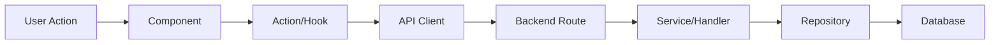
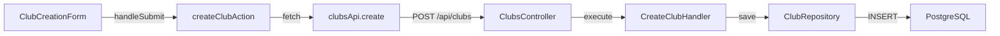

# Bug Finding Methodology

## 🎯 Mission

Identifier **méthodiquement** la cause racine d'un bug en utilisant une approche systématique avant toute correction.

## 🧐 Philosophie

**CRITICAL**: Ne JAMAIS proposer de fix avant d'avoir identifié et validé la cause racine du bug.

### Pourquoi ?

1. ✅ **Évite les faux positifs**: Un fix sans comprendre peut masquer le vrai problème
2. ✅ **Économise du temps**: Corriger la bonne cause du premier coup
3. ✅ **Réduit la dette technique**: Pas de workarounds qui s'accumulent
4. ✅ **Améliore la compréhension**: On apprend le système en profondeur

### Anti-Pattern

```typescript
// ❌ MAUVAIS WORKFLOW
User: "Le bouton ne marche pas"
Dev: "Ok, j'ajoute un console.log et je change le onClick"
// Résultat: Bug peut-être masqué, cause inconnue

// ✅ BON WORKFLOW
User: "Le bouton ne marche pas"
Dev: "Analysons systématiquement..."
// 1. Reproduire le bug
// 2. Identifier les causes probables
// 3. Valider la cause racine
// 4. ALORS proposer un fix minimal
```

## 📋 Méthodologie en 6 Étapes

### Étape 1: Résumer le Problème

**Objectif**: S'assurer de bien comprendre le bug avant de l'investiguer.

**Actions**:
1. Lire attentivement le bug report
2. Reformuler avec vos propres mots
3. Identifier les symptômes observables
4. Distinguer le comportement attendu vs observé

**Template**:
```markdown
## Résumé du Bug

**Comportement Attendu**:
[Ce qui devrait se passer]

**Comportement Observé**:
[Ce qui se passe réellement]

**Symptômes**:
- Symptôme 1
- Symptôme 2
- Symptôme 3

**Contexte**:
- Environnement: [Dev, Prod, Test]
- User role: [Coach, Player, etc.]
- Actions précédentes: [Étapes avant le bug]
```

**Exemple**:
```markdown
## Résumé du Bug

**Comportement Attendu**:
Le bouton "Créer un club" devrait créer un nouveau club et rediriger vers le dashboard.

**Comportement Observé**:
Le bouton ne fait rien, aucun feedback visuel.

**Symptômes**:
- Aucune requête API n'est envoyée
- Aucun message d'erreur
- Le bouton ne passe pas en état "loading"

**Contexte**:
- Environnement: Dev
- User role: Coach nouvellement inscrit
- Actions précédentes: Signup → Arrive sur /signup/coach/club
```

### Étape 2: Visualiser le Flow

**Objectif**: Identifier tous les fichiers et fonctions impliqués dans le flux du bug.

**Actions**:
1. Lister tous les fichiers potentiellement impliqués
2. Créer un diagramme mermaid du flux d'exécution
3. Identifier les points de transition critiques

**Template Mermaid**:


**Exemple Complet**:
```markdown
## Flow Analysis

### Fichiers Impliqués
1. `volley-app-frontend/src/features/club-management/components/ClubCreationForm.tsx`
2. `volley-app-frontend/src/features/club-management/actions/create-club.action.ts`
3. `volley-app-frontend/src/features/club-management/api/clubs.api.ts`
4. `volley-app-backend/src/club-management/presentation/controllers/clubs.controller.ts`
5. `volley-app-backend/src/club-management/application/commands/create-club/create-club.handler.ts`

### Flow Diagram

```

### Étape 3: Examiner les Fichiers Pertinents

**Objectif**: Lire et analyser le code des fichiers identifiés dans le flow.

**Actions**:
1. Lire chaque fichier dans l'ordre du flow
2. Noter les anomalies potentielles
3. Identifier les points de défaillance possibles
4. Vérifier les dépendances et imports

**Checklist par Type de Fichier**:

**Component (Frontend)**:
- [ ] Event handler correctement bindé ?
- [ ] Props reçues correctement ?
- [ ] State initialisé correctement ?
- [ ] useEffect dépendances correctes ?
- [ ] Validation côté client ?

**Action (Server Action)**:
- [ ] 'use server' directive présente ?
- [ ] Validation Zod correcte ?
- [ ] Try/catch présent ?
- [ ] revalidatePath appelé ?
- [ ] Retour success/error correct ?

**API Client**:
- [ ] URL correcte ?
- [ ] Headers présents (Authorization, Content-Type) ?
- [ ] Body correctement formaté ?
- [ ] Error handling présent ?

**Controller (Backend)**:
- [ ] Route correctement décorée (@Post, @Get, etc.) ?
- [ ] DTO validation active ?
- [ ] Guards appliqués (@UseGuards) ?
- [ ] Exception handling présent ?

**Handler (Backend)**:
- [ ] Repository injecté correctement ?
- [ ] Validation métier présente ?
- [ ] Transactions gérées ?
- [ ] Erreurs domain propagées ?

### Étape 4: Lister les Causes Probables

**Objectif**: Identifier les 3 causes les plus probables avec confiance estimée.

**Actions**:
1. Basé sur l'analyse des fichiers, lister les hypothèses
2. Classer par probabilité (High, Medium, Low)
3. Ajouter une description courte pour chaque cause
4. Estimer le niveau de confiance (%)

**Template**:
```markdown
## Top 3 Causes Probables

### 1. [Nom de la Cause] - Confiance: 80%
**Probabilité**: High
**Description**: [Explication courte de pourquoi c'est probable]
**Fichier(s)**: [Fichiers concernés]
**Preuve**: [Ce qui indique que c'est la cause]

### 2. [Nom de la Cause] - Confiance: 50%
**Probabilité**: Medium
**Description**: [Explication]
**Fichier(s)**: [Fichiers]
**Preuve**: [Indices]

### 3. [Nom de la Cause] - Confiance: 20%
**Probabilité**: Low
**Description**: [Explication]
**Fichier(s)**: [Fichiers]
**Preuve**: [Indices]
```

**Exemple Complet**:
```markdown
## Top 3 Causes Probables

### 1. Event Handler Non Bindé - Confiance: 80%
**Probabilité**: High
**Description**: Le handleSubmit n'est pas correctement passé au form, donc l'event n'est jamais déclenché.
**Fichier(s)**: `ClubCreationForm.tsx`
**Preuve**:
- Aucune requête API n'est visible dans Network tab
- Pas de logs dans la console
- Suggère que le handler n'est jamais appelé

### 2. Validation Zod Échoue Silencieusement - Confiance: 50%
**Probabilité**: Medium
**Description**: La validation Zod dans createClubAction échoue mais l'erreur n'est pas catchée.
**Fichier(s)**: `create-club.action.ts`
**Preuve**:
- Pas de try/catch visible dans l'action
- Pourrait throw sans être géré

### 3. Backend Route Non Enregistrée - Confiance: 20%
**Probabilité**: Low
**Description**: La route POST /api/clubs n'est pas correctement enregistrée dans le module NestJS.
**Fichier(s)**: `club-management.module.ts`
**Preuve**:
- Moins probable car d'autres routes fonctionnent
- Mais possible si route récemment ajoutée
```

### Étape 5: Attendre Confirmation Utilisateur

**Objectif**: Valider avec l'utilisateur avant de procéder.

**Actions**:
1. Présenter les 3 causes probables
2. Demander confirmation ou clarification
3. Ajuster les hypothèses si nécessaire

**Template Message**:
```markdown
J'ai identifié 3 causes probables pour ce bug. Voici mon analyse :

[Insérer les 3 causes probables]

**Question**: Souhaitez-vous que je procède à la vérification de la cause #1 (la plus probable), ou avez-vous des informations supplémentaires qui pourraient affiner mon analyse ?
```

### Étape 6: Proposer Plan de Vérification

**Objectif**: Proposer les 3 meilleures actions pour vérifier et fixer le bug.

**Actions**:
1. Pour chaque cause probable, proposer une vérification
2. Suggérer des logs, tests, ou inspections
3. Ordonner par priorité
4. Attendre confirmation avant d'exécuter

**Template**:
```markdown
## Plan de Vérification (Top 3 Actions)

### Action 1: [Vérifier Cause #1]
**Objectif**: [Ce qu'on cherche à confirmer]
**Méthode**: [Comment vérifier]
**Outils**: [Logs, tests, inspections]
**Si Confirmé**: [Fix proposé]
**Temps Estimé**: [5 min, 15 min, etc.]

### Action 2: [Vérifier Cause #2]
**Objectif**: [...]
**Méthode**: [...]
**Outils**: [...]
**Si Confirmé**: [...]
**Temps Estimé**: [...]

### Action 3: [Vérifier Cause #3]
**Objectif**: [...]
**Méthode**: [...]
**Outils**: [...]
**Si Confirmé**: [...]
**Temps Estimé**: [...]
```

**Exemple Complet**:
```markdown
## Plan de Vérification (Top 3 Actions)

### Action 1: Vérifier Event Handler Binding
**Objectif**: Confirmer que handleSubmit est bien bindé au form
**Méthode**:
1. Lire le code de ClubCreationForm.tsx
2. Vérifier que `action={handleSubmit}` ou `onSubmit={handleSubmit}` est présent
3. Ajouter un console.log au début de handleSubmit pour voir s'il est appelé
**Outils**: Read tool, Edit tool (pour log temporaire)
**Si Confirmé**: Corriger le binding (passer handleSubmit à l'attribut correct)
**Temps Estimé**: 5 min

### Action 2: Tester Validation Zod
**Objectif**: Vérifier si la validation Zod throw une erreur
**Méthode**:
1. Lire create-club.action.ts
2. Vérifier présence de try/catch
3. Ajouter logs avant/après schema.parse()
4. Tester avec des données invalides
**Outils**: Read tool, Edit tool, Bash (pour run dev server)
**Si Confirmé**: Ajouter try/catch + error handling correct
**Temps Estimé**: 10 min

### Action 3: Vérifier Route Backend
**Objectif**: S'assurer que POST /api/clubs est bien enregistrée
**Méthode**:
1. Lire club-management.module.ts
2. Vérifier que ClubsController est dans providers
3. Tester avec curl ou Postman
**Outils**: Read tool, Bash (curl)
**Si Confirmé**: Enregistrer correctement le controller
**Temps Estimé**: 5 min
```

## 🛠️ Outils à Utiliser

### Lecture de Code
```bash
# Read specific files
Read tool: <file_path>

# Search for patterns
Grep tool: pattern="handleSubmit" output_mode="content"

# Find files by name
Glob tool: pattern="**/*club*.tsx"
```

### Logs Temporaires

```typescript
// ✅ BON - Log avec contexte
console.log('[DEBUG] handleSubmit called with:', formData);

// ✅ BON - Log avant/après opération critique
console.log('[DEBUG] Before API call');
const result = await clubsApi.create(data);
console.log('[DEBUG] After API call, result:', result);
```

**CRITICAL**: Toujours supprimer les logs de debug avant de commit.

### Tests Reproductibles

```typescript
// Test unitaire pour reproduire le bug
describe('ClubCreationForm', () => {
  it('should call handleSubmit when form is submitted', () => {
    const mockSubmit = jest.fn();
    render(<ClubCreationForm onSubmit={mockSubmit} />);

    fireEvent.submit(screen.getByRole('button', { name: /créer/i }));

    expect(mockSubmit).toHaveBeenCalled();
  });
});
```

### Network Inspection

```bash
# Test API endpoint directement
curl -X POST http://localhost:3000/api/clubs \
  -H "Content-Type: application/json" \
  -H "Authorization: Bearer TOKEN" \
  -d '{"name": "Test Club", "description": "Test"}'
```

## ✅ Checklist Bug Finding

- [ ] **Étape 1**: Résumé du bug (attendu vs observé)
- [ ] **Étape 2**: Flow diagram (mermaid) créé
- [ ] **Étape 3**: Fichiers pertinents examinés
- [ ] **Étape 4**: Top 3 causes probables listées avec confiance
- [ ] **Étape 5**: Confirmation utilisateur obtenue
- [ ] **Étape 6**: Plan de vérification proposé (3 actions)
- [ ] **Attendre validation** avant d'exécuter le plan
- [ ] **Ne PAS proposer de fix** sans cause validée

## 🚨 Erreurs Courantes

### 1. Proposer un Fix Trop Tôt

```markdown
❌ MAUVAIS
User: "Le bouton ne marche pas"
Dev: "Ok, j'ajoute un onClick={handleSubmit}"

✅ BON
User: "Le bouton ne marche pas"
Dev: "Analysons le problème méthodiquement..."
[Suit les 6 étapes]
```

### 2. Ne Pas Visualiser le Flow

```markdown
❌ MAUVAIS
Dev: "Je regarde juste le composant"

✅ BON
Dev: "Voici le flow complet avec mermaid diagram"
[Montre toutes les couches impliquées]
```

### 3. Hypothèses Sans Preuves

```markdown
❌ MAUVAIS
"C'est probablement un problème de cache"
(Aucune preuve)

✅ BON
"La cause probable est X parce que:"
- Preuve 1
- Preuve 2
- Confiance: 80%
```

### 4. Ne Pas Attendre Confirmation

```markdown
❌ MAUVAIS
Dev propose 3 causes et commence immédiatement à fixer

✅ BON
Dev propose 3 causes et attend:
"Souhaitez-vous que je procède à la vérification ?"
```

## 📚 Skills Complémentaires

- **debugger** : Debugging systématique après identification de la cause
- **refactoring** : Refactoring pour éviter le bug à l'avenir
- **ddd-testing** : Tests pour prévenir la régression

---

**Rappel CRITIQUE** : Ne JAMAIS proposer de fix avant d'avoir validé la cause racine avec l'utilisateur.
