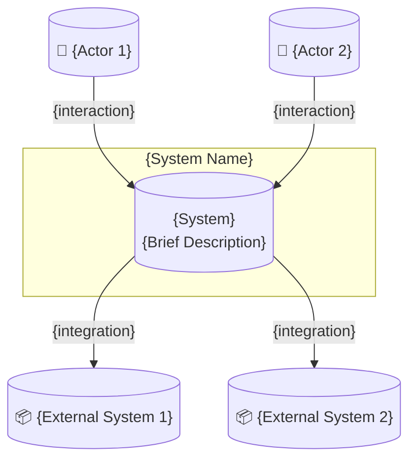
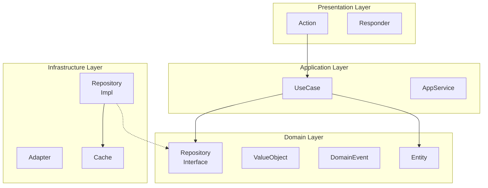
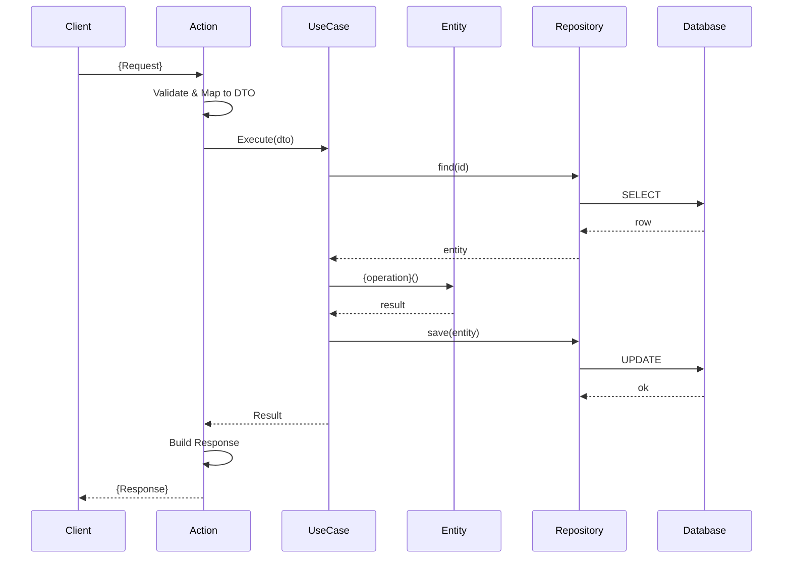
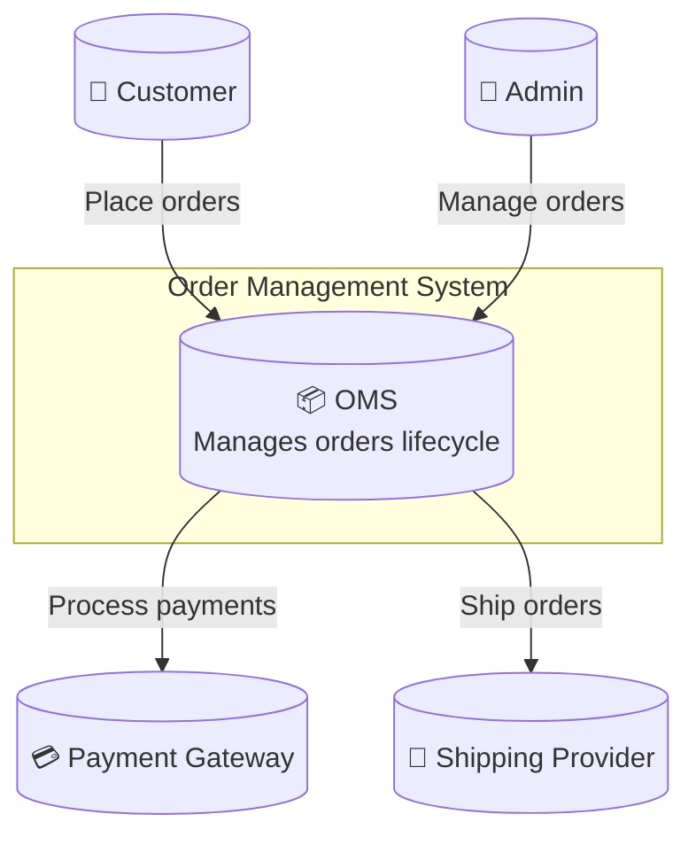

# Architecture Documentation Template Generator

Generate comprehensive architecture documentation for PHP projects.

## Document Structure

```markdown
# Architecture

## Overview
{high-level description}

## Directory Structure
{annotated project tree}

## System Context
{C4 context diagram}

## Architecture Layers
{layer descriptions}

## Components
{component descriptions}

## Data Flow
{sequence diagrams}

## Technology Stack
{technology decisions}

## Architecture Decisions
{link to ADRs}

## Deployment
{deployment diagram}
```

## Section Templates

### Directory Structure Section

```markdown
## Directory Structure

```
project/
├── src/                           # Source code
│   ├── Domain/                    # Domain Layer (DDD)
│   │   ├── Entity/                # Domain entities
│   │   ├── ValueObject/           # Value objects
│   │   ├── Repository/            # Repository interfaces
│   │   ├── Service/               # Domain services
│   │   └── Event/                 # Domain events
│   ├── Application/               # Application Layer
│   │   ├── UseCase/               # Use cases / Commands / Queries
│   │   ├── DTO/                   # Data Transfer Objects
│   │   └── Service/               # Application services
│   ├── Infrastructure/            # Infrastructure Layer
│   │   ├── Persistence/           # Repository implementations
│   │   ├── Http/                  # HTTP clients
│   │   ├── Messaging/             # Queue adapters
│   │   └── Cache/                 # Cache adapters
│   └── Presentation/              # Presentation Layer
│       ├── Api/                   # REST API (Actions, Requests, Responses)
│       ├── Web/                   # Web controllers
│       └── Console/               # CLI commands
├── tests/                         # Test suite
│   ├── Unit/                      # Unit tests (mirrors src/)
│   ├── Integration/               # Integration tests
│   └── Functional/                # E2E / Functional tests
├── config/                        # Configuration files
├── public/                        # Web root
├── docker/                        # Docker configuration
└── docs/                          # Documentation
    ├── architecture/              # Architecture docs
    ├── adr/                       # Architecture Decision Records
    └── api/                       # API documentation
```

### Generation Command

```bash
tree -L 3 -I 'vendor|node_modules|.git|var|cache' --dirsfirst
```

### Annotation Rules

| Rule | Description |
|------|-------------|
| Layer name | Add DDD layer in comment |
| Purpose | Describe directory purpose |
| Depth | Max 3 levels in main docs |
| Details | Link to subdirectory READMEs |
```

### Overview Section

```markdown
## Overview

{Project Name} follows {Architecture Style} (e.g., Clean Architecture, DDD, Hexagonal).

### Key Principles

- **Separation of Concerns** — Each layer has distinct responsibility
- **Dependency Rule** — Dependencies point inward (Domain is center)
- **Testability** — Business logic isolated from infrastructure
- **Framework Independence** — Core logic doesn't depend on frameworks

### High-Level Structure

```
┌─────────────────────────────────────────┐
│            Presentation Layer           │
│         (Actions, Responders)           │
├─────────────────────────────────────────┤
│            Application Layer            │
│          (UseCases, Services)           │
├─────────────────────────────────────────┤
│              Domain Layer               │
│    (Entities, Value Objects, Events)    │
├─────────────────────────────────────────┤
│           Infrastructure Layer          │
│      (Repositories, Adapters, DB)       │
└─────────────────────────────────────────┘
```
```

### System Context Section

```markdown
## System Context



### Actors

| Actor | Description |
|-------|-------------|
| {Actor 1} | {Description} |
| {Actor 2} | {Description} |

### External Systems

| System | Purpose | Integration |
|--------|---------|-------------|
| {System 1} | {Purpose} | {Protocol/API} |
| {System 2} | {Purpose} | {Protocol/API} |
```

### Architecture Layers Section

```markdown
## Architecture Layers

### Presentation Layer

**Responsibility:** Handle HTTP requests and responses

**Components:**
- `Api/` — REST API endpoints (Actions + Responders)
- `Web/` — Web interface (Actions + Responders)
- `Console/` — CLI commands

**Rules:**
- No business logic
- Validate input
- Call Application layer
- Format output

### Application Layer

**Responsibility:** Orchestrate business operations

**Components:**
- `UseCase/` — Application-specific business rules
- `Service/` — Cross-cutting application services
- `DTO/` — Data transfer objects

**Rules:**
- Orchestrate Domain objects
- Handle transactions
- No infrastructure concerns

### Domain Layer

**Responsibility:** Core business logic

**Components:**
- `Entity/` — Business objects with identity
- `ValueObject/` — Immutable value concepts
- `Event/` — Domain events
- `Repository/` — Repository interfaces
- `Service/` — Domain services

**Rules:**
- No external dependencies
- Pure business logic
- Self-validating objects

### Infrastructure Layer

**Responsibility:** Technical implementations

**Components:**
- `Persistence/` — Repository implementations
- `Adapter/` — External service adapters
- `Cache/` — Caching implementations
- `Queue/` — Queue implementations

**Rules:**
- Implement Domain interfaces
- Handle technical concerns
- No business logic
```

### Components Section

```markdown
## Components



### Component Descriptions

| Component | Layer | Responsibility |
|-----------|-------|----------------|
| Action | Presentation | HTTP request handling |
| Responder | Presentation | HTTP response building |
| UseCase | Application | Business operation orchestration |
| Entity | Domain | Business object with identity |
| ValueObject | Domain | Immutable value concept |
| Repository | Infrastructure | Data persistence |
```

### Data Flow Section

```markdown
## Data Flow

### {Operation Name} Flow


```

### Technology Stack Section

```markdown
## Technology Stack

| Layer | Technology | Purpose |
|-------|------------|---------|
| Language | PHP 8.5 | Type safety, modern features |
| Framework | Symfony 7.x | HTTP, DI, Console |
| ORM | Doctrine 3.x | Database abstraction |
| Database | PostgreSQL 16 | Primary storage |
| Cache | Redis 7.x | Session, cache |
| Queue | RabbitMQ 3.x | Async processing |
| API | OpenAPI 3.1 | API specification |

### Technology Decisions

| Decision | Rationale |
|----------|-----------|
| PostgreSQL over MySQL | JSONB support, better type system |
| Symfony over Laravel | More explicit, better DI |
| Redis over Memcached | Data structures, persistence |
```

### ADR Link Section

```markdown
## Architecture Decisions

Key decisions are documented as ADRs:

| ADR | Status | Title |
|-----|--------|-------|
| [ADR-001](docs/adr/001-use-ddd.md) | Accepted | Use DDD Architecture |
| [ADR-002](docs/adr/002-cqrs.md) | Accepted | Implement CQRS |
| [ADR-003](docs/adr/003-event-sourcing.md) | Proposed | Consider Event Sourcing |
```

## Complete Example

```markdown
# Architecture

## Overview

Order Management System follows Domain-Driven Design with Clean Architecture principles.

### Key Principles

- **Domain-Centric** — Business logic in Domain layer
- **Dependency Inversion** — Abstractions over implementations
- **Bounded Contexts** — Order, Inventory, Shipping

## Directory Structure

```
order-management/
├── src/
│   ├── Order/                     # Order Bounded Context
│   │   ├── Domain/                # Domain Layer
│   │   ├── Application/           # Application Layer
│   │   ├── Infrastructure/        # Infrastructure Layer
│   │   └── Presentation/          # Presentation Layer
│   ├── Inventory/                 # Inventory Bounded Context
│   └── Shipping/                  # Shipping Bounded Context
├── tests/
├── config/
└── docs/
```

## System Context



## Architecture Layers

[... layer descriptions ...]

## Technology Stack

| Layer | Technology | Purpose |
|-------|------------|---------|
| Language | PHP 8.5 | Type safety |
| Framework | Symfony 7.2 | HTTP, DI |
| Database | PostgreSQL 16 | Storage |
| Cache | Redis 7.4 | Performance |
| Queue | RabbitMQ 3.13 | Async |

## Architecture Decisions

| ADR | Status | Title |
|-----|--------|-------|
| [ADR-001](docs/adr/001-ddd.md) | Accepted | Use DDD |
| [ADR-002](docs/adr/002-cqrs.md) | Accepted | Use CQRS |
```

## Generation Instructions

When generating ARCHITECTURE.md:

1. **Analyze** project structure for layer organization
2. **Identify** architectural style (DDD, Clean, Hexagonal)
3. **Map** components to layers
4. **Create** context diagram with actors/systems
5. **Generate** component diagram
6. **List** technology stack from `composer.json`
7. **Link** existing ADRs if present
