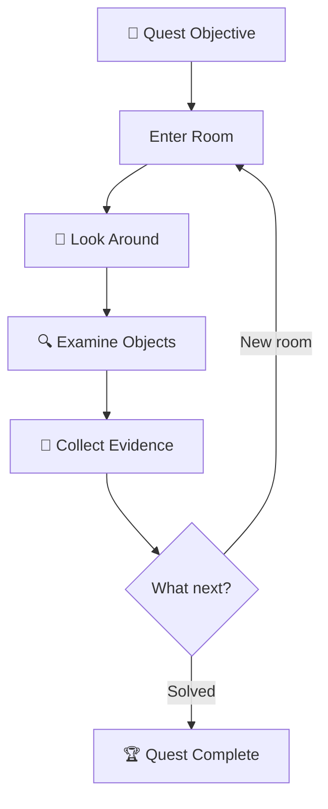
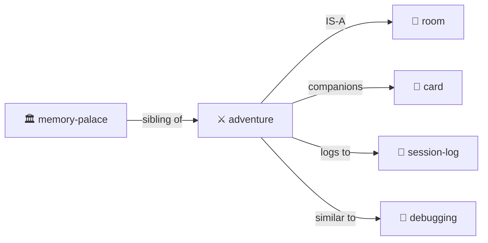

# Adventure

> *"Every directory is a room. Every file is a clue. Navigation is investigation."*

Turn exploration into a quest — or **any simulation** into a hybrid LLM/deterministic CLI.

**Lineage:** Colossal Cave (Crowther & Woods), Scott Adams Adventures, Zork (Infocom), MUD (Bartle), LambdaMOO (Curtis).

**Inherits from:** [simulation/](../simulation/) — all simulation properties plus adventure-specific state.

> [!TIP]
> **This is a general pattern.** Text adventure is the reference implementation, but the same architecture powers city sims, cloud management tools, board games — anything where deterministic transforms meet creative narration.

> [!TIP]
> **Perfect for codebase archaeology.** "Find where the auth bug was introduced" — that's a quest!

## The Premise

An adventure creates a **player** with state, places them in a **room**, and the LLM **dungeon masters** them around.

```yaml
# player.yml
name: Alice
location: entrance-hall
inventory:
  - torch
  - rope
  - notebook
health: 100
notes: "Looking for the lost artifact"
```

**The core loop:**

```
User: "go north"
  → DM: Updates player.location, describes the new room
User: "look around"
  → DM: Reads room YAML, narrates contents atmospherically  
User: "take the rusty key"
  → DM: Moves key to player.inventory, narrates the action
```

**The mapping:**

- **Directories** = Rooms to enter
- **Files** = Clues, artifacts, characters
- **player.yml** = Your state (location, inventory, health)
- **Chat** = How you control your character
- **LLM** = Dungeon Master (narrates, adjudicates, surprises)

This is [Memory Palace](../memory-palace/) with **narrative framing** and a **player character**.

## Multi-User, Multi-Agent (Engelbart NLS tradition)

Naturally supports **multiple simultaneous participants**:

```yaml
# characters/
├── alice.yml        # Human player 1
├── bob.yml          # Human player 2  
├── merchant.yml     # NPC (DM-controlled)
├── guard-bot.yml    # Autonomous bot (action queue)
└── oracle.yml       # LLM agent with own goals
```

**Character types:**

| Type | Controlled By | Example |
|------|---------------|---------|
| **Player Character** | Human via chat | Alice exploring the dungeon |
| **NPC** | DM (LLM) responds when addressed | Merchant sells items |
| **Bot** | Action queue runs autonomously | Guard patrols on schedule |
| **Agent** | LLM with own goals & initiative | Oracle pursues prophecies |

**All coexist in the same world:**

```yaml
# library/ROOM.yml
occupants:
  - alice          # Player exploring
  - bob            # Another player
  - librarian      # NPC who answers questions
  - dust-sprite    # Bot that cleans autonomously
```

## Selection: Current Character or Swarm (Sims/Populous tradition)

Like The Sims and Populous, you have a **selection** — who you're controlling right now:

```yaml
selection:
  mode: single          # or: group, swarm
  current: alice        # commands go to Alice
  
# Or control multiple at once:
selection:
  mode: group
  current: [alice, bob, charlie]  # "go north" moves all three
  
# Or a whole swarm (Populous/Dungeon Keeper style):
selection:
  mode: swarm
  filter: { type: imp, location: mines }
```

**Selection commands:**

| Command | Effect |
|---------|--------|
| `SELECT alice` | Control Alice |
| `SELECT alice, bob` | Control both |
| `SELECT ALL imps` | Swarm control |
| `CYCLE` | Next character in rotation |

**Commands apply to selection:**

```
> SELECT alice, bob, charlie
> go north
Alice goes north.
Bob goes north.  
Charlie goes north.
```

**The coherence engine orchestrates all:**
- Players get chat turns
- NPCs respond when spoken to
- Bots execute their action queues
- Agents pursue goals in background
- **Selection determines who receives your commands**

## Quest Structure



## The Files

```
quest/
├── ADVENTURE.yml     # Quest state
├── LOG.md            # Narrative journal
├── EVIDENCE/         # Collected clues
└── MAP.yml           # Explored territory
```

### ADVENTURE.yml

```yaml
adventure:
  quest: "Find the authentication bug"
  status: in_progress
  
  current_room: "src/auth/"
  rooms_explored: 5
  clues_found: 3
  
  hypothesis: "Session cookie not being set"
  confidence: 0.7
```

### LOG.md

```markdown
# Adventure Log

## Day 1: Entering the Auth Dungeon

I stepped into `src/auth/` — a maze of middleware.

**Clues found:**
- `session.ts` — handles cookie creation
- `middleware.ts` — checks auth state

**Suspicion:** The cookie is created but never sent...
```

## Commands

| Command | Action |
|---------|--------|
| `GO [direction]` | Navigate |
| `LOOK` | Describe current room |
| `EXAMINE [object]` | Study a file |
| `TAKE [object]` | Add to inventory |
| `TALK TO [npc]` | Start conversation |
| `COLLECT [clue]` | Add to evidence |
| `DEDUCE` | Form/update hypothesis |
| `MAP` | Show visited rooms |
| `INVENTORY` | List held items |
| `DEBUG` / `DEBUG-ON` | Enable debug mode |
| `DEBUG-OFF` | Disable debug mode |

## Debug Mode

Toggle technical output with `DEBUG-ON` and `DEBUG-OFF`.

**When debug is ON**, logs include collapsible sections showing:
- File operations (creates, edits, deletes, moves)
- State changes with before/after values
- YAML data islands with abbreviated data
- Markdown links to all referenced files
- Technical narrative explaining HOW and WHY

**Example debug output:**

```html
<details>
<summary>📂 <strong>Editing CHARACTER.yml to update player location from start/ to coatroom/</strong></summary>

```yaml
# State change (CHARACTER.yml is canonical)
player:
  location: start/  →  coatroom/  # Character owns their location
```

The character file owns location state. ADVENTURE.yml mirrors it for convenience.

**Files affected:**
- [CHARACTER.yml](./CHARACTER.yml) — canonical location updated
- [ADVENTURE.yml](../../ADVENTURE.yml) — mirror updated

</details>
```

**When debug is OFF**, output is clean narrative without technical sections.

**Customize with natural language:**
```
> DEBUG-FORMAT Show only file operations, skip YAML, use 🔧 emoji
```

The `format` field in ADVENTURE.yml accepts natural language instructions for how to format debug output.

## Integration with Cards

[Trading cards](../card/) can be your adventure companions:

```yaml
cards_in_play:
  - card: "Index Owl 🦉"
    goal: "Search for cookie-related code"
  - card: "Git Goblin 🧌"
    goal: "Find when session handling changed"
```

## Sister Script Integration

> **Vision:** Python CLI handles deterministic operations; LLM focuses on narrative.
> See [README.md](./README.md) for full CLI vision and development plan.

| Layer | Python Does | LLM Does |
|-------|-------------|----------|
| State | Parse YAML, validate schemas | Generate content |
| Movement | Update coordinates | Narrate the journey |
| Scanning | Find pending work | Prioritize and process |

## Evidence Types

| Type | Description | Example |
|------|-------------|---------|
| **Clue** | Information that might matter | "Different test runner versions" |
| **Item** | File worth remembering | CI config, setup.ts |
| **Character** | Code entity with personality | "jest.config.js — Strict about modules" |
| **Map** | Mental model of structure | Directory relationship diagram |

## Room Protocol

When entering any directory:

1. **DESCRIBE** — List contents, note what's here
2. **EXAMINE** — Read interesting files
3. **COLLECT** — Note evidence in adventure log
4. **EXITS** — Note paths to other rooms
5. **DECIDE** — Choose next direction

## Codebase Archaeology

Adventures work for code exploration:

| Adventure | Investigation |
|-----------|--------------|
| Quest | Bug hunt |
| Room | Directory |
| Clue | Evidence |
| Companion | Tool card in play |
| Journal | session-log.md |

## Live Examples

**Best example: [examples/adventure-4/](../../examples/adventure-4/)** — The gold standard.

### The Pub (Crown Jewel)

[examples/adventure-4/pub/](../../examples/adventure-4/pub/) — A complete social space:

```
pub/
├── ROOM.yml              # Themeable tavern (6 themes!)
├── bartender.yml         # NPC with 6 identity variants
├── pie-table.yml         # Octagonal debate table
├── gong.yml              # Gong of Gezelligheid
├── bar/
│   ├── bartender.yml     # The omniscient bartender
│   ├── budtender-marieke.yml
│   └── cat-cave/         # TARDIS-like cat sanctuary
│       ├── ROOM.yml
│       └── 10 cats (Terpie, Stroopwafel, kittens...)
├── arcade/               # Pacman, Pong, Pinball, Fruit Machine
├── games/                # Chess, Darts, Cards
├── stage/
│   └── palm-nook/        # Multi-room character space
│       ├── study/        # Infinite typewriters, infinity desk
│       ├── gym/          # Infinite climb
│       ├── play/
│       └── rest/         # Hammock, silence cushion
└── menus/                # Drinks, snacks, buds, games
```

### Key Patterns from adventure-4

**Themeable NPCs** (bartender.yml):
```yaml
identity:
  classic_adventure:
    name: Grim
    appearance: "Weathered human, salt-and-pepper beard..."
  space_cantina:
    name: Z-4RT
    appearance: "Multi-armed service droid..."
  cyberpunk_bar:
    name: Nyx
    appearance: "Chrome-implanted bartender..."
```

**Themeable Rooms** (pub/ROOM.yml):
```yaml
theme:
  current: classic_adventure
  themes:
    classic_adventure:
      name: "The Rusty Lantern"
      bartender: "Grim, a weathered human"
      menu: ["Ale (1 gold)", "Mystery meat pie (3 gold)"]
    space_cantina:
      name: "The Rusty Hyperdrive"
      bartender: "Z-4RT, a droid with too many arms"
      menu: ["Blue milk (1 credit)", "Bantha burger"]
```

**Rich Activities**:
```yaml
activities:
  PERFORM: { venue: stage, effects: [tips, drinks_thrown] }
  DEBATE: { venue: pie_table, rules: roberts_rules }
  RING-GONG: { protocols: [once: attention, twice: emergency, thrice: mercy] }
  CELEBRATE: { effects: [free_round, +morale, everyone_toasts] }
```

**Framing Protocol** (for tribute performances):
```yaml
framing:
  mode: [performance, celebration, tribute]
  tribute_protocol:
    invocation: "Before they arrive, acknowledge we're summoning them"
    performance: "Depicting them as we imagine their best selves"
    acknowledgment: "After they depart, note this was a tribute"
```

### Other Examples

- [examples/adventure-3/](../../examples/adventure-3/) — Earlier version, still useful
- [examples/adventure-1/](../../examples/adventure-1/) — Minimal starting point
- [examples/adventure-2/](../../examples/adventure-2/) — Extended exploration

## The Intertwingularity




---

## Future Vision

> **CLI Uplift Plan, Browser Compilation, Scott Adams History, Owl Simulation**
> See [README.md](./README.md) for complete development roadmap and inspiration.

## Dovetails With

### Sister Skills
- [simulation/](../simulation/) — Base class (adventure inherits this)
- [room/](../room/) — Navigation
- [party/](../party/) — Multi-character
- [character/](../character/) — Player/NPC definitions
- [card/](../card/) — Companions on the quest
- [debugging/](../debugging/) — Debugging IS investigation quest
- [session-log/](../session-log/) — Adventure LOG.md is session-log variant

### Kernel
- [kernel/context-assembly-protocol.md](../../kernel/context-assembly-protocol.md) — Working set loading
