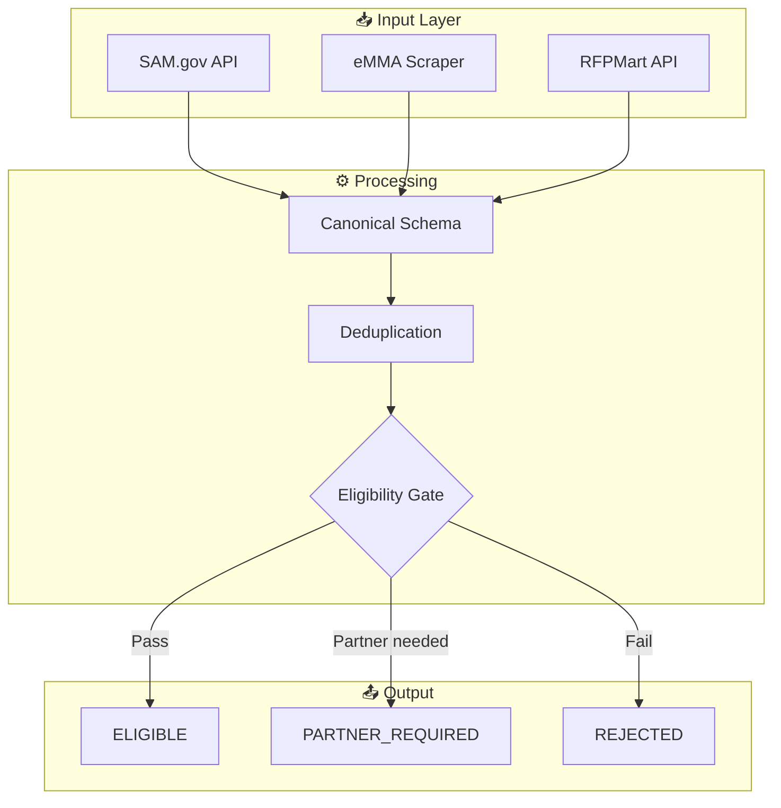
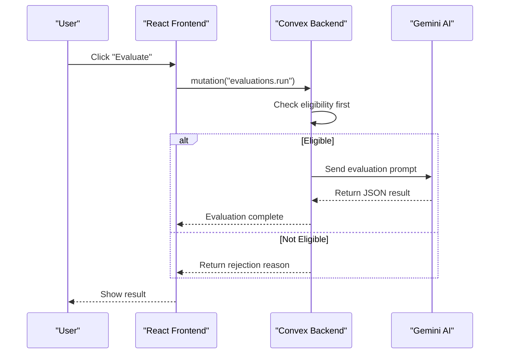
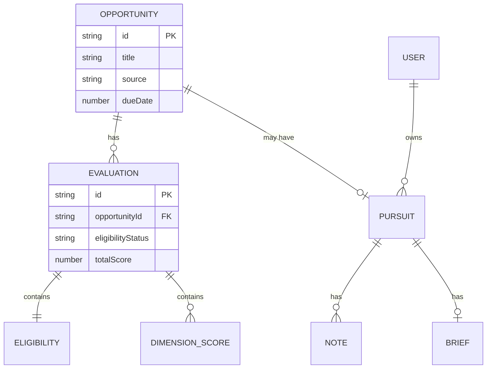
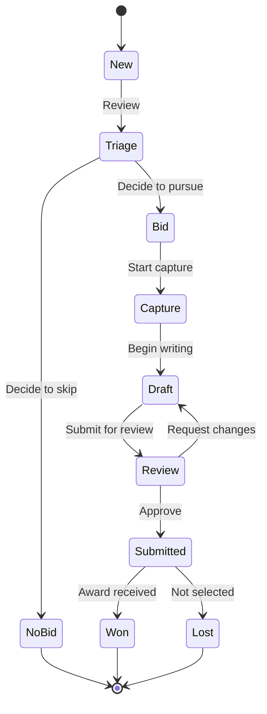

# Architecture Documentation Skill

## Overview

This skill provides patterns for creating clear, maintainable architecture documentation with properly formatted Mermaid diagrams.

## When to Use

- Creating system architecture diagrams
- Documenting data flows
- Writing implementation plans
- Creating entity relationship diagrams
- Updating `docs/implementation-plan/`

---

## Mermaid Diagram Best Practices

### CRITICAL: Quote Special Characters

Mermaid will break on unquoted special characters. **ALWAYS quote node labels containing:**

| Character | Example | Wrong | Correct |
|-----------|---------|-------|---------|
| Parentheses | `(info)` | `A[Label (info)]` | `A["Label (info)"]` |
| Brackets | `[0]` | `A[Array [0]]` | `A["Array [0]"]` |
| Angle brackets | `<table>` | `A[Id<table>]` | `A["Id<table>"]` |
| Colon | `:` | `A[Key: Value]` | `A["Key: Value"]` |
| Ampersand | `&` | `A[A & B]` | `A["A & B"]` |
| Greater/Less | `>`, `<` | `A[x > 5]` | `A["x > 5"]` |
| Pipe | `\|` | `A[A \| B]` | `A["A \| B"]` |
| Question mark | `?` | `A[Is valid?]` | `A["Is valid?"]` |

### Flowchart Template



### Sequence Diagram Template



### Entity Relationship Diagram Template



### State Diagram Template



---

## Documentation Structure

### Implementation Plan Structure

```
docs/implementation-plan/
├── README.md                    # Executive summary
│   - High-level architecture diagram
│   - Phase timeline table
│   - Success metrics
│   - Approval checklist
│
├── phase-N-[name]/README.md     # Phase details
│   - Objectives
│   - Data model changes
│   - Code examples
│   - Implementation checklist
│   - Files to create/modify
│
└── architecture/
    ├── README.md                # Multi-level architecture
    │   - Executive view (business flow)
    │   - Technical view (system components)
    │   - Implementation view (file structure)
    │
    └── DATABASE-SCHEMA.md       # Complete schema
        - Entity relationship diagram
        - Table definitions
        - Index definitions
        - Complete schema.ts code
```

### Feature Documentation Structure

```
docs/features/[feature-name]/
├── README.md           # Problem, solution, success criteria
├── ARCHITECTURE.md     # Technical design with diagrams
└── IMPLEMENTATION.md   # Step-by-step plan with checklists
```

---

## ASCII Diagrams

For inline documentation or simpler contexts, use ASCII art:

### Box Diagram

```
┌─────────────────────────────────────────────────────────┐
│                    PROCESSING PIPELINE                   │
├─────────────────────────────────────────────────────────┤
│  INGEST → DEDUPE → ELIGIBILITY → SCORE → PIPELINE       │
└─────────────────────────────────────────────────────────┘
```

### Flow Diagram

```
┌──────────┐    ┌──────────┐    ┌──────────┐
│  INPUT   │───▶│ PROCESS  │───▶│  OUTPUT  │
└──────────┘    └──────────┘    └──────────┘
```

### Decision Tree

```
                    ┌─────────────┐
                    │   START     │
                    └──────┬──────┘
                           │
                    ┌──────▼──────┐
                    │  Eligible?  │
                    └──────┬──────┘
                     Yes   │   No
              ┌────────────┴────────────┐
              ▼                         ▼
       ┌──────────┐              ┌──────────┐
       │  SCORE   │              │  REJECT  │
       └──────────┘              └──────────┘
```

---

## Quick Reference

### Audience-Specific Diagrams

| Audience | Diagram Type | Focus |
|----------|--------------|-------|
| Executive | Flowchart | Business value flow |
| Architect | Component diagram | System boundaries |
| Developer | Sequence diagram | API interactions |
| DBA | ERD | Data relationships |

### Diagram Checklist

- [ ] All special characters are quoted
- [ ] Subgraph labels are descriptive
- [ ] Arrows have labels where helpful
- [ ] Colors/styles are consistent
- [ ] Diagram renders without errors
