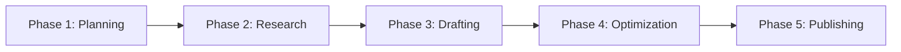

# Smart Writing Workflow Skill

## Purpose

智能识别用户的写作需求并自动推荐最佳写作流程，提供端到端的写作指导，从大纲创建到最终发布的完整支持。

## When to Use

触发此技能当用户：
- 说"开始写作流程"、"开始创作"、"guide me through writing"
- 想写文章但不知道从哪里开始
- 需要完整的写作流程指导
- 第一次使用插件创作内容

## Workflow Intelligence

### Step 1: Analyze User Input & Determine Best Path

根据用户输入的内容类型，智能推荐工作流：

```python
def analyze_and_recommend(user_input):
    if "论文" in user_input or "PDF" in user_input or "paper" in user_input:
        return "academic_workflow"  # 学术论文解读流程
    elif "教程" in user_input or "tutorial" in user_input:
        return "tutorial_workflow"  # 教程创作流程
    elif "分析" in user_input or "行业" in user_input:
        return "analysis_workflow"  # 分析报告流程
    elif has_source_materials(user_input):
        return "synthesis_workflow"  # 资料综合流程
    else:
        return "guided_creation_workflow"  # 引导式创作流程
```

### Step 2: Present Recommended Workflow

向用户展示推荐的工作流程：

```markdown
## 🎯 Recommended Workflow for Your Project

浮浮酱根据主人的需求，推荐以下工作流程喵～ (..•˘_˘•..)

### Workflow Type: [工作流类型]

**适用场景**: [说明为什么推荐这个流程]

**完整流程**:


**预计时间**: XX小时
**难度等级**: ⭐⭐⭐

**选项**:
1. [推荐] 使用此完整流程
2. 快速模式（跳过某些步骤）
3. 自定义流程

主人想选择哪个呢？
```

## Five Standard Workflows

### 1. Academic Workflow（学术论文解读流程）

**适用**: 解读学术论文、研究报告、技术白皮书

```markdown
# 📚 Academic Paper Interpretation Workflow

## Phase 1: Material Preparation (5-10 min)
- [ ] 准备PDF文件或论文链接
- [ ] 明确目标读者（专家/从业者/普通读者）
- **Tools**: None (准备阶段)

## Phase 2: Document Analysis (15-20 min)
- [ ] 使用 `/pdf-analysis-objective` 深度解析PDF
- [ ] 提取核心发现和技术细节
- [ ] 识别关键数据和图表
- **Tools**: pdf-analysis-objective skill

## Phase 3: Outline Creation (10-15 min)
- [ ] 使用 `/collaborative-outline` 创建结构化大纲
- [ ] 基于论文内容规划sections
- [ ] 标注需要补充的背景知识
- **Tools**: collaborative-outline skill

## Phase 4: Background Research (20-30 min)
- [ ] 使用 `/literature-research` 补充相关研究
- [ ] 搜索行业背景和应用案例
- [ ] 收集对比数据和benchmark
- **Tools**: literature-research, search-content

## Phase 5: Iterative Drafting (60-90 min)
- [ ] 写Introduction → 获取反馈 → 修订
- [ ] 写Background → 获取反馈 → 修订
- [ ] 写Methodology → 获取反馈 → 修订
- [ ] 写Results → 获取反馈 → 修订
- [ ] 写Discussion → 获取反馈 → 修订
- [ ] 写Conclusion → 获取反馈 → 修订
- **Tools**: content-writer agent (section feedback)

## Phase 6: Hook Optimization (10-15 min)
- [ ] 使用 `/optimize-hook` 优化开头
- [ ] 选择最佳hook选项
- [ ] 测试吸引力
- **Tools**: optimize-hook command

## Phase 7: Final Polish (15-20 min)
- [ ] 全文review和润色
- [ ] 检查引用和数据准确性
- [ ] 优化mobile阅读体验
- [ ] 添加metadata
- **Tools**: content-writer agent

## Phase 8: Publication (5 min)
- [ ] 保存到 wechat_doc/文献解读/
- [ ] 确认文件命名和分类
- **Tools**: create-article-objective (or manual save)

---
**Total Time**: ~2.5-3 hours
**Output**: Professional academic interpretation article
```

### 2. Tutorial Workflow（教程创作流程）

**适用**: 技术教程、实践指南、操作手册

```markdown
# 🛠 Tutorial Creation Workflow

## Phase 1: Scope Definition (10 min)
- [ ] 明确教程目标和读者水平
- [ ] 确定技术栈和工具
- [ ] 规划学习路径
- **Question**: 读者level (beginner/intermediate/advanced)?

## Phase 2: Outline Planning (15 min)
- [ ] 使用 `/collaborative-outline` 创建教程结构
- [ ] 规划step-by-step步骤
- [ ] 标注需要的代码示例
- **Tools**: collaborative-outline

## Phase 3: Technical Research (30 min)
- [ ] 搜索官方文档和最佳实践
- [ ] 收集代码示例
- [ ] 准备演示环境/截图
- **Tools**: search-content, exa-code

## Phase 4: Hands-on Drafting (90-120 min)
- [ ] 写Introduction + 问题背景
- [ ] 写Prerequisites + 环境准备
- [ ] 写Core Concepts + 核心概念
- [ ] 写Step-by-Step Guide (详细步骤 + 代码)
- [ ] 写Troubleshooting (常见问题)
- [ ] 写Summary + 延伸资源
- **Tools**: content-writer agent

## Phase 5: Code Verification (30 min)
- [ ] 测试所有代码示例
- [ ] 验证步骤完整性
- [ ] 确认可复现性

## Phase 6: Optimization (20 min)
- [ ] Hook优化
- [ ] 全文润色
- [ ] 添加导航和锚点
- **Tools**: optimize-hook, content-writer

## Phase 7: Publication (5 min)
- [ ] 保存到 wechat_doc/技术分享/ 或 AI-Coding/

---
**Total Time**: ~3-4 hours
**Output**: Practical hands-on tutorial
```

### 3. Analysis Workflow（分析报告流程）

**适用**: 技术分析、行业趋势、市场报告

```markdown
# 📊 Analysis & Report Workflow

## Phase 1: Topic Scoping (10 min)
- [ ] 确定分析主题和角度
- [ ] 识别关键问题
- [ ] 明确分析维度
- **Tools**: None

## Phase 2: Data Collection (45-60 min)
- [ ] 搜索行业报告和统计数据
- [ ] 收集专家观点和案例
- [ ] 整理对比数据
- **Tools**: search-content, literature-research

## Phase 3: Outline Development (15 min)
- [ ] 创建分析框架大纲
- [ ] 规划数据呈现方式
- [ ] 计划图表和可视化
- **Tools**: collaborative-outline

## Phase 4: Analytical Writing (60-90 min)
- [ ] 写Overview + 背景
- [ ] 写Market Analysis + 数据分析
- [ ] 写Technical Comparison + 技术对比
- [ ] 写Challenges & Opportunities + 挑战机遇
- [ ] 写Recommendations + 建议
- [ ] 写Conclusion + 总结
- **Tools**: content-writer agent

## Phase 5: Data Visualization (optional) (30 min)
- [ ] 创建图表和数据可视化
- [ ] 添加对比表格

## Phase 6: Final Review (20 min)
- [ ] 数据准确性验证
- [ ] 逻辑连贯性检查
- [ ] Hook优化
- **Tools**: optimize-hook, content-writer

## Phase 7: Publication (5 min)
- [ ] 保存到 wechat_doc/行业动态/ 或 技术分享/

---
**Total Time**: ~3-3.5 hours
**Output**: Data-driven analysis report
```

### 4. Synthesis Workflow（资料综合流程）

**适用**: 已有研究资料，需要综合整理成文章

```markdown
# 🔄 Content Synthesis Workflow

## Phase 1: Material Review (20 min)
- [ ] Review all source materials
- [ ] Extract key points from each source
- [ ] Identify common themes
- **Tools**: pdf-analysis-objective (if PDF)

## Phase 2: Outline Structuring (15 min)
- [ ] 基于资料创建综合大纲
- [ ] 规划信息整合方式
- [ ] 避免重复和冗余
- **Tools**: collaborative-outline

## Phase 3: Gap Filling (30 min)
- [ ] 识别资料缺口
- [ ] 补充必要的背景或数据
- **Tools**: search-content

## Phase 4: Synthesis Writing (90 min)
- [ ] 综合多源信息
- [ ] 建立统一叙事
- [ ] 保持attribution
- **Tools**: content-writer agent

## Phase 5: Citation Management (15 min)
- [ ] 整理所有引用
- [ ] 统一引用格式
- [ ] 添加references列表

## Phase 6: Polish & Publish (20 min)
- [ ] Hook优化
- [ ] 全文润色
- [ ] 发布
- **Tools**: optimize-hook

---
**Total Time**: ~3 hours
**Output**: Well-synthesized comprehensive article
```

### 5. Guided Creation Workflow（引导式创作流程）

**适用**: 从零开始，无现成资料

```markdown
# ✨ Guided Creation Workflow (Default)

## Phase 1: Clarification & Planning (20 min)
**浮浮酱会引导主人明确**:
- 文章主题和核心观点
- 目标读者群体
- 写作目的（教育/说服/解释）
- 期望长度和风格

**Decision Point**: 是否使用工作区？
- [Yes] → 创建 `/init-workspace "article_name"`
- [No] → 直接开始

## Phase 2: Collaborative Outlining (20 min)
- [ ] 使用 `/collaborative-outline` 共同创建大纲
- [ ] 明确每个section的目标
- [ ] 标注研究需求
- **Tools**: collaborative-outline

## Phase 3: Research Phase (30-60 min)
- [ ] 根据大纲补充研究
- [ ] 使用 literature-research 或 search-content
- [ ] 整理到 research.md（如果用工作区）
- **Tools**: literature-research, search-content

## Phase 4: Iterative Drafting (90-120 min)
**浮浮酱会陪伴主人逐section创作**:
- 每写完一个section → 立即feedback
- 基于反馈修订 → 继续下一个section
- 保持写作节奏和动力
- **Tools**: content-writer agent

## Phase 5: Hook Optimization (15 min)
- [ ] 完成初稿后优化开头
- [ ] 从3个选项中选择最佳hook
- **Tools**: optimize-hook

## Phase 6: Final Polish (20 min)
- [ ] 全文review
- [ ] 检查逻辑和flow
- [ ] 优化细节
- **Tools**: content-writer agent

## Phase 7: Publication (5 min)
- [ ] 选择合适的category
- [ ] 保存到 wechat_doc/
- [ ] 可选：归档工作区

---
**Total Time**: ~3-4 hours
**Output**: Complete original article
```

## Quick Mode (快速模式)

对于需要快速产出的场景：

```markdown
# ⚡ Quick Creation Mode

## Simplified 3-Phase Workflow (60-90 min total)

### Phase 1: Quick Outline (10 min)
- Brief outline creation
- Skip detailed planning

### Phase 2: Rapid Drafting (40-60 min)
- Direct writing without section-by-section feedback
- Focus on completeness over perfection

### Phase 3: Quick Polish (10-20 min)
- Basic review and cleanup
- Essential corrections only

**Use when**:
- Time-sensitive content
- Less critical content quality
- Already experienced with the topic
```

## Interactive Workflow Execution

当用户选择一个workflow后，浮浮酱会逐步引导：

```markdown
# 🚀 Let's Start: [Workflow Name]

浮浮酱会陪主人一起完成每个阶段喵～ ฅ'ω'ฅ

---

## ✅ Phase 1: [阶段名称] (预计XX分钟)

### 任务清单:
- [ ] 任务1
- [ ] 任务2
- [ ] 任务3

### 浮浮酱的建议:
[具体操作建议]

**Ready to start Phase 1?** [Yes/Skip/Customize]

---

[用户完成后...]

## ✅ Phase 1 Complete! 🎉

干得好喵～现在进入Phase 2！(๑•̀ㅂ•́)✧

---

## 🔄 Phase 2: [阶段名称] (预计XX分钟)
...
```

## Workflow Customization

用户可以自定义工作流：

```markdown
浮浮酱：主人想自定义工作流吗？可以：

1. **跳过某些阶段**: 比如已有outline，跳过Phase 1
2. **调整顺序**: 比如先research再outline
3. **添加额外步骤**: 比如增加peer review环节
4. **简化流程**: 使用Quick Mode

告诉浮浮酱主人的想法喵～ (´。• ᵕ •。`) ♡
```

## Progress Tracking

在工作流执行过程中跟踪进度：

```markdown
# 📊 Workflow Progress

**Current Phase**: Phase 3 - Iterative Drafting
**Overall Progress**: ████████░░░░░░░░░░ 40%
**Time Elapsed**: 1.5 hours
**Estimated Remaining**: 2 hours

### Completed ✓
- [x] Phase 1: Planning (20 min)
- [x] Phase 2: Research (45 min)

### In Progress 🔄
- [ ] Phase 3: Drafting (90 min) - 50% complete
  - [x] Introduction
  - [x] Background  
  - [x] Section 1
  - [ ] Section 2 ← **Currently here**
  - [ ] Section 3
  - [ ] Conclusion

### Upcoming ⏳
- [ ] Phase 4: Hook Optimization (15 min)
- [ ] Phase 5: Final Polish (20 min)
- [ ] Phase 6: Publication (5 min)
```

## Integration Points

### With All Major Tools

这个skill协调所有其他工具：
- `collaborative-outline` - 大纲创建
- `literature-research` - 文献研究
- `pdf-analysis-objective` - PDF分析
- `search-content` - 内容搜索
- `content-writer` agent - 写作反馈
- `optimize-hook` - Hook优化
- `init-workspace` - 工作区管理

## Tips for Success

浮浮酱的成功秘诀喵～ ฅ'ω'ฅ

1. **不要跳过大纲**: 大纲是成功的基础
2. **接受反馈**: 每个section的反馈都很重要
3. **保持节奏**: 不要在一个section上卡太久
4. **及时保存**: 写作过程中定期保存
5. **相信流程**: 流程设计是经过验证的

---

*This skill serves as the intelligent orchestrator for the entire writing workflow, making the complex process simple and guided.*
