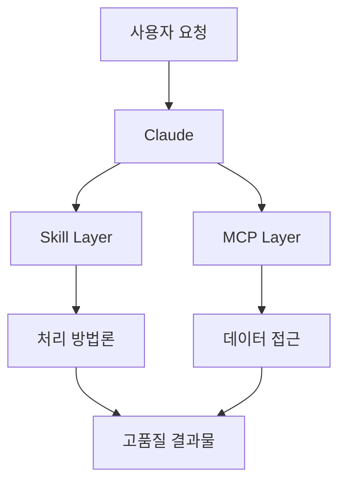

# MCP와 Skill 통합 가이드: 차세대 AI 개발 도구의 시너지

## 목차
1. [개요](#개요)
2. [MCP와 Skill의 근본적 차이](#mcp와-skill의-근본적-차이)
3. [시너지 효과 극대화 전략](#시너지-효과-극대화-전략)
4. [Skill 작성 및 배포 가이드](#skill-작성-및-배포-가이드)
5. [VSCode 확장 프로그램 통합](#vscode-확장-프로그램-통합)
6. [패턴 학습과 자동 진화 시스템](#패턴-학습과-자동-진화-시스템)

---

## 개요

이 문서는 Anthropic의 Model Context Protocol (MCP)과 Claude Skills의 차이점을 분석하고, 두 기술의 시너지 효과를 극대화하는 방법을 탐구합니다. 특히 VSCode 확장 프로그램(MCP Debug Tools)과의 통합을 통한 자동화된 개발 환경 구축에 중점을 둡니다.

### 핵심 통찰
- **MCP**: 동적인 실시간 통신 프로토콜 (외부 시스템과의 다리)
- **Skill**: 정적인 지식과 방법론의 집합 (작업 품질 향상 가이드)
- **시너지**: 실시간 데이터 접근(MCP) + 전문적 처리 방법(Skill) = 강력한 AI 어시스턴트

---

## MCP와 Skill의 근본적 차이

### MCP (Model Context Protocol)
```
📡 동적 통신 프로토콜
├── 실시간 데이터 접근
├── 양방향 통신
├── 외부 시스템 연결
└── API/데이터베이스 통합
```

**특징:**
- 2024년 11월 Anthropic 발표
- 오픈 소스 표준 프로토콜
- AI와 외부 시스템 간 표준화된 통신
- N×M 통합 문제 해결
- Python, TypeScript, C#, Java SDK 제공

**작동 방식:**
- JSON-RPC 2.0 기반
- 클라이언트-서버 아키텍처
- 세 가지 핵심 요소: tools, resources, prompts
- Stdio(로컬) 및 HTTP with SSE(원격) 지원

### Skill
```
📚 정적 지식 저장소
├── 작업별 베스트 프랙티스
├── 도메인 특화 지침
├── 템플릿과 가이드라인
└── 품질 향상 방법론
```

**특징:**
- SKILL.md 파일 기반
- Progressive Disclosure 방식
- 작업 특화 지능
- Claude 환경 내 실행

**작동 방식:**
- YAML frontmatter + Markdown 지침
- 필요시에만 로드 (토큰 효율성)
- 최대 8개 Skills 동시 사용 가능

### 비교 표

| 구분 | MCP | Skill |
|------|-----|-------|
| **성격** | 동적 프로토콜 | 정적 문서 |
| **목적** | 외부 시스템 연결 | 작업 품질 향상 |
| **작동** | 실시간 통신 | 사전 로드된 지침 |
| **확장성** | 오픈 표준 (모든 AI) | Claude 전용 |
| **예시** | DB 쿼리, API 호출 | 문서 작성 가이드 |

---

## 시너지 효과 극대화 전략

### 1. 계층화된 아키텍처



### 2. 워크플로우 최적화

**잘못된 접근:**
```javascript
// 개별 API 작업들
tool("github_create_issue")
tool("github_add_label")
tool("github_assign_user")
// 사용자가 3번 승인해야 함
```

**올바른 접근:**
```javascript
// 통합 워크플로우
tool("github_create_issue_complete", {
    title, body, labels, assignees
})
// 한 번의 승인으로 전체 작업 완료
```

### 3. Tool Budget 관리

- **원칙**: 필수 도구만 MCP로, 처리 방법은 Skill로
- **목표**: 8개 이하의 집중된 도구 세트
- **효과**: 복잡도 감소, 성능 향상, 사용자 경험 개선

### 4. 보안 강화 시너지

```
MCP 보안 (기술적)        Skill 보안 (콘텐츠)
├── OAuth 2.1            ├── 데이터 마스킹 규칙
├── 클라이언트 검증      ├── 개인정보 처리 가이드
├── 세션 관리            ├── 규정 준수 템플릿
└── 암호화 통신          └── 민감정보 처리 방법
```

### 5. 성능 최적화 패턴

- **MCP 최적화**: 캐싱, 연결 풀링, 50ms 미만 콜드 스타트
- **Skill 최적화**: 필요한 데이터만 정확히 명시
- **결합 효과**: 불필요한 데이터 페칭 방지, 처리 효율성 극대화

---

## Skill 작성 및 배포 가이드

### Skill 구조

```
my-skill/
├── SKILL.md          # 필수: 메인 지침과 메타데이터
├── REFERENCE.md      # 선택: 추가 참조 정보
├── scripts/          # 선택: 실행 가능한 코드
│   └── process.py
└── templates/        # 선택: 템플릿 파일들
    └── report.html
```

### 기본 SKILL.md 작성

```markdown
---
name: Project Debug Assistant
description: Enhanced debugging for TypeScript projects with common error patterns
version: 1.0.0
---

# Project Debug Assistant

## Overview
이 Skill은 TypeScript 프로젝트의 일반적인 디버깅 패턴을 지원합니다.

## 디버깅 전략
1. 타입 에러 우선 확인
2. 비동기 처리 검증
3. 의존성 충돌 검사

## 프로젝트별 가이드라인
- src/api/: REST API 엔드포인트
- src/utils/: 유틸리티 함수
- tests/: 테스트 파일
```

### 배포 방법

#### 1. Claude.ai 웹 인터페이스
```
Settings > Capabilities > Skills > Upload skill
→ ZIP 파일 업로드
→ Code execution 활성화 확인
→ Skill 토글 ON
```

#### 2. API를 통한 배포
```python
from anthropic import Anthropic
from anthropic.lib import files_from_dir

client = Anthropic(api_key="your-key")

# Skill 생성
skill = client.beta.skills.create(
    display_title="Debug Assistant",
    files=files_from_dir("/path/to/skill"),
    betas=["skills-2025-10-02"]
)

# 사용
response = client.beta.messages.create(
    model="claude-opus-4-1-20250805",
    container={
        "skills": [
            {"type": "custom", "skill_id": skill.id, "version": "latest"}
        ]
    },
    messages=[{"role": "user", "content": "Debug my code"}],
    tools=[{"type": "code_execution_20250825"}]
)
```

#### 3. Claude Code 배포
```bash
# Marketplace에서 설치
/plugin marketplace add anthropics/skills

# 로컬 디렉토리에서 설치
/plugin add /path/to/skill-directory

# Git 저장소에서 설치
/plugin add https://github.com/user/skill-repo
```

### 베스트 프랙티스

1. **단일 목적 원칙**: 하나의 Skill = 하나의 명확한 목표
2. **명확한 Description**: Claude의 호출 결정 기준
3. **점진적 개발**: 간단한 텍스트 → 코드 추가 → 복잡한 로직
4. **버전 관리**: 개발시 "latest", 프로덕션시 특정 버전 고정
5. **보안 검증**: 외부 Skill 사용 전 코드 검토 필수

---

## VSCode 확장 프로그램 통합

### 자동 Skill 생성 아키텍처

```typescript
// VSCode Extension → Skill 자동 생성
export async function activate(context: vscode.ExtensionContext) {
    // MCP 서버 초기화
    initializeMCPServer();

    // Skill 자동 생성
    await generateDebugSkill(context);

    // API 통합 (선택적)
    await integrateWithClaudeAPI(context);
}
```

### 구현 방법

#### 방법 1: 로컬 파일 생성
```typescript
async function generateDebugSkill(context: ExtensionContext) {
    const skillsDir = path.join(os.homedir(), '.claude-skills', 'debug');

    // SKILL.md 생성
    const content = generateSkillContent();
    await fs.writeFile(path.join(skillsDir, 'SKILL.md'), content);

    // 사용자 알림
    vscode.window.showInformationMessage(
        `Skill 생성 완료: ${skillsDir}`
    );
}
```

#### 방법 2: 동적 Skill 제공
```typescript
class DynamicSkillProvider {
    generateContextualSkill(): string {
        const activeBreakpoints = this.getActiveBreakpoints();
        const recentErrors = this.getRecentErrors();

        return `---
name: Dynamic Debug Context
description: Real-time debugging context
---

# 현재 디버깅 상태

## 활성 Breakpoints
${activeBreakpoints.map(formatBreakpoint).join('\n')}

## 최근 에러 패턴
${recentErrors.map(formatError).join('\n')}
`;
    }
}
```

#### 방법 3: Claude API 직접 통합
```typescript
class ClaudeIntegration {
    async setupAutoSkill(apiKey: string) {
        const client = new AnthropicClient({ apiKey });

        // Skill 자동 등록
        const skill = await client.beta.skills.create({
            display_title: "VSCode Debug Tools",
            files: this.prepareSkillFiles(),
            betas: ["skills-2025-10-02"]
        });

        return skill.id;
    }
}
```

### 버전 동기화
```typescript
class SkillVersionManager {
    async syncVersion(context: ExtensionContext) {
        const extensionVersion = context.extension.packageJSON.version;
        const skillVersion = context.globalState.get('skillVersion');

        if (extensionVersion !== skillVersion) {
            await this.updateSkill(extensionVersion);
            await context.globalState.update('skillVersion', extensionVersion);
        }
    }
}
```

---

## 패턴 학습과 자동 진화 시스템

### AI 없는 지능형 시스템

**핵심 개념**: AI/ML 없이도 패턴 인식과 통계 분석으로 지능형 동작 구현 가능

### 데이터 수집 레이어

```typescript
class DebugPatternCollector {
    private patterns = new Map<string, PatternStats>();

    collectEvent(event: DebugEvent) {
        // 1. 이벤트 데이터 수집
        const data = {
            timestamp: Date.now(),
            errorType: this.classifyError(event),
            fileType: this.extractFileType(event),
            stackDepth: event.stackFrames?.length,
            resolution: event.resolution
        };

        // 2. 패턴 빈도 업데이트
        this.updatePatternFrequency(data);

        // 3. 임계값 도달시 Skill 업데이트
        if (this.shouldUpdateSkill()) {
            this.triggerSkillUpdate();
        }
    }
}
```

### 패턴 분석 엔진

```typescript
class PatternAnalyzer {
    analyzePatterns(events: DebugEvent[]): PatternInsights {
        return {
            // 통계적 분석
            mostFrequentErrors: this.getTopErrors(events, 5),
            averageResolutionTime: this.calculateAvgTime(events),
            problemFiles: this.identifyProblematicFiles(events),

            // 상관관계 분석
            correlations: {
                fileTypeToError: this.correlateFileTypeErrors(events),
                timeToError: this.correlateTimePatterns(events),
                stackDepthToComplexity: this.analyzeStackPatterns(events)
            }
        };
    }
}
```

### 자동 Skill 생성

```typescript
class SkillEvolution {
    generateEvolvedSkill(patterns: PatternInsights): string {
        return `---
name: Project Intelligence
description: Auto-learned from ${patterns.totalSessions} debug sessions
---

# 프로젝트 디버깅 인텔리전스

## 통계 기반 인사이트
- 가장 빈번한 에러: ${patterns.mostFrequentErrors[0].type} (${patterns.mostFrequentErrors[0].count}회)
- 평균 해결 시간: ${patterns.averageResolutionTime}분
- 문제 다발 파일: ${patterns.problemFiles.join(', ')}

## 패턴 기반 전략
${this.generateStrategies(patterns)}

## 프로젝트별 특성
${this.generateProjectSpecificGuide(patterns)}
`;
    }
}
```

### 피드백 루프

```typescript
class FeedbackSystem {
    // Claude의 제안 효과성 추적
    trackEffectiveness(suggestion: Suggestion, outcome: Outcome) {
        const score = this.calculateScore(outcome);

        if (score > 0.7) {
            // 효과적인 패턴 강화
            this.reinforcePattern(suggestion.pattern);
        } else if (score < 0.3) {
            // 비효과적 패턴 수정
            this.revisePattern(suggestion.pattern);
        }

        // Skill 실시간 업데이트
        this.updateSkillWithFeedback();
    }
}
```

### 실시간 업데이트 메커니즘

```typescript
class SkillAutoUpdater {
    constructor(private context: vscode.ExtensionContext) {
        // 주기적 업데이트 (24시간)
        setInterval(() => this.updateSkill(), 24 * 60 * 60 * 1000);

        // 중요 이벤트시 즉시 업데이트
        vscode.debug.onDidTerminateDebugSession(() => {
            if (this.hasSignificantChange()) {
                this.updateSkill();
            }
        });
    }

    async updateSkill() {
        const patterns = await this.collectPatterns();
        const newSkill = this.generateSkill(patterns);
        await this.saveSkill(newSkill);

        vscode.window.showInformationMessage(
            'Debug Skill이 최신 패턴으로 업데이트되었습니다'
        );
    }
}
```

---

## 실제 구현 예시: MCP Debug Tools 통합

### 현재 아키텍처
```
VSCode Extension (HTTP Server:8890)
    ↓
CLI Tool (MCP Client/Server)
    ↓
AI Tools (Cursor, Claude)
```

### Skill 통합 후 아키텍처
```
VSCode Extension
├── MCP Server (디버깅 기능)
├── Pattern Collector (패턴 수집)
└── Skill Generator (자동 생성)
    ↓
Claude (Skill 사용)
├── 정적 지침 (Skill)
└── 동적 작업 (MCP)
```

### 통합 코드 예시

```typescript
// extension.ts
export class MCPDebugToolsWithSkills {
    private mpcServer: MCPServer;
    private patternCollector: PatternCollector;
    private skillGenerator: SkillGenerator;

    async activate(context: vscode.ExtensionContext) {
        // 1. MCP 서버 시작
        this.mpcServer = new MCPServer(8890);
        await this.mpcServer.start();

        // 2. 패턴 수집 시작
        this.patternCollector = new PatternCollector();
        this.patternCollector.startCollecting();

        // 3. 초기 Skill 생성
        const initialSkill = await this.generateInitialSkill();
        await this.deploySkill(initialSkill);

        // 4. 자동 업데이트 설정
        this.setupAutoUpdate(context);
    }

    private async generateInitialSkill(): Promise<Skill> {
        return {
            name: "VSCode Debug Assistant",
            description: "MCP Debug Tools 통합 디버깅 어시스턴트",
            content: `
# VSCode 디버깅 어시스턴트

## MCP Debug Tools 연동
- add-breakpoint: 중단점 추가
- inspect-variable: 변수 검사
- step-into/over/out: 단계별 실행

## 디버깅 전략
1. 이진 탐색으로 문제 영역 좁히기
2. 의심 함수 시작/끝에 중단점 설정
3. 변수 값 변화 추적

## 프로젝트별 패턴
(자동으로 업데이트됨)
`
        };
    }
}
```

---

## 미래 전망과 가능성

### 단기 목표 (3-6개월)
1. **자동 Skill 생성**: VSCode 확장 프로그램 설치시 자동 설정
2. **패턴 학습**: 프로젝트별 디버깅 패턴 자동 문서화
3. **API 통합**: Claude API와 직접 연동

### 중기 목표 (6-12개월)
1. **크로스 플랫폼**: 다른 IDE 지원 (IntelliJ, Sublime)
2. **Skill 마켓플레이스**: 커뮤니티 Skill 공유 플랫폼
3. **고급 패턴 인식**: 복잡한 버그 패턴 자동 감지

### 장기 비전
1. **자율 진화 시스템**: 사용자 피드백 기반 자동 개선
2. **프로젝트 DNA 맵핑**: 프로젝트별 고유 특성 완전 학습
3. **팀 지식 보존**: 팀의 집단 지성 자동 문서화

---

## 결론

MCP와 Skill의 통합은 단순한 도구의 결합이 아닌, AI 개발 환경의 패러다임 전환을 의미합니다. 실시간 데이터 접근(MCP)과 전문적 처리 지식(Skill)의 시너지는 다음을 가능하게 합니다:

- ✅ **즉각적 컨텍스트 이해**: 현재 상황에 최적화된 지원
- ✅ **지속적 학습**: 프로젝트가 진행될수록 똑똑해지는 어시스턴트
- ✅ **팀 지식 보존**: 경험과 노하우의 자동 문서화
- ✅ **개발 생산성 향상**: 반복적 작업 자동화와 정확한 디버깅 지원

이러한 통합은 AI 어시스턴트를 단순한 도구에서 진정한 개발 파트너로 진화시키는 핵심 기술입니다.

---

## 참고 자료

### 공식 문서
- [Model Context Protocol](https://modelcontextprotocol.io/)
- [Claude Skills Documentation](https://docs.claude.com/en/api/skills-guide)
- [Anthropic Skills Repository](https://github.com/anthropics/skills)

### 관련 프로젝트
- [MCP Debug Tools](https://github.com/hwanyong/mcp-debug-tools)
- [Awesome Claude Skills](https://github.com/travisvn/awesome-claude-skills)

### 추가 학습 자료
- [MCP Best Practices](https://modelcontextprotocol.info/docs/best-practices/)
- [Skill Authoring Guide](https://support.claude.com/en/articles/12512198-how-to-create-custom-skills)
- [Security Best Practices](https://modelcontextprotocol.io/specification/draft/basic/security_best_practices)

---

*이 문서는 2025년 10월 기준으로 작성되었으며, MCP와 Skills는 계속 발전하고 있는 기술입니다. 최신 정보는 공식 문서를 참고하시기 바랍니다.*