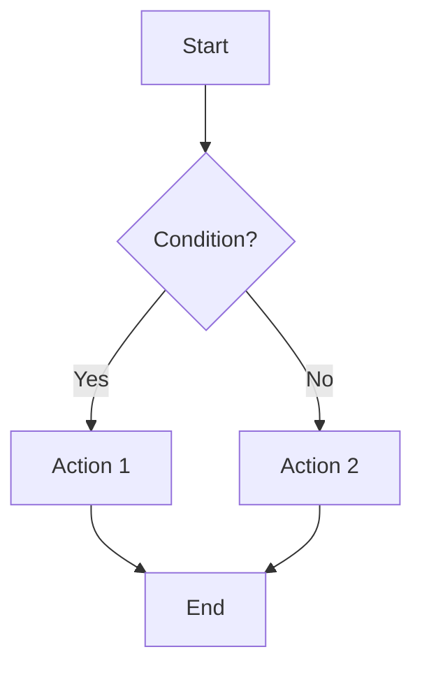
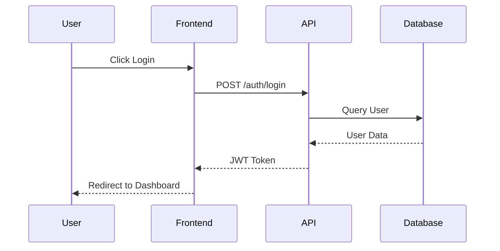
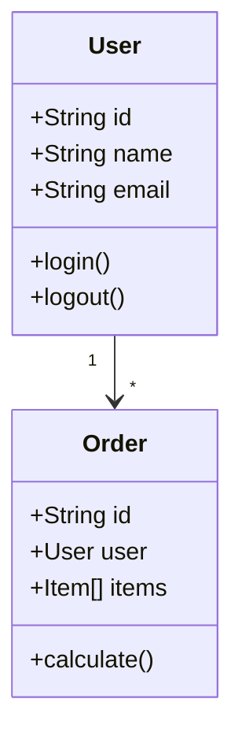
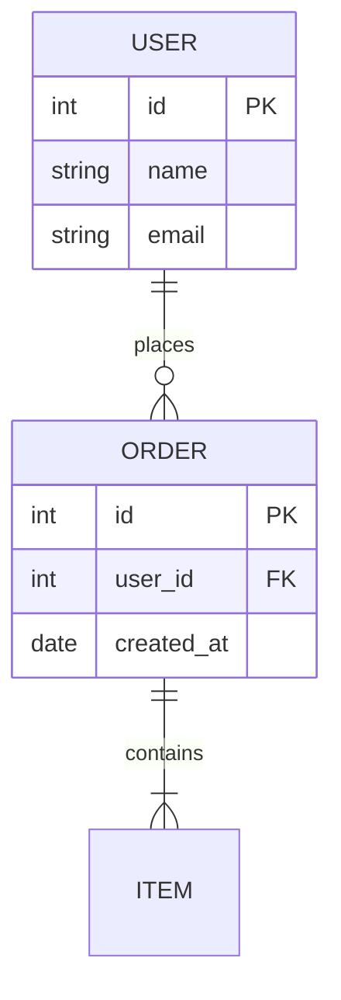
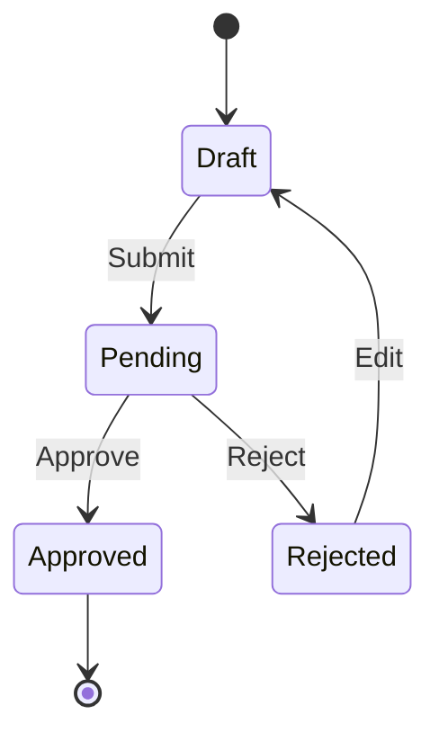
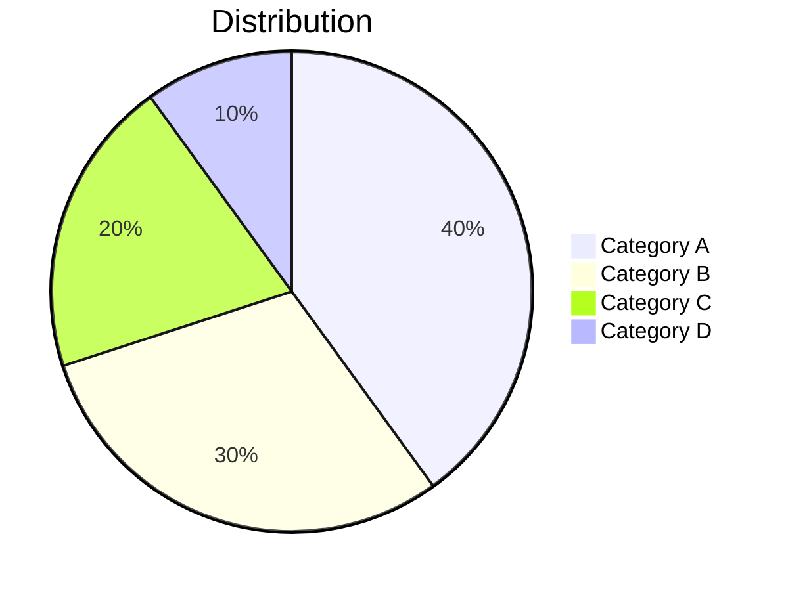
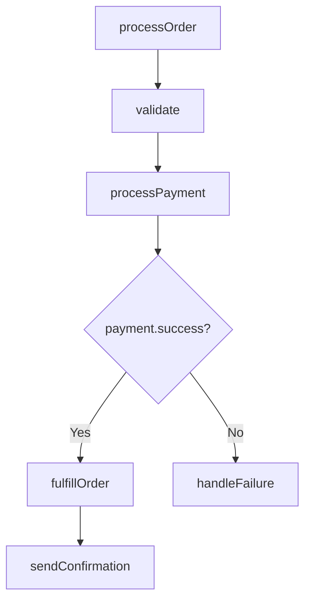
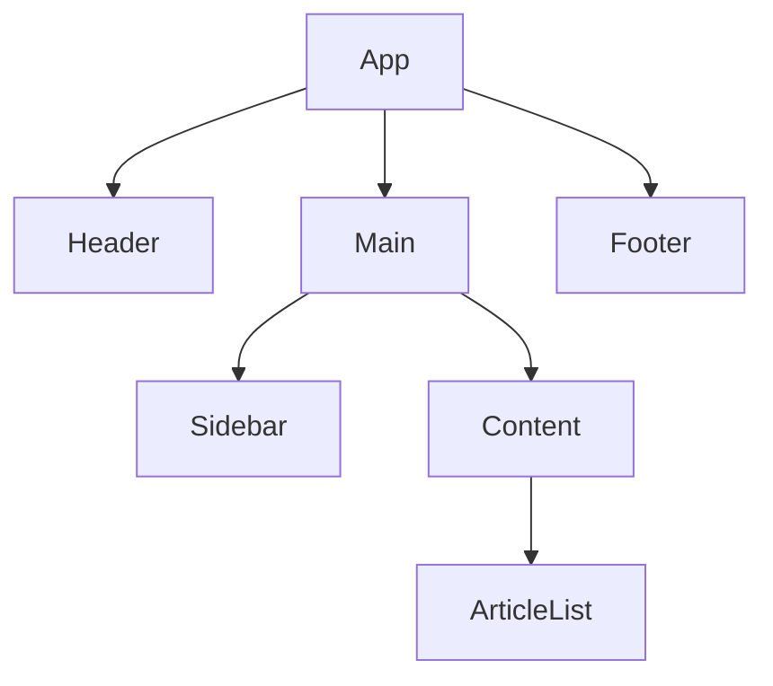
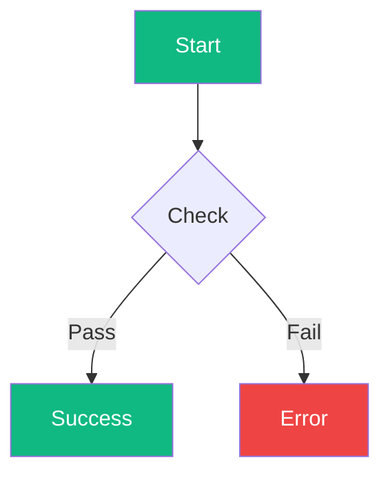

# 📊 Diagram Generator Skill

---
name: diagram-generator
description: Generate visual diagrams from code, text descriptions, or data structures using Mermaid
---

## 🎯 Purpose

สร้าง diagrams จาก code, text descriptions, หรือ data structures โดยใช้ Mermaid syntax

## 📋 When to Use

- Document architecture
- Explain flows
- Visualize relationships
- Create documentation
- Present to stakeholders

## 🔧 Diagram Types

### 1. Flowchart


### 2. Sequence Diagram


### 3. Class Diagram


### 4. Entity Relationship


### 5. State Diagram


### 6. Pie Chart


## 📝 Generation From Code

### From Function Flow
```javascript
// Input: Code
async function processOrder(order) {
  validate(order);
  const payment = await processPayment(order);
  if (payment.success) {
    await fulfillOrder(order);
    sendConfirmation(order);
  } else {
    handleFailure(order);
  }
}
```



### From Component Tree
```jsx
// Input: React Components
<App>
  <Header />
  <Main>
    <Sidebar />
    <Content>
      <ArticleList />
    </Content>
  </Main>
  <Footer />
</App>
```



## 🎨 Styling



## ✅ Best Practices

- [ ] Keep diagrams simple
- [ ] Use meaningful labels
- [ ] Group related items
- [ ] Choose right diagram type
- [ ] Add colors for clarity
- [ ] Include legend if needed

## 🔗 Related Skills

- `documentation` - Create docs
- `codebase-understanding` - Understand structure
- `code-explanation` - Explain with visuals
