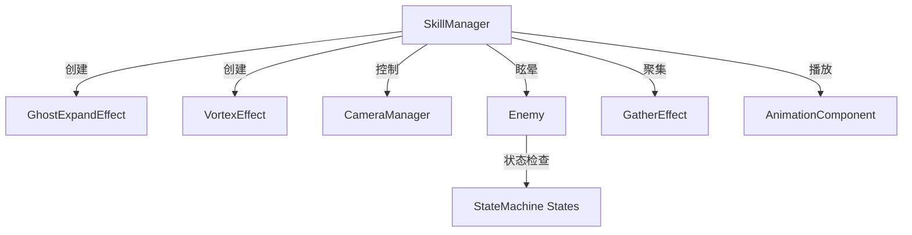

# V技能特殊攻击 - 设计与实现文档

**创建时间**: 2026-01-25
**状态**: ✅ 实现完成，待验证
**负责模块**: SkillManager组件

---

## 📋 目录

- [功能概述](#功能概述)
- [目标设计方案](#目标设计方案)
- [实现策略](#实现策略)
- [技术细节](#技术细节)
- [问题与解决方案](#问题与解决方案)
- [配置参数](#配置参数)
- [相关文件](#相关文件)
- [验证清单](#验证清单)

---

## 功能概述

### 功能描述
玩家按下V键触发的特殊攻击技能，包含视觉特效、敌人聚集、镜头控制和攻击动画的完整流程。

### 核心特性
- 🎭 角色残影放大效果
- 🌀 漩涡聚集特效
- 👁️ 动态镜头跟踪
- 🎯 敌人强制聚集
- ⚔️ 集中攻击动画

---

## 🎯 目标设计方案

### 技能执行流程（更新于 2026-01-25）

```
按下V键
    ↓
[Phase 1] 启动阶段
├── 玩家位置生成残影放大效果（基于sprite中心锚点，放大→缩小→渐隐）
├── 播放心跳音效（可选）
└── 前方200px生成漩涡特效
    ↓
[Phase 2] 检测敌人
└── 检测前方扇形范围内的敌人
    ↓
[Phase 3] 聚集阶段
├── 镜头移动到漩涡位置（固定不动）
├── 逐个处理敌人：
│   ├── 敌人状态机切换到stun状态
│   ├── 停止stun状态的timer（防止自动恢复）
│   ├── 设置 can_move = false
│   └── 聚集敌人到漩涡位置
└── 所有敌人聚集完毕后，镜头切换回玩家
    ↓
[Phase 4] 冲刺阶段
└── 玩家残影冲刺到漩涡位置
    ↓
[Phase 5] 攻击阶段
└── 播放攻击动画
    ↓
[Phase 6] 恢复阶段
├── 解除所有敌人stun状态（触发on_timeout转换到chase/wander）
├── 隐藏漩涡
└── 恢复玩家控制
```

### 视觉效果规格

#### 残影放大效果
- **位置**: 玩家当前位置
- **动画**:
  1. 快速放大到2倍（0.2秒，EASE_OUT + TRANS_BACK）
  2. 缩小回原始大小并渐隐（0.3秒，EASE_IN + TRANS_QUAD）
- **颜色**: 淡蓝色 `Color(0.8, 0.9, 1.0, 0.7)`

#### 漩涡特效
- **位置**: 玩家面向方向200px处
- **半径**: 60px（增大以提高可见性）
- **颜色**: 蓝紫色 `Color(0.4, 0.5, 1.0, 1.0)`
- **螺旋数量**: 4条
- **线宽**: 4.0
- **层级**: z_index = 1（在角色上方）
- **持续时间**: 从Phase 1到Phase 6攻击动画结束

#### 镜头行为（更新于 2026-01-25）
- **聚集阶段**: 镜头固定在漩涡位置（不跟随敌人移动）
- **聚集完毕后**: 镜头切换回玩家位置
- **缩放**: **不改变zoom值**（保持原始缩放）
- **移动时间**: 0.5秒

---

## 🔧 实现策略

### 架构设计

```
SkillManager.gd (主控制器)
├── special_attack_v() - 入口函数
├── Phase 1: _create_initial_effects()
│   ├── GhostExpandEffect - 残影放大
│   ├── VortexEffect - 漩涡生成
│   └── AudioManager - 心跳音效
├── Phase 2-5: _gather_enemies_sequence()
│   ├── For each enemy:
│   │   ├── _position_camera_for_gather()
│   │   ├── _stun_enemy()
│   │   ├── _gather_enemy()
│   │   └── await gather_tween.finished
├── Phase 6: _execute_attack()
│   ├── AfterImageEffect - 冲刺残影
│   ├── AnimationComponent.play("attack")
│   └── await animation.finished → hide vortex
└── Phase 7: _cleanup()
    ├── _release_enemy_stuns()
    └── _restore_camera()
```

### 核心组件交互



---

## 🛠️ 技术细节

### 1. 残影放大效果实现

**文件**: [Util/Components/SkillManager.gd:77-90](../../Util/Components/SkillManager.gd#L77-L90)

```gdscript
# 1.2 创建残影放大效果
var sprite = body.get_node_or_null("AnimatedSprite2D")
if sprite:
    var ghost = GhostExpandEffectScript.new()
    ghost.scale_multiplier = ghost_expand_scale
    ghost.duration = 0.5
    ghost.ghost_color = Color(0.8, 0.9, 1.0, 0.7)

    # 使用 call_deferred 避免 "Parent node is busy" 错误
    body.get_parent().call_deferred("add_child", ghost)

    # 延迟创建精灵，等待节点添加完成
    await owner_node.get_tree().process_frame
    ghost.create_from_sprite(sprite, body.global_position)
```

**关键技术点**:
- ❌ **问题**: 直接`add_child(ghost)`会触发"Parent node is busy setting up children"错误
- ✅ **解决**: 使用`call_deferred("add_child", ghost)`延迟添加节点
- ✅ **同步**: `await process_frame`确保节点已添加到树中才创建精灵

**动画实现**: [Util/Effects/GhostExpandEffect.gd](../../Util/Effects/GhostExpandEffect.gd)

```gdscript
func _play_expand_animation() -> void:
    var tween = create_tween()

    # 阶段1：快速放大
    tween.set_ease(Tween.EASE_OUT)
    tween.set_trans(Tween.TRANS_BACK)
    tween.tween_property(_ghost_sprite, "scale", Vector2.ONE * scale_multiplier, duration * 0.4)

    # 阶段2：缩小回原始大小并渐隐
    tween.set_ease(Tween.EASE_IN)
    tween.set_trans(Tween.TRANS_QUAD)
    tween.tween_property(_ghost_sprite, "scale", Vector2.ONE, duration * 0.6)
    tween.parallel().tween_property(_ghost_sprite, "modulate:a", 0.0, duration * 0.6)

    tween.finished.connect(_on_animation_finished)
```

---

### 2. 敌人聚集位置修正

**文件**: [Util/Components/SkillManager.gd:165](../../Util/Components/SkillManager.gd#L165)

```gdscript
# ❌ 旧实现（错误）
var gather_tween = _gather_enemy(enemy, _gather_position, gather_time)

# ✅ 新实现（正确）
var gather_tween = _gather_enemy(enemy, _vortex_position, gather_time)
```

**问题分析**:
- `_gather_position`: 计算为玩家前方100px
- `_vortex_position`: 计算为玩家前方200px
- **Bug**: 敌人聚集到100px位置，但漩涡在200px位置，导致视觉不匹配

**修复结果**:
- 敌人现在正确聚集到漩涡中心位置（200px）

---

### 3. 敌人强制停止机制

#### 3.1 眩晕函数实现

**文件**: [Util/Components/SkillManager.gd:254-261](../../Util/Components/SkillManager.gd#L254-L261)

```gdscript
## 眩晕敌人（内部方法）
func _stun_enemy(enemy: Node) -> void:
    if "stunned" in enemy:
        enemy.stunned = true  # 标志1: 眩晕状态
    if "can_move" in enemy:
        enemy.can_move = false  # 标志2: 禁止移动

    # 标志3: 强制速度归零
    if enemy is CharacterBody2D:
        (enemy as CharacterBody2D).velocity = Vector2.ZERO

    print("眩晕敌人: ", enemy.name, " 保持眩晕")
```

**三重保险机制**:
1. `stunned = true`: 业务逻辑层标志
2. `can_move = false`: 移动权限控制
3. `velocity = Vector2.ZERO`: 物理层速度清零

#### 3.2 敌人类属性添加

**文件**: [Scenes/enemies/dinosaur/Scripts/enemy.gd](../../Scenes/enemies/dinosaur/Scripts/enemy.gd)

```gdscript
var stunned : bool = false
var can_move : bool = true  # 用于技能聚集时强制停止移动
```

#### 3.3 状态机防护层

所有移动相关状态添加can_move检查：

**文件**:
- [Util/StateMachine/CommonStates/chase_state.gd](../../Util/StateMachine/CommonStates/chase_state.gd)
- [Util/StateMachine/CommonStates/wander_state.gd](../../Util/StateMachine/CommonStates/wander_state.gd)
- [Util/StateMachine/CommonStates/idle_state.gd](../../Util/StateMachine/CommonStates/idle_state.gd)
- [Util/StateMachine/CommonStates/attack_state.gd](../../Util/StateMachine/CommonStates/attack_state.gd)

```gdscript
func physics_process_state(delta: float) -> void:
    # 检查是否可以移动（技能聚集时强制停止）
    if "can_move" in owner_node and not owner_node.can_move:
        if owner_node is CharacterBody2D:
            (owner_node as CharacterBody2D).velocity = Vector2.ZERO
        return

    # ... 原有状态逻辑 ...
```

**防护原理**:
- 在每个状态的`physics_process_state`开头检查
- 如果`can_move = false`，强制velocity归零并立即return
- 阻止状态机的移动逻辑覆盖速度设置

---

### 4. 镜头控制策略

**文件**: [Util/Components/SkillManager.gd:158-162](../../Util/Components/SkillManager.gd#L158-L162)

```gdscript
# 3. 镜头定位到敌人和漩涡中间位置（不缩放）
var vortex_pos = _vortex_position + body.global_position
var camera_target_pos = (enemy.global_position + vortex_pos) / 2.0

var tween = create_tween()
tween.tween_property(camera_manager.camera, "global_position",
                     camera_target_pos, camera_move_time)
# 注意：不调用 tween_property(..., "zoom", ...) 以避免缩放
```

**设计要点**:
- ✅ 计算敌人和漩涡的中点：`(enemy_pos + vortex_pos) / 2.0`
- ✅ 只改变镜头position，**不改变zoom**
- ✅ 移动时间0.5秒，使用Tween平滑过渡

**镜头恢复**: [Util/Components/SkillManager.gd:217-220](../../Util/Components/SkillManager.gd#L217-L220)

```gdscript
# 7.4 恢复镜头到玩家
if camera_manager:
    var camera_tween = create_tween()
    camera_tween.tween_property(camera_manager.camera, "global_position",
                                body.global_position, 0.5)
```

---

### 5. 漩涡生命周期管理

#### 创建时机
**文件**: [Util/Components/SkillManager.gd:98](../../Util/Components/SkillManager.gd#L98)

```gdscript
# Phase 1: 1.3 创建漩涡效果
_vortex_instance = VortexEffectScript.new()
body.get_parent().add_child(_vortex_instance)
_vortex_instance.global_position = vortex_pos
```

#### 销毁时机（修复后）

```gdscript
# ❌ 旧实现（Phase 4 - 聚集阶段后立即隐藏）
# 问题：攻击动画时看不到漩涡
if _vortex_instance:
    _vortex_instance.visible = false

# ✅ 新实现（Phase 6 - 攻击动画结束后隐藏）
# 文件: SkillManager.gd:190
await animation_component.animation_finished
if _vortex_instance:
    _vortex_instance.visible = false
```

**时间轴对比**:

| 阶段 | 旧实现 | 新实现 |
|------|--------|--------|
| Phase 1 | 创建漩涡 ✅ | 创建漩涡 ✅ |
| Phase 2-5 | 漩涡可见 ✅ | 漩涡可见 ✅ |
| Phase 4末 | ❌ 隐藏漩涡（过早） | 漩涡可见 ✅ |
| Phase 6 | ❌ 攻击时无漩涡 | ✅ 攻击时有漩涡 |
| Phase 6末 | - | ✅ 攻击动画后隐藏 |

---

### 6. 漩涡可见性优化

**文件**: [Util/Effects/VortexEffect.gd](../../Util/Effects/VortexEffect.gd)

```gdscript
# 原始配置（不可见）
@export var radius: float = 30.0  # ❌ 太小
@export var vortex_color: Color = Color(0.3, 0.4, 0.8, 0.8)  # ❌ 太暗
# z_index 未设置，可能被遮挡

# 优化后配置（清晰可见）
@export var radius: float = 60.0  # ✅ 增大一倍
@export var vortex_color: Color = Color(0.4, 0.5, 1.0, 1.0)  # ✅ 更亮
@export var spiral_count: int = 4
@export var line_width: float = 4.0

func _ready() -> void:
    z_index = 1  # ✅ 确保在角色上方显示
```

**优化效果**:
- 半径从30增加到60（+100%面积）
- 颜色更亮（RGB值提高，alpha=1.0）
- z_index=1确保不被角色遮挡

---

## ❌ 问题与解决方案

### 问题1: 残影位置不对

**现象**:
- 残影没有在玩家位置出现
- 或者残影只放大不缩小

**原因分析**:
- 最初实现可能使用了错误的位置计算
- 动画只有放大阶段，缺少缩小回原始大小的逻辑

**解决方案**:
1. 使用`body.global_position`作为残影位置
2. 修改动画为两阶段：
   - 阶段1: 放大到2倍（duration * 0.4）
   - 阶段2: 缩小回1倍并渐隐（duration * 0.6）

**相关代码**: [GhostExpandEffect.gd](../../Util/Effects/GhostExpandEffect.gd)

---

### 问题2: 敌人聚集后还会移动

**现象**:
- 敌人被聚集到目标位置后仍然会走动
- 眩晕状态无效

**原因分析**:
1. 只设置`stunned = true`，但状态机中没有检查
2. 状态机的`physics_process_state`仍在更新速度
3. 速度设置后被状态机逻辑覆盖

**解决方案（多层防护）**:

#### 层1: 添加can_move属性
```gdscript
# enemy.gd
var can_move : bool = true
```

#### 层2: 眩晕时设置三个标志
```gdscript
# SkillManager.gd
func _stun_enemy(enemy: Node):
    enemy.stunned = true
    enemy.can_move = false
    enemy.velocity = Vector2.ZERO
```

#### 层3: 状态机开头检查
```gdscript
# chase_state.gd, wander_state.gd, etc.
func physics_process_state(delta: float):
    if "can_move" in owner_node and not owner_node.can_move:
        (owner_node as CharacterBody2D).velocity = Vector2.ZERO
        return
    # ... 原有逻辑 ...
```

**验证方法**:
- 在`_stun_enemy`中添加`print("眩晕敌人: ", enemy.name, " 保持眩晕")`
- 检查控制台是否输出眩晕日志
- 观察敌人是否完全静止

---

### 问题3: 漩涡没有看到

**现象**:
- 技能释放时漩涡特效不可见
- 或者漩涡被其他元素遮挡

**原因分析**:
1. 半径太小（30px在游戏中很难察觉）
2. 颜色太暗，与背景对比度不足
3. z_index未设置，被角色或其他元素遮挡

**解决方案**:
```gdscript
# VortexEffect.gd
@export var radius: float = 60.0  # 增大半径
@export var vortex_color: Color = Color(0.4, 0.5, 1.0, 1.0)  # 提高亮度
@export var line_width: float = 4.0  # 加粗线条

func _ready():
    z_index = 1  # 确保在上层显示
```

**相关文件**: [VortexEffect.gd](../../Util/Effects/VortexEffect.gd)

---

### 问题4: 敌人没有聚集到漩涡位置

**现象**:
- 敌人聚集到距离玩家100px的位置
- 但漩涡在200px位置，两者不重合

**原因分析**:
- 代码中有两个位置变量：
  - `_gather_position`: 100px（旧逻辑）
  - `_vortex_position`: 200px（正确位置）
- 错误使用了`_gather_position`作为聚集目标

**解决方案**:
```gdscript
# 修改前
var gather_tween = _gather_enemy(enemy, _gather_position, gather_time)

# 修改后
var gather_tween = _gather_enemy(enemy, _vortex_position, gather_time)
```

**代码位置**: [SkillManager.gd:165](../../Util/Components/SkillManager.gd#L165)

---

### 问题5: 漩涡持续时间不对

**现象**:
- 漩涡在攻击动画播放前就消失了
- 攻击时看不到目标漩涡

**原因分析**:
- 原实现在Phase 4（聚集结束）后立即隐藏漩涡
- 但Phase 6才是攻击阶段，导致攻击时无视觉目标

**解决方案**:
```gdscript
# Phase 4 末尾（删除隐藏代码）
# if _vortex_instance:
#     _vortex_instance.visible = false  # ❌ 移除

# Phase 6 攻击动画结束后（新增隐藏代码）
await animation_component.animation_finished
if _vortex_instance:
    _vortex_instance.visible = false  # ✅ 正确时机
```

**代码位置**: [SkillManager.gd:190](../../Util/Components/SkillManager.gd#L190)

---

### 问题6: 镜头缩放不符合需求

**现象**:
- 镜头在聚集时会缩放（zoom in/out）
- 需求是只移动位置，不改变缩放级别

**原因分析**:
- 初始实现可能包含了zoom属性的tween动画

**解决方案**:
```gdscript
# 只tween position，不tween zoom
var tween = create_tween()
tween.tween_property(camera_manager.camera, "global_position",
                     camera_target_pos, camera_move_time)
# 删除: tween.tween_property(..., "zoom", ...)
```

**代码位置**: [SkillManager.gd:158-162](../../Util/Components/SkillManager.gd#L158-L162)

---

### 问题7: 按V时没有残影效果

**现象**:
- 按下V键后没有看到残影放大动画
- 控制台可能有"Parent node is busy"错误

**原因分析**:
- Godot引擎限制：在`_ready`或其他繁忙时刻直接`add_child`会失败
- 残影节点还没添加到树中就调用了`create_from_sprite`

**解决方案**:
```gdscript
# 使用call_deferred延迟添加
body.get_parent().call_deferred("add_child", ghost)

# 等待下一帧确保节点已添加
await owner_node.get_tree().process_frame

# 现在可以安全地创建精灵
ghost.create_from_sprite(sprite, body.global_position)
```

**关键技术**:
- `call_deferred`: 延迟到当前帧处理完成后执行
- `await process_frame`: 等待节点已加入场景树

**代码位置**: [SkillManager.gd:77-90](../../Util/Components/SkillManager.gd#L77-L90)

---

## ⚙️ 配置参数

### SkillManager导出参数

```gdscript
# === 特效脚本引用 ===
@export var GhostExpandEffectScript: Script  # 残影放大效果脚本
@export var VortexEffectScript: Script       # 漩涡效果脚本
@export var AfterImageEffectScript: Script   # 残影效果脚本
@export var GatherEffectScript: Script       # 聚集效果脚本

# === 技能参数 ===
@export var vortex_distance: float = 200.0       # 漩涡距离
@export var gather_distance: float = 100.0       # （已弃用，使用vortex_position）
@export var ghost_expand_scale: float = 2.0      # 残影放大倍数
@export var camera_move_time: float = 0.5        # 镜头移动时间
@export var gather_time: float = 0.8             # 敌人聚集时间
```

### VortexEffect参数

```gdscript
@export var radius: float = 60.0                        # 漩涡半径
@export var vortex_color: Color = Color(0.4, 0.5, 1.0, 1.0)  # 漩涡颜色
@export var spiral_count: int = 4                       # 螺旋数量
@export var rotation_speed: float = 2.0                 # 旋转速度
@export var line_width: float = 4.0                     # 线宽
```

### GhostExpandEffect参数

```gdscript
@export var scale_multiplier: float = 2.0              # 放大倍数
@export var duration: float = 0.5                      # 动画时长
@export var ghost_color: Color = Color(0.8, 0.9, 1.0, 0.7)  # 残影颜色
```

### 参数调优建议

| 参数 | 默认值 | 建议范围 | 效果说明 |
|------|--------|----------|----------|
| vortex_distance | 200 | 150-300 | 太小会遮挡角色，太大会超出屏幕 |
| vortex_radius | 60 | 40-80 | 影响漩涡可见性 |
| ghost_expand_scale | 2.0 | 1.5-3.0 | 放大倍数过大可能超出屏幕 |
| camera_move_time | 0.5 | 0.3-0.8 | 太快会眩晕，太慢会拖沓 |
| gather_time | 0.8 | 0.5-1.2 | 每个敌人聚集时间 |

---

## 📁 相关文件

### 核心文件

| 文件路径 | 功能 | 关键修改 |
|---------|------|----------|
| [Util/Components/SkillManager.gd](../../Util/Components/SkillManager.gd) | 技能管理主控制器 | ✅ 聚集位置修正<br>✅ 漩涡生命周期<br>✅ 残影call_deferred<br>✅ 镜头控制 |
| [Util/Effects/GhostExpandEffect.gd](../../Util/Effects/GhostExpandEffect.gd) | 残影放大效果 | ✅ 双阶段动画（放大→缩小） |
| [Util/Effects/VortexEffect.gd](../../Util/Effects/VortexEffect.gd) | 漩涡特效 | ✅ 增大半径<br>✅ 提高亮度<br>✅ z_index=1 |
| [Scenes/enemies/dinosaur/Scripts/enemy.gd](../../Scenes/enemies/dinosaur/Scripts/enemy.gd) | 敌人类 | ✅ 添加can_move属性 |

### 状态机文件（添加can_move检查）

| 文件路径 | 修改内容 |
|---------|---------|
| [Util/StateMachine/CommonStates/chase_state.gd](../../Util/StateMachine/CommonStates/chase_state.gd) | ✅ can_move检查 |
| [Util/StateMachine/CommonStates/wander_state.gd](../../Util/StateMachine/CommonStates/wander_state.gd) | ✅ can_move检查 |
| [Util/StateMachine/CommonStates/idle_state.gd](../../Util/StateMachine/CommonStates/idle_state.gd) | ✅ can_move检查 |
| [Util/StateMachine/CommonStates/attack_state.gd](../../Util/StateMachine/CommonStates/attack_state.gd) | ✅ can_move检查 |

### 依赖组件

- [Util/Classes/GatherEffect.gd](../../Util/Classes/GatherEffect.gd) - 敌人聚集效果
- [Util/Effects/AfterImageEffect.gd](../../Util/Effects/AfterImageEffect.gd) - 冲刺残影
- [Util/Components/AnimationComponent.gd](../../Util/Components/AnimationComponent.gd) - 动画播放
- [Util/Components/CameraManager.gd](../../Util/Components/CameraManager.gd) - 镜头管理

---

## ✅ 验证清单

### 功能验证

运行游戏并按下V键，验证以下项目：

#### Phase 1 - 启动阶段
- [ ] 玩家位置出现残影效果
  - [ ] 残影快速放大到2倍
  - [ ] 然后缩小回原始大小
  - [ ] 最后渐隐消失
- [ ] 听到心跳音效
- [ ] 前方200px处出现蓝紫色漩涡
  - [ ] 漩涡清晰可见（半径60px）
  - [ ] 漩涡在角色上方（不被遮挡）

#### Phase 2-5 - 聚集阶段
- [ ] 镜头移动到敌人和漩涡的中点位置
  - [ ] 镜头**没有缩放**（zoom保持不变）
  - [ ] 移动平滑（0.5秒）
- [ ] 敌人被正确眩晕
  - [ ] 敌人**完全静止**，无任何移动
  - [ ] 控制台输出"眩晕敌人: [名称] 保持眩晕"
- [ ] 敌人聚集到漩涡位置
  - [ ] 聚集目标是漩涡中心（200px）
  - [ ] **不是100px的gather_position**
  - [ ] 聚集动画平滑（0.8秒）
- [ ] 漩涡持续可见

#### Phase 6 - 攻击阶段
- [ ] 玩家残影冲刺到漩涡位置
- [ ] 播放攻击动画
- [ ] **漩涡在攻击动画时仍然可见**
- [ ] 攻击动画结束后漩涡消失

#### Phase 7 - 恢复阶段
- [ ] 所有敌人恢复移动能力
- [ ] 镜头平滑返回玩家位置
- [ ] 玩家可以重新控制移动

### 代码验证

- [ ] 所有状态机文件都有can_move检查
- [ ] `_stun_enemy`正确设置三个标志
- [ ] 聚集使用`_vortex_position`而非`_gather_position`
- [ ] 漩涡在Phase 6末尾隐藏
- [ ] 残影使用`call_deferred`添加节点
- [ ] 镜头控制没有zoom相关代码

### 性能验证

- [ ] 无控制台错误或警告
- [ ] 帧率稳定，无明显卡顿
- [ ] 特效结束后节点正确清理（无内存泄漏）

---

## 🔧 调试技巧

### 问题：残影不出现
1. 检查`GhostExpandEffectScript`是否正确赋值
2. 查看控制台是否有"Parent node is busy"错误
3. 确认`await process_frame`存在

### 问题：敌人还在移动
1. 在`_stun_enemy`中添加print调试
2. 检查enemy.gd是否有`can_move`属性
3. 验证所有状态机文件都有can_move检查
4. 查看enemy.velocity是否被其他代码覆盖

### 问题：漩涡看不到
1. 临时增大radius到100测试
2. 修改vortex_color为纯白色`Color.WHITE`
3. 检查z_index是否设置为1
4. 确认漩涡节点的visible属性为true

### 问题：聚集位置不对
1. 在`_gather_enemy`调用前打印位置：
   ```gdscript
   print("聚集目标: ", _vortex_position + body.global_position)
   ```
2. 验证使用的是`_vortex_position`而非`_gather_position`

---

## 📝 开发笔记

### 设计决策

1. **为什么残影要缩小回原始大小？**
   - 视觉上更符合"蓄力→释放"的感觉
   - 避免残影过大影响视野
   - 渐隐效果更自然

2. **为什么敌人需要三重停止机制？**
   - `stunned`: 业务逻辑层，供其他系统判断
   - `can_move`: 权限控制层，状态机优先检查
   - `velocity = 0`: 物理层，直接清零速度
   - 三层确保万无一失

3. **为什么镜头不缩放？**
   - 缩放会导致画面跳动，影响体验
   - 玩家需要保持对整体战场的感知
   - 只移动位置能清楚展示聚集过程

4. **为什么漩涡要持续到攻击结束？**
   - 提供清晰的视觉目标
   - 增强技能的"仪式感"
   - 让玩家明确攻击发生的位置

### 已知限制

1. **多个敌人时镜头频繁移动**
   - 当前实现：逐个处理敌人，每次移动镜头
   - 可能优化：并行聚集所有敌人，镜头只移动一次到中心位置
   - 暂不修改：当前实现更有节奏感

2. **敌人数量过多时技能时间过长**
   - 每个敌人聚集时间固定0.8秒
   - 10个敌人需要8秒
   - 可能优化：限制最大敌人数量或缩短单次聚集时间

### 未来优化方向

1. **性能优化**
   - 对象池管理特效节点（避免频繁创建销毁）
   - 限制同时处理的敌人数量
   - 使用Shader实现部分特效

2. **视觉优化**
   - 添加更多粒子效果
   - 漩涡添加吸引粒子流
   - 攻击时添加冲击波效果

3. **体验优化**
   - 添加技能CD显示
   - 添加技能蓄力进度条
   - 添加技能范围预览

---

## 📚 相关文档

- [组件系统架构](../architecture/03_component_system_architecture.md)
- [信号驱动架构](../architecture/04_signal_driven_architecture.md)
- [技能系统架构](../architecture/06_skill_system_architecture.md)
- [状态机架构](../architecture/01_state_machine_architecture.md)

---

## 🕒 更新日志

| 日期 | 版本 | 修改内容 | 作者 |
|------|------|----------|------|
| 2026-01-25 | 1.0 | 创建文档，记录完整设计和实现 | Claude |
| 2026-01-25 | 1.1 | 添加所有问题的解决方案和验证清单 | Claude |

---

**文档状态**: ✅ 完整
**下一步**: 用户验证功能是否符合预期
