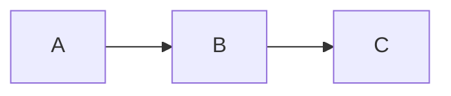

# Obsidian Spec Wiki

Create and manage specification wikis as Obsidian-compatible markdown. Workstreams capture both **what** the system does (specs) and **how** to build it (plans).

## Last-Writer-Wins Source of Truth

Specs and code are **bidirectional**. The most recent authoritative change wins:

| Situation | Action |
|-----------|--------|
| **Docs newer** (DOCS-ahead) | Code must be rewritten to match spec |
| **Code newer** (CODE-ahead) | Spec must be updated to match code |

**Authoritative changes** = behavior decisions (not typos/refactors).

**Per-feature, not global** - different features can have different directions.

**Decision procedure:**
1. Identify the feature/spec
2. Find docs location and code location
3. Check git history for most recent behavior change
4. Tag as DOCS-ahead or CODE-ahead
5. Apply the appropriate action

See [[references/last-writer-wins]] for full model details.

## When to Use

- Creating new project specs or documentation
- Working with existing wikis using `%% [ ] 🙋‍♂️/🤖: %%` task format
- User mentions "wiki", "spec", "workstream", or "Obsidian"
- Need to document behavior for agent-driven code updates

## Wiki Discovery

Check for existing wiki in order:
1. `docs/` - Primary location
2. `docs/wiki/` - Nested variant
3. `wiki/` - Root alternative
4. `.plans/*/` - Legacy support

First match wins. **Always use `docs/` for new wikis.**

## Directory Structure

```
docs/
├── README.md              # Index with workstream table
├── CLAUDE.md              # Symlink → AGENTS.md
├── AGENTS.md              # Actual agent instructions
├── changelog.md           # Keep a Changelog format
├── workstreams/
│   └── NN-name/
│       ├── README.md      # Executive summary + spec/plan tables
│       ├── AGENTS.md      # Optional: workstream-specific agent rules
│       ├── N.N-spec.md    # Behavior specs (what)
│       └── N.N-plan.md    # Implementation plans (how)
├── reference/             # Shared architecture docs
└── research/              # Oracle outputs (frozen)
```

**CLAUDE.md vs AGENTS.md convention:**
- `CLAUDE.md` = **symlink** to `AGENTS.md` (NOT a file containing `@AGENTS.md`)
- `AGENTS.md` = actual agent instructions and wiki operations

**Why symlink?** The `@filename` convention in file contents causes some tools to ignore the file entirely. A symlink ensures CLAUDE.md is always read as the actual AGENTS.md content.

**Key concepts:**
- **Workstreams** = logical functional areas (not temporal phases)
- **Specs** = behavior documents (what the system does)
- **Plans** = implementation documents (how to build it)
- **Research** = Oracle/Delphi outputs (frozen snapshots)

## Core Principles

### 1. Progressive Disclosure

Load only what's needed:

```
User asks about auth → Read workstreams/01-auth/README.md
User asks about login → Read workstreams/01-auth/1.1-login.md
User asks for overview → Read README.md only
```

Load only what each task requires.

### 2. Wiki Links Everywhere

All references use `[[wiki-links]]`. Broken links = sync signal.

```markdown
[[workstreams/01-auth/1.1-login|Login Flow]]
[[reference/architecture#auth-middleware|Auth Middleware]]
```

### 3. Task Tracking with Obsidian Comments

Track open questions using hidden comments with emoji prefixes and block references:

```markdown
%% [ ] 🙋‍♂️: human task or instruction %% ^q-scope-descriptor

%% [ ] 🤖: agent question needing human input %% ^q-scope-question

%% [x] 🤖: resolved → answer here %% ^q-scope-resolved
```

**CRITICAL: Separate each question with a blank line.** Obsidian treats consecutive lines as a single block; only the last block ID works.

**Format components:**
- `🙋‍♂️:` = **human wrote this** → AGENTS SHOULD ACTION/ANSWER
- `🤖:` = **agent wrote this** → AGENTS MUST SKIP (waiting for human)
- `^q-{scope}-{descriptor}` = block ID for Obsidian navigation

**WHO ANSWERS WHAT:**
| Emoji | Who wrote it | Who should answer/action |
|-------|--------------|--------------------------|
| 🙋‍♂️ | Human | **Agent** (this is work for you!) |
| 🤖 | Agent | **Human** (skip this, you asked it) |

**Conversation threading:** Questions can have inline replies. The **LAST emoji** determines whose turn:
```
%% [ ] 🤖: Should we cache? 🙋‍♂️ yes 🤖: what limit? %% ^q-cache
```
Last emoji is 🤖 → Human's turn. When `[x]` → Done.

**Block ID convention:** `^q-{scope}-{descriptor}`
- `^q-auth-oauth` (auth workstream, OAuth question)
- `^q-tabs-persist` (tabs workstream, persistence question)

**Workflow:**
- Agent adds `🤖:` question → human answers (agent skips these)
- Human answers → convert to `🙋‍♂️:` (now actionable by agent) or `[x]` (resolved)
- Human adds `🙋‍♂️:` task → agent should action this
- Resolved format: `%% [x] 🤖: question → answer %% ^q-id`

**Linking to questions:**
```markdown
[[workstreams/01-auth/1.1-login#^q-auth-oauth|OAuth question]]
```

**Search in Obsidian:** Search for the emoji, or create a Dataview index (see references).

**Find via terminal:**
```bash
grep -rn '%% \[ \]' docs/              # all open
grep -rn '🤖:' docs/                   # agent questions
grep -rn '🙋‍♂️:' docs/                  # human tasks
grep -rn '%% \[ \].*%%$' docs/         # missing block IDs
```

**Agent responsibility:** Add block IDs to any question missing one. Generate the ID from the file's workstream/spec and the question topic:
```
%% [ ] 🤖: how to handle OAuth? %%           → missing block ID
%% [ ] 🤖: how to handle OAuth? %% ^q-auth-oauth   → fixed
```

### 4. Changelog Protocol

Log every change in `changelog.md`:

```markdown
## YYYY-MM-DD

### Added
- [[path/to/file]] - Description

### Changed
- [[path/to/file]] - What changed and why
```

## Templates

### Spec File Template

```markdown
# N.N Spec Name

> **Workstream:** [[../README|NN-Workstream-Name]]

## Behavior

### Contract
- **Input:** description
- **Output:** description
- **Preconditions:** what must be true before
- **Postconditions:** what will be true after

### Scenarios
- When X happens → Y should occur
- When edge case → handle gracefully

## Decisions

### Assumptions
1. [Assumption] - [implication if wrong]
2. [Assumption] - [implication if wrong]

### Failure Modes
| Failure | Detection | Recovery |
|---------|-----------|----------|
| [scenario] | [how to detect] | [what to do] |

### ADR-1: Decision Title
- **Status:** Proposed | Accepted | Deprecated | Superseded
- **Context:** Why this decision was needed
- **Decision:** What we decided
- **Consequences:** What happens as a result
- **Alternatives:** What we considered and rejected

### Open Questions

%% [ ] 🤖: Question needing resolution? %% ^q-specname-topic

## Integration

### Dependencies
- [[path/to/spec|Display Name]] - what we need from it

### Consumers
- [[path/to/spec|Display Name]] - what uses us

### Diagram

```

### Plan File Template

```markdown
# N.N Plan Name

> **Workstream:** [[../README|NN-Workstream-Name]]
> **Related Spec:** [[N.N-spec-name]] (optional)

## Goal
What this plan achieves.

## Prerequisites
- [ ] Dependency 1
- [ ] Dependency 2

## Implementation Steps

### Phase 1: [Name]
- [ ] Step 1
- [ ] Step 2

### Phase 2: [Name]
- [ ] Step 3
- [ ] Step 4

## Files to Modify
| File | Changes |
|------|---------|
| `path/to/file` | Description of changes |

## Testing Strategy
How to verify the implementation works.

## Risks & Mitigations
| Risk | Mitigation |
|------|------------|
| [What could go wrong] | [How to prevent/handle] |

## Open Questions

%% [ ] 🤖: Implementation question? %% ^q-planname-topic
```

### Workstream README Template

```markdown
# NN Workstream Name

> Brief description of what this workstream covers.

## Goal
What this workstream achieves.

## Specs

| Spec | Description | Status |
|------|-------------|--------|
| [[N.1-spec-name]] | Brief description | Status |
| [[N.2-spec-name]] | Brief description | Status |

## Plans

| Plan | Description | Status |
|------|-------------|--------|
| [[N.1-plan-name]] | Implementation approach | Status |

## Shared Decisions

ADRs that apply to all specs in this workstream:
- **Decision:** Brief summary

## Integration Points

This workstream connects to:
- [[../other-workstream/README|Other Workstream]] - how
```

### CLAUDE.md Setup (Symlink)

CLAUDE.md should be a **symlink** to AGENTS.md, not a file with content:

```bash
# From within docs/ directory
ln -s AGENTS.md CLAUDE.md
```

This ensures CLAUDE.md and AGENTS.md always have identical content. All actual instructions go in AGENTS.md.

### AGENTS.md Template

Agent instructions belong here:

```markdown
# Agent Instructions: [Project Name]

[Project-specific rules here...]

---

## Wiki Operations

**IMPORTANT:** When working with this wiki, use the `obsidian-plan-wiki` skill if available. It provides the full spec format, LWW source-of-truth model, and workflow patterns.

This documentation uses Obsidian vault format. Follow these patterns.

### Last-Writer-Wins Source of Truth

Specs and code flip source-of-truth based on which changed last:
- **DOCS-ahead** (spec newer) → update code to match spec
- **CODE-ahead** (code newer) → update spec to match code

Check git history to determine direction. Per-feature, not global.

### Progressive Disclosure

**Don't load everything.** Navigate in layers:

1. **Start at workstream README** - `workstreams/##-name/README.md`
   - Understand scope and current status
   - See which specs exist

2. **Read specific specs as needed** - `workstreams/##-name/#.#-spec.md`
   - Load only the spec you're implementing
   - Check "Integration" section for related specs

3. **Dive into reference docs for deep context** - `reference/` or `workstreams/##-name/reference/`

4. **Check research for background** - `research/topic/`

### Open Questions System

See [[reference/obsidian-open-questions-system]] for full spec.

**WHO ANSWERS WHAT:**
| Emoji | Who wrote it | Who should answer/action |
|-------|--------------|--------------------------|
| 🙋‍♂️ | Human | **Agent** (this is work for you!) |
| 🤖 | Agent | **Human** (skip this, you asked it) |

### Updating Specs

**Before:** Read Assumptions and Failure Modes
**During:** Mark `🙋‍♂️:` questions resolved, note discoveries
**After:** Update Success Criteria checkboxes, update README status

### Link Format

| Target | Format |
|--------|--------|
| Same directory | `[text](filename.md)` |
| Parent | `[text](../README.md)` |
| Cross-workstream | `[text](../06-name/README.md)` |
```

### Root README Template

```markdown
# Project Wiki

> **For Claude:** Start here. Read workstream READMEs for context, then specific specs as needed.

## Workstreams

| # | Workstream | Description |
|---|------------|-------------|
| 01 | [[workstreams/01-name/README\|Name]] | Description |

## Quick Links

- [[AGENTS]] - Rules for agents
- [[changelog]] - What changed and when
- [[reference/architecture]] - System overview

## Research

Oracle/Delphi outputs (frozen snapshots):
- [[research/topic]] - Description
```

## Workflow Patterns

### Creating a New Wiki

1. Create `docs/` directory structure
2. Write README.md with workstream table
3. Create AGENTS.md with actual agent instructions
4. Create CLAUDE.md as a symlink: `ln -s AGENTS.md CLAUDE.md`
5. Initialize changelog.md
6. Create workstream folders with README.md
7. Add specs as needed

### Adding a Spec

1. Create `N.N-spec-name.md` in workstream folder
2. Fill in Behavior (contract + scenarios)
3. Document Decisions (ADRs)
4. Map Integration (dependencies + consumers with wiki links)
5. Update workstream README table
6. Add to changelog

### Adding a Plan

1. Create `N.N-plan-name.md` in workstream folder
2. Link to related spec if one exists
3. Fill in Implementation Steps with checkboxes
4. List Files to Modify
5. Document Risks & Mitigations
6. Update workstream README plans table
7. Add to changelog

### Research Workflow

When a `%% [ ] 🙋‍♂️/🤖: %%` needs research:

**Simple question:** Launch oracle agent
**Complex/uncertain:** Use Delphi (3 parallel oracles + synthesis)

Store results in `research/`, link from spec:
```markdown
%% [x] question → see [[research/topic]] %%
```

### Syncing Specs and Code (LWW in Practice)

**DOCS-ahead: Update code from spec**
1. Agent reads the spec's Behavior section (contract + scenarios)
2. Agent reads the Integration section (what it touches)
3. Agent implements/updates code to match spec
4. Agent marks spec as implemented, updates changelog

**CODE-ahead: Update spec from code**
1. Agent reads the implementation code
2. Agent identifies behavior that differs from spec (or isn't documented)
3. Agent updates spec to match actual code behavior
4. Agent updates changelog with spec sync

**Determining direction:**
```bash
# Find last behavior change in spec
git log -1 --format='%ci' -- docs/workstreams/NN-feature/

# Find last behavior change in code
git log -1 --format='%ci' -- src/feature/
```
Compare dates. Newer wins.

### Updating Specs During Implementation

**Before:** Read the spec's Assumptions and Failure Modes.

**During implementation:**
- Add implementation notes to the spec
- Mark open questions as resolved: `%% [x] Decided → [outcome] %%`
- Note any discovered failure modes

**After completing:**
- Update Success Criteria checkboxes
- Add commit hash if significant
- Update workstream README status if needed

## Link Format

Use relative markdown links (Obsidian-compatible):

| Target | Link Format |
|--------|-------------|
| Same directory | `[text](filename.md)` |
| Parent directory | `[text](../README.md)` |
| Subdirectory | `[text](reference/file.md)` |
| Cross-workstream | `[text](../06-context-menu/README.md)` |
| Heading anchor | `[text](file.md#section-name)` |

## When to Create New Documentation

| Situation | Action |
|-----------|--------|
| New feature area | Create new workstream directory |
| New behavior to document | Create numbered spec file (`N.N-spec.md`) |
| New implementation approach | Create numbered plan file (`N.N-plan.md`) |
| Deep technical topic | Add to `reference/` subdirectory |
| Research question | Use Oracle, save to `research/` |
| Workstream-specific rules | Create `AGENTS.md` in workstream |

## Best Practices

1. **Specs describe behavior** - What it does (contract, scenarios)
2. **Plans describe implementation** - How to build it (steps, files, risks)
3. **All references are wiki links** - Broken links signal sync issues
4. **Update changelog immediately** - Don't batch changes
5. **One spec per feature/component** - Keep focused
6. **Research before deciding** - Use oracles for uncertain questions
7. **Optional AGENTS.md per workstream** - For scoped agent rules
8. **CLAUDE.md is a symlink** - Points to AGENTS.md via symlink
