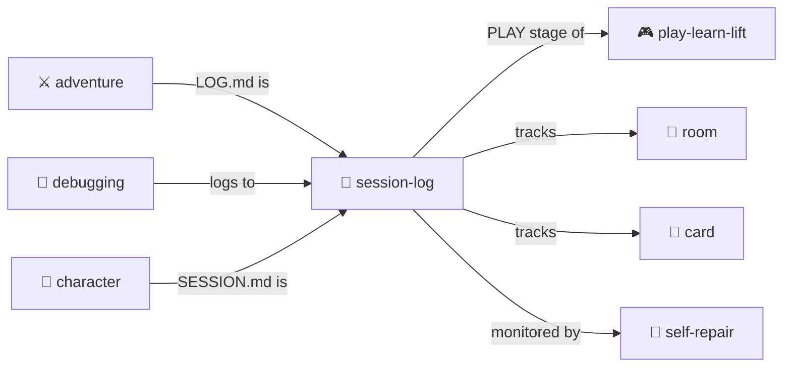

# Session Log

> **Human-readable markdown logs that tell stories.**

Session logs are **living documents** that capture the narrative of play. Unlike technical event logs, sessions are meant to be READ — by users, by future LLMs warming context, by anyone who wants to understand what happened.

> [!IMPORTANT]
> Session logs are **NOT append-only!** They are living documents that grow and improve over time. You can and should retroactively improve them as new information comes in.

---

## 📍 Where Sessions Live

The default session file is **`SESSION.md`** in the character directory:

```
characters/
├── real-people/don-hopkins/
│   ├── CHARACTER.yml
│   └── SESSION.md          ← Default session log
├── fictional/donna-toadstool/
│   ├── CHARACTER.yml
│   └── SESSION.md          ← Default session log
└── animals/palm/
    ├── CHARACTER.yml
    └── SESSION.md          ← Default session log
```

### Naming Sessions

You can create multiple session files with descriptive suffixes:

| Session File | Purpose |
|--------------|---------|
| `SESSION.md` | Default — the main session log |
| `SESSION-day1-exploration.md` | Specific day or theme |
| `SESSION-fluxx-marathon.md` | Named adventure arc |
| `SESSION-debug-investigation.md` | Debugging session |

**Command:** `START SESSION [name]` — Creates a new session file with optional suffix.

---

## 📝 Writing Good Sessions

### The Golden Rule

**Sessions are meant to be read by humans.** Write them like stories, not logs.

### Structure with Outlines

Use `<details>` tags to create **collapsible sections** that:
- Show narrative meant to be read (opened)
- Hide technical data and debugging (closed)
- Group related content into logical sections
- Allow readers to drill down on demand

```markdown
<details open>
<summary><h2>🌟 Chapter Title — Descriptive Subtitle</h2></summary>

The narrative content goes here. This is what readers see first.

<details>
<summary>📂 <strong>Technical details: What the YAML changes looked like</strong></summary>

```yaml
# The YAML data island
state_change:
  file: ./CHARACTER.yml
  changes: [location, inventory]
```

</details>

</details>
```

### Outline Patterns

| Pattern | When to Use | State |
|---------|-------------|-------|
| `<details open>` | Narrative chapters — always show | **Open** |
| `<details>` | Technical details — hide by default | **Closed** |
| Nested `<details>` | Data within narrative | Mixed |

### The Summary Line

The `<summary>` is part of the narrative! Write it as a headline:

```markdown
<!-- BAD: Generic summaries -->
<summary>Turn 5</summary>
<summary>File operations</summary>

<!-- GOOD: Descriptive headlines -->
<summary><h2>🌟 Turn 5: The Wish is Spoken — Palm's Incarnation</h2></summary>
<summary>📂 <strong>File creation: CHARACTER.yml with 32 Mind Mirror dimensions</strong></summary>
```

### Use Emojis in Section Headers

Add emojis **after the folder icon** for narrative sections:

| Emoji | Meaning |
|-------|---------|
| 📂 | Technical/collapsed section |
| 🌟 | Major milestone |
| 🎭 | Character transformation |
| 🗺️ | Exploration/travel |
| 💬 | Dialogue/conversation |
| 🎰 | Games/randomness |
| 🐕 🐱 🐵 | Animal character sections |
| ⚡ | Speed-of-light simulation |

---

## 📊 Session Index

**Keep an index at the top of every session!** Update it retroactively as you append.

```markdown
<details open>
<summary><h2>⭐ Session Highlights & Index</h2></summary>

### 📚 Session Index (Internal Links)

**Day 1 — The Wish**
- [🌿 LOOK AROUND](#-look-around) — First impressions
- [Turn 1: Talk to Marieke](#turn-1-talk-to-marieke) — Lucky strains
- [Turn 7: THE WISH IS SPOKEN](#turn-7-the-wish-is-spoken) — 🌟 Palm's incarnation

**Day 2 — The Fluxx Marathon**
- [🎰 33 Turns of Gezelligheid](#33-turns-of-gezelligheid) — Speed of Light demo

### 🏠 Key Locations (External Links)

| Location | Description |
|----------|-------------|
| [Palm's Nook](../../../pub/stage/palm-nook/) | The monkey's home |
| [The Pub](../../../pub/) | Main location |

</details>
```

### Index Rules

1. **Internal links** use anchor syntax: `[Title](#anchor-name)`
2. **External links** use relative paths: `[File](../../../path/file.yml)`
3. **Update retroactively** — every append is a chance to improve the index
4. **Group by day/arc** — natural narrative divisions

---

## 🔗 Linking Generously

**Links draw people into the repo!** Every file, character, room, and skill mentioned should be a link.

### Link Everything

```markdown
<!-- BAD: No links -->
Palm wrote an essay about being a monkey.

<!-- GOOD: Link everything -->
[Palm](../../animals/palm/) wrote an essay 
([palm-on-being-palm.md](../../../pub/stage/palm-nook/study/palm-on-being-palm.md)) 
about being a monkey.
```

### Use Tables for Related Files

```markdown
### Files Created

| File | Description |
|------|-------------|
| [CHARACTER.yml](./CHARACTER.yml) | Soul file |
| [APPEARANCE.yml](./APPEARANCE.yml) | Physical description |
| [→ Full directory](../../animals/palm/) | Complete character |

### Related Skills

| Skill | Purpose |
|-------|---------|
| [incarnation]($SKILLS/incarnation/) | Character creation protocol |
| [speed-of-light]($SKILLS/speed-of-light/) | Multi-agent simulation |
```

> **Path variables in YAML vs Markdown:** Use `$SKILLS/` in YAML files (runtime resolution).
> Use relative paths in Markdown for GitHub rendering.

---

## 📈 Tables Tell Stories

Tables are excellent for:
- **Summarizing actions** — turns, outcomes, stats
- **Showing state** — inventories, relationships, locations
- **Listing files** — what was created, edited, linked
- **Character rosters** — who's present, their status

```markdown
## Current Status

| Character | Location | Status |
|-----------|----------|--------|
| [Don](../../real-people/don-hopkins/) | pub/ | Active |
| [Palm](../../animals/palm/) | stage/palm-nook/ | Writing |
| [Biscuit](../../animals/biscuit/) | following Don | WIGGLING |

## Session Statistics

| Metric | Value |
|--------|-------|
| Turns | 33 |
| NPCs encountered | 15 |
| Relationships formed | 12 |
| Gold spent | 31 |
```

### Fold Large Tables

```markdown
<details>
<summary>📂 <strong>Full inventory (47 items)</strong></summary>

| Item | Location | Value |
|------|----------|-------|
| ... | ... | ... |

</details>
```

---

## 🔄 Retroactive Improvement

**Sessions are living documents.** Every time you append:

1. **Update the index** — add new sections, fix anchors
2. **Add missing links** — file paths, character names
3. **Improve summaries** — make them more descriptive
4. **Fill in context** — as you learn more, annotate earlier sections
5. **Fix broken links** — paths change as files move

### Ninja Edits

Small retroactive improvements are encouraged:
- Correcting typos
- Adding links to newly-created files
- Improving section summaries
- Updating the index

---

## 📋 YAML Data Islands

Embed structured data in fenced code blocks for machine readability:

```markdown
<details>
<summary>📂 <strong>State change: Moving player from start/ to coatroom/</strong></summary>

```yaml
state_change:
  file: ./CHARACTER.yml
  changes:
    player.location: "coatroom/"  # Was: "start/"
    
  file: ../../../ADVENTURE.yml
  changes:
    player.location: "coatroom/"  # Mirror update
```

</details>
```

### Data Island Best Practices

| Practice | Reason |
|----------|--------|
| Use `# comments` | Explain the WHY, not just WHAT |
| Abbreviate long data | Show structure, not everything |
| Include file paths | Link to actual files |
| Explain relationships | "Mirror update", "Canonical source" |

---

## 🆚 Session Logs vs Event Logs

| Session Logs (SESSION.md) | Event Logs (events.yml) |
|---------------------------|-------------------------|
| **Human readable** | Machine readable |
| **Narrative style** | Structured data |
| Living document (editable) | Append-only |
| Collapsible outlines | YAML events |
| For reading | For debugging/audit |
| In character directories | In `.agent/` or adventure root |

**Create event logs** for:
- Technical debugging
- Append-only audit trails
- Machine-parseable history

**Create session logs** for:
- User-facing narrative
- GitHub browsing
- Context warming
- Storytelling

---

## 🌟 Examples: Gold Standard Sessions

These sessions demonstrate best practices:

### Don Hopkins' Marathon Session

[**examples/adventure-4/characters/real-people/don-hopkins/sessions/marathon-session.md**](../../examples/adventure-4/characters/real-people/don-hopkins/sessions/marathon-session.md)

7000+ lines spanning 5 days of adventure. Demonstrates:
- Extensive use of collapsible sections
- Comprehensive index at top
- Generous linking to files and skills
- Tables for menus, stats, and rosters
- Speed-of-light simulation transcripts
- Technical details hidden in collapsed sections

### Donna Toadstool's Session

[**examples/adventure-4/characters/fictional/donna-toadstool/SESSION.md**](../../examples/adventure-4/characters/fictional/donna-toadstool/SESSION.md)

Complete character creation narrative. Demonstrates:
- Table of contents with parts
- Character transformation documentation
- File operation explanations
- Appendix with technical reference
- Clear separation of narrative and data

---

## 🎯 Quick Reference

### Starting a New Section

```markdown
---

<details open>
<summary><h2>🌟 Turn N: Title — Descriptive Subtitle</h2></summary>

Narrative description of what happened.

<details>
<summary>📂 <strong>Technical: What changed under the hood</strong></summary>

```yaml
changes:
  - file: path/to/file.yml
    field: value
```

</details>

</details>
```

### Checklist for Every Append

- [ ] Updated index at top with new section
- [ ] Added links to all mentioned files
- [ ] Linked character names to their directories
- [ ] Used collapsible sections appropriately
- [ ] Wrote descriptive summary lines
- [ ] Included relevant tables
- [ ] Fixed any broken links noticed

---

## The Intertwingularity

Session-log is the PLAY stage of [play-learn-lift](../play-learn-lift/) — capture everything.



---

## Dovetails With

### Sister Skills

| Skill | Relationship |
|-------|--------------|
| [character/](../character/) | Session files live in character directories |
| [adventure/](../adventure/) | Adventure LOG.md follows session-log patterns |
| [play-learn-lift/](../play-learn-lift/) | Session-log is the PLAY capture stage |
| [summarize/](../summarize/) | Compress session-log when too long |
| [self-repair/](../self-repair/) | Monitors session-log integrity |
| [debugging/](../debugging/) | Debug sessions log here |

### Protocol Symbols

| Symbol | Link |
|--------|------|
| `SESSION-LOG` | [PROTOCOLS.yml](../../PROTOCOLS.yml#SESSION-LOG) |
| `NARRATIVE-FIRST` | Write for humans |
| `LINK-GENEROUSLY` | Every file is a link |

### Kernel

- [kernel/event-logging-protocol.md](../../kernel/event-logging-protocol.md) — Technical event format
- [schemas/event-schema.yml](../../schemas/event-schema.yml) — YAML block schema

### Navigation

| Direction | Destination |
|-----------|-------------|
| ⬆️ Up | [skills/](../) |
| ⬆️⬆️ Root | [Project Root](../../) |
| 🎮 Sister | [play-learn-lift/](../play-learn-lift/) |
| 👤 Sister | [character/](../character/) |
