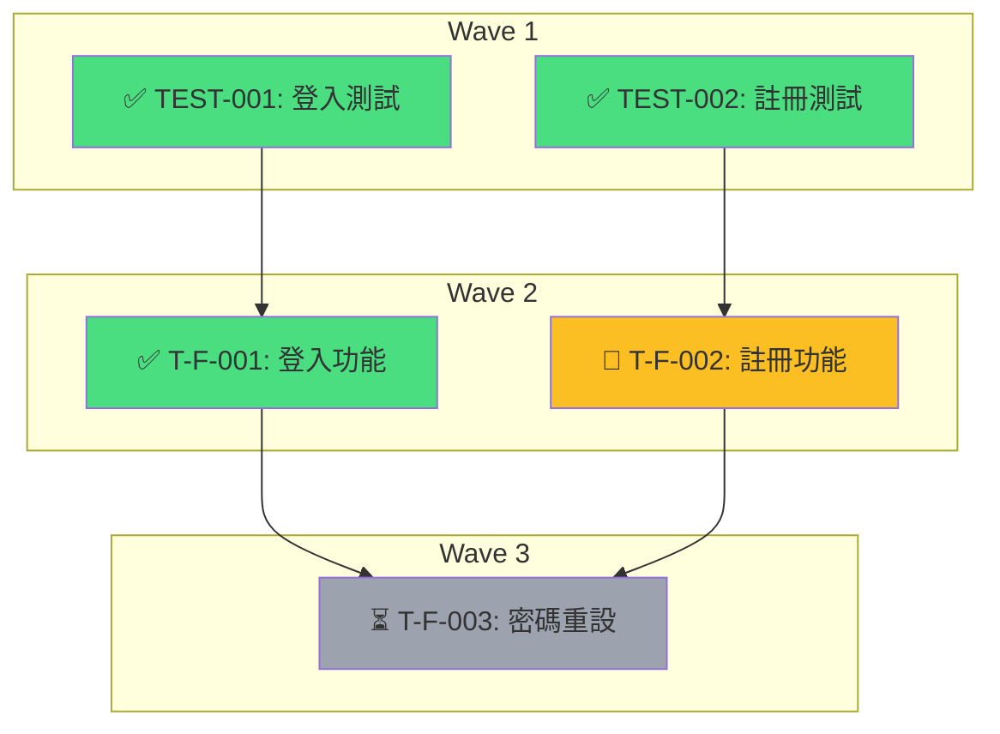

# Multi-Agent Status v1.0.0

> 即時查看工作流執行進度與統計

## 使用方式

```bash
/status                    # 顯示當前工作流狀態
/status [workflow-id]      # 顯示特定工作流狀態
/status --list             # 列出所有工作流歷史
/status --dag              # 顯示任務依賴 DAG 圖
```

**Flags**: `--list` | `--dag` | `--json` | `--html` | `-o <file>`

## 輸出格式

### 終端輸出（預設）

```
╭──────────────────────────────────────────────────────────╮
│  🎯 user-auth-feature                                    │
│  狀態: 執行中 | 品質: 82/100                              │
╰──────────────────────────────────────────────────────────╯

進度: [████████████░░░░░░] 65%

RESEARCH ✅ → PLAN ✅ → TASKS ✅ → IMPLEMENT 🔄 → REVIEW ⏳ → VERIFY ⏳
                                    ↑
                                 當前階段

┌─────────────┬─────────────┬─────────────┬─────────────┐
│ TDD 守護者  │ 安全審計員  │ 效能優化師  │ 維護性專家  │
│     ✅      │     🔄      │     ⏳      │     ⏳      │
└─────────────┴─────────────┴─────────────┴─────────────┘

任務進度: 3/5 完成
├── ✅ TEST-001: 登入功能測試
├── ✅ T-F-001: 實作登入功能
├── 🔄 T-F-002: 實作註冊功能
└── ⏳ T-F-003: 實作密碼重設

Memory: .claude/memory/implement/user-auth/
```

### 其他格式

| 格式 | 說明 | 範例 |
|------|------|------|
| `--json` | 程式化處理 | `/status --json` |
| `--markdown` | Markdown + Mermaid | `/status -o report.md` |
| `--html` | 互動式 Dashboard | `/status --html -o dashboard.html` |

## 執行方式

執行底層 CLI 工具：

```bash
python shared/tools/workflow-status.py {args}
```

將輸出直接展示給用戶。

### 參數對應

| Skill 參數 | CLI 參數 |
|-----------|----------|
| `/status` | `python workflow-status.py` |
| `/status user-auth` | `python workflow-status.py --id user-auth` |
| `/status --list` | `python workflow-status.py --list` |
| `/status --dag` | `python workflow-status.py --dag` |
| `/status --json` | `python workflow-status.py --json` |
| `/status --html -o dash.html` | `python workflow-status.py --html -o dash.html` |

## 工作流歷史

`/status --list` 顯示所有工作流歷史：

```
╭──────────────────────────────────────────────────────────╮
│  📋 工作流歷史                                           │
╰──────────────────────────────────────────────────────────╯

最近 5 個工作流：

│ ID                  │ 任務            │ 狀態    │ 品質  │ 日期       │
├─────────────────────┼─────────────────┼─────────┼───────┼────────────┤
│ user-auth-feature   │ 用戶認證功能    │ 🔄執行中│ 82    │ 2026-01-26 │
│ api-refactor        │ API 重構        │ ✅完成  │ 91    │ 2026-01-25 │

統計：
  總計: 12 | 完成: 9 | 失敗: 2 | 執行中: 1
  平均品質分數: 84.5
```

## 任務 DAG 可視化

`/status --dag` 生成 Mermaid 任務依賴圖：



## 狀態圖示

| 圖示 | 狀態 | 說明 |
|------|------|------|
| ⏳ | pending | 等待執行 |
| 🔄 | running | 執行中 |
| ✅ | completed | 成功完成 |
| ❌ | failed | 執行失敗 |
| ⏭️ | skipped | 已跳過 |

## 進度計算

```yaml
stage_weights:
  RESEARCH: 0.15
  PLAN: 0.15
  TASKS: 0.10
  IMPLEMENT: 0.35
  REVIEW: 0.15
  VERIFY: 0.10

# 公式: progress = sum(weight * stage_completion)
```

## 輸出位置

狀態資訊來源：

```
.claude/memory/
├── workflows/[id]/meta.yaml     # 完整工作流
├── research/[id]/meta.yaml      # 研究階段
├── plans/[id]/meta.yaml         # 計劃階段
├── tasks/[id]/tasks.yaml        # 任務定義
└── implement/[id]/meta.yaml     # 實作階段
```

## 相關模組

| 模組 | 用途 |
|------|------|
| [workflow-status.py](../../shared/tools/workflow-status.py) | CLI 核心工具 |
| [dag-validator.py](../../shared/tools/dag-validator.py) | DAG 驗證 + Mermaid |
| [display.md](../../shared/progress/display.md) | 進度顯示規範 |
