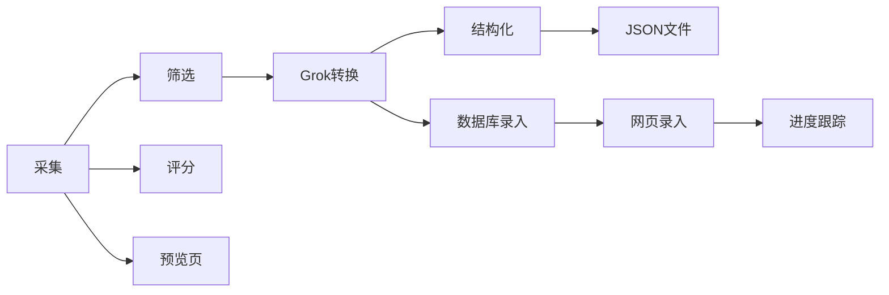

# Twitter 完整工作流

Twitter 数据从采集到数据库的完整自动化流程。

## 使用场景

当你需要从 Twitter 采集数据，经过人工筛选，转换为结构化数据并录入数据库时使用。

## 工作流程

```
1. 采集链接（twitter-collector）
     ↓
2. 人工筛选（预览页）
     ↓
3. Grok 转换（grok-json-generator）
     ↓
4. 数据库录入（db-importer）
```

## 快速开始

### 完整流程

```bash
# 一键执行所有阶段
node scripts/workflow.js --stage all --preset nano-banana-pro

# 只采集 + 筛选
node scripts/workflow.js --stage collector --preset nano-banana-pro

# 只 Grok 转换
node scripts/workflow.js --stage grok --input-file /Users/douba/twitter-output/twitter-links-2026-01-13.txt

# 只数据库录入
node scripts/workflow.js --stage import --input-file /Users/douba/twitter-output/grok-data-2026-01-13.json
```

### 分阶段执行

```bash
# 第一阶段：采集
node scripts/workflow.js --stage collector --preset nano-banana-pro

# 第二阶段：打开预览页
node scripts/workflow.js --stage collector --output preview

# 第三阶段：Grok 转换
node scripts/workflow.js --stage grok --links "https://x.com/link1 https://x.com/link2"

# 第四阶段：数据库录入
node scripts/workflow.js --stage import --input-file /Users/douba/twitter-output/grok-data-2026-01-13.json

# 第五阶段：断点续跑（从第 10 条开始）
node scripts/workflow.js --stage import --start-index 10
```

## 可用参数

| 参数 | 说明 | 默认值 | 示例 |
|------|--------|---------|--------|
| `--stage` | 执行阶段 | all | all, collector, grok, import |
| `--preset` | 采集预设 | nano-banana-pro | nano-banana-pro |
| `--links` | 链接列表 | - | "https://x.com/link1 https://x.com/link2" |
| `--input-file` | 输入文件路径 | - | /Users/douba/twitter-output/grok-data.json |
| `--start-index` | 起始索引 | 0 | 10 |

## 传递参数

不同阶段的参数会传递到对应的技能：

### collector 阶段

```
--preset <预设>
--output <输出格式>
--score-keywords <评分关键词>
--min-score <最低评分>
--filter-url <筛选页 URL>
--output-dir <输出目录>
```

### grok 阶段

```
--links <链接列表>
--input-file <文件>
--grok-url <Grok URL>
--prompt <提示词>
--batch-size <批大小>
--output-dir <输出目录>
--browser <浏览器端口>
```

### import 阶段

```
--input-file <JSON 文件>
--start-index <起始索引>
--batch-size <批大小>
--delay <延迟时间>
--output-dir <输出目录>
--browser <浏览器端口>
```

## 输出示例

```
🔄 Twitter 完整工作流启动...

📊 执行阶段: all
🔍 采集预设: nano-banana-pro

📋 阶段 1: 采集
🔍 搜索参数: (#NanoBananaPro OR #NanoBanana OR "Nano Banana" OR "prompt") AND -female -woman -hair -GEMINIFOURTH
📊 最大采集: 100 条
✅ 采集完成
📁 预览页: /Users/douba/twitter-output/twitter-preview-2026-01-13.html

📋 阶段 2: Grok 转换
🔗 输入文件: /Users/douba/twitter-output/twitter-links-2026-01-13.txt
✅ Grok 转换完成
📁 数据文件: /Users/douba/twitter-output/grok-data-2026-01-13.json

📋 阶段 3: 数据库录入
🔗 输入文件: /Users/douba/twitter-output/grok-data-2026-01-13.json
📤 正在录入: 1/10, 2/10, 3/10...
✅ 录入完成
📁 进度文件: /Users/douba/twitter-output/importer-progress.json

🎉 全流程执行完成！
```

## 技术架构

### 技能组合

本技能组合了以下独立技能：

1. **twitter-collector**：采集链接 + 评分 + 可视化预览
2. **grok-json-generator**：Grok 转换
3. **db-importer**：数据库录入
4. **twitter-workflow**：工作流编排

### 数据流转



### 目录结构

```
twitter-workflow/
├── scripts/
│   └── workflow.js       # 主流程编排脚本
└── skill.md              # 本技能说明

grok-json-generator/
├── scripts/
│   └── rok-generator.js  # Grok 转换脚本
└── README.md              # Grok 转换说明

db-importer/
├── scripts/
│   └── importer.js        # 数据库录入脚本
└── README.md              # 数据库录入说明

twitter-collector/
├── scripts/
│   └── collector.js       # 采集脚本
├── README.md              # 采集技能说明

twitter-output/
├── twitter-links-*.txt      # 链接文件
├── twitter-preview-*.html    # 预览页
├── grok-data-*.json         # Grok 数据文件
└── importer-progress.json  # 进度文件
```

## 状态管理

每个阶段完成后更新状态：

```json
{
  "workflow_stage": "collector",
  "completed_at": "2026-01-13T10:00:00Z",
  "outputs": {
    "links_file": "twitter-links-2026-01-13.txt",
    "preview_file": "twitter-preview-2026-01-13.html",
    "grok_file": "grok-data-2026-01-13.json",
    "import_status": "pending"
  }
}
```

## 使用技巧

### 1. 快速验证

每完成一个阶段后，立即验证输出：

```bash
# 检查采集的链接
cat /Users/douba/twitter-output/twitter-links-2026-01-13.txt

# 检查预览页
open /Users/douba/twitter-output/twitter-preview-2026-06-13.html

# 检查 Grok 数据
cat /   /Users/douba/twitter-output/grok-data-2026-06-13.json
```

### 2. 断点续跑

如果在数据库录入阶段中断：

```bash
# 从第 30 条继续
node scripts/workflow.js --stage import --start-index 30
```

### 3. 灵活调整

根据不同情况灵活调整参数：

```bash
# 采集更多数据
node scripts/workflow.js --stage collector --preset nano-banana-pro --max-tweets 200

# 减少批大小以提高成功率
node scripts/workflow.js --stage import --batch-size 5

# 增加延迟以避免限流
node scripts/workflow.js --stage import --delay 3000
```

### 4. 监控进度

实时查看各阶段状态：

```bash
# 检查工作流状态
cat /Users/douba/twitter-output/workflow-status.json

# 检查数据库录入进度
cat /Users/douba/twitter-output/importer-progress.json
```

## 故障排查

### 采集阶段

- 搜索无结果：调整关键词或时间范围
- 浏览器连接失败：检查 Chrome 是否在指定端口运行

### Grok 转换阶段

- JSON 未生成：检查 Grok 页面是否正常响应
- 解析失败：检查提示词是否合理

### 数据库录入阶段

- 录入失败：检查网络和网页状态
- 进度卡住：尝试减少批大小或增加延迟
- 超时：检查浏览器连接状态

## 下一步

录入完成后，数据已在你的数据库中，可以进行后续的筛选和分析工作。
