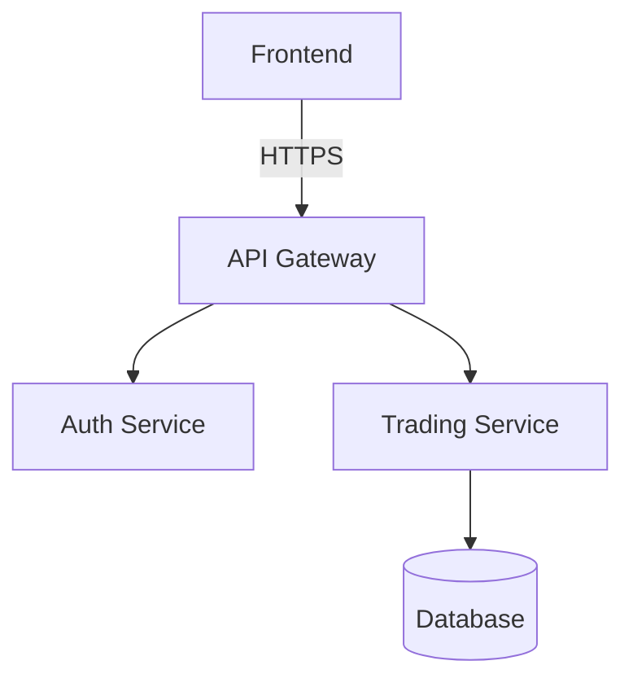

# 📝 문서화 스위트 (Dev Doc Suite)

이 워크플로우는 `dev-doc-suite` 스킬을 사용하여 프로젝트 문서를 코드는 항상 '진실(Truth)'이라는 원칙 하에 최신 상태로 유지합니다.

## 1. 초기화 (Initialization)

1.  **스킬 로드**: `this document`를 읽어 문서화 원칙(Core Principles)을 파악합니다.
2.  **대상 확인**: 사용자에게 문서화할 대상(전체 프로젝트, 특정 모듈, 또는 특정 파일)을 묻습니다.

## 2. 분석 (Analysis - Phase 1)

**"코드가 곧 문서의 원천입니다."**

1.  **구조 파악**: 대상 경로에 대해 `list_dir`를 수행하여 파일 구조를 파악합니다.
2.  **내용 스캔**: 주요 파일(진입점, 핵심 모듈)에 대해 `view_file_outline` 또는 `read_file`을 사용하여 클래스, 함수 시그니처, 독스트링(Docstring)을 추출합니다.
3.  **의존성 분석**: 주요 파일들이 서로 어떻게 연결되어 있는지 파악합니다.

## 3. 작성 (Drafting - Phase 2)

**"독자를 먼저 생각하세요 (개발자 vs 사용자)."**

1.  **초안 작성**: 분석된 내용을 바탕으로 문서 유형을 선택하여 작성합니다. (SKILL.md 참조)
    *   **Code Docs (Docstrings)**: 함수/클래스 단위의 상세 설명 (Python/JS).
    *   **API Docs**: REST API 엔드포인트 명세 (Request/Response).
    *   **Architecture**: Mermaid 다이어그램을 포함한 시스템 구조도.
    *   **README**: 프로젝트 목적, 설치, 사용법을 포함한 대문.
    *   **Explanations**: 복잡한 비즈니스 로직에 대한 "How it works" 심층 해설.
2.  **포맷팅 적용**: `SKILL.md`의 "Standardized Format"에 따라 마크다운을 정돈합니다.

## 4. 검증 및 완료 (Verification - Phase 3)

1.  **정합성 확인**: 작성된 설명이 실제 코드 동작과 일치하는지 재확인합니다.
2.  **저장**: `docs/` 디렉토리 또는 해당 파일 위치(README.md 등)에 문서를 저장합니다.
3.  **사용자 알림**: `notify_user`를 통해 생성된 문서의 위치와 요약을 알리고 리뷰를 요청합니다.


---

## Standards & Rules

# Documentation Suite (Dev Doc Suite)

## Core Principles
1.  **Code as Truth**: Documentation must always be derived from the actual code implementation, not assumptions.
2.  **Living Documents**: Documentation is NOT a post-mortem artifact; it must evolve with every commit.
3.  **Audience-Centric**: Clearly distinguish between User Docs (Ease of use) and Developer Docs (Implementation details).
4.  **Standardized Format**: Follow the "3-Tier Language Strategy" (Korean for high-level structure, English for technical details).

## Documentation Types & Templates (Source: document-suite-skills)

### 1. Code Documentation (Docstrings)

**Goal:** Clear, comprehensive function/class documentation

**Example Format:**

```python
def function_name(param1: Type, param2: Type) -> ReturnType:
    """
    Brief one-line description.

    Detailed explanation of purpose, behavior, and context.

    Args:
        param1: Description with type and example values
        param2: Description with constraints

    Returns:
        Description of return value and meaning

    Example:
        >>> function_name(example_value1, example_value2)
        expected_output

    Raises:
        ErrorType: When and why this error occurs

    Note:
        Important details, gotchas, performance considerations
    """
```

### 2. API Documentation

**Goal:** Complete API reference for endpoints

**REST API Example:**

```markdown
## Authentication API

### POST /api/auth/login

Authenticate user and return JWT access token.

**Request:**

```json
{
  "email": "user@example.com",
  "password": "SecureP@ss123"
}
```

**Response (200 OK):**

```json
{
  "success": true,
  "data": {
    "accessToken": "eyJhbGciOiJIUzI1NiIsInR5cCI6IkpXVCJ9...",
    "expiresIn": 3600
  }
}
```
```

### 3. Architecture Documentation

**Goal:** Clear system overview and component relationships

**Example:**

```markdown
# System Architecture

## System Diagram



## Core Components

### 1. API Gateway
**Responsibility:** Entry point for all client requests
- Request routing
- Rate limiting

### 2. Auth Service
**Responsibility:** User authentication
- JWT generation
- Session management
```

### 4. README Generation

**Goal:** Comprehensive project README

**Essential Sections:**

```markdown
# [Project Name]

[One-line description] - [What problem it solves]

## Features
- Key feature 1
- Key feature 2

## Installation
\`\`\`bash
npm install
npm run dev
\`\`\`

## Configuration
| Variable | Description | Required |
|----------|-------------|----------|
| `DATABASE_URL` | DB connection string | Yes |
```

### 5. Code Explanations

**Goal:** Clear explanations of complex code

**Process:**
1. **High-Level Purpose**: What problem does this solve?
2. **Step-by-Step Logic**: Break down into phases.
3. **Key Algorithms**: Identify important patterns.
4. **Edge Cases**: validation and error handling.

## Quality Standards
- **Freshness**: All generated docs must be verified against the current codebase state.
- **Completeness**: Every public function/class must have at least a summary description.
- **Readability**: Use clear formatting, bullet points, and code blocks.
- **Safe YAML**: Frontmatter descriptions with special characters must be quoted.

## Checklist
- [ ] **Analysis**: Did you read all relevant code files before writing?
- [ ] **Verification**: Does the documentation accurately reflect the code behavior?
- [ ] **Formatting**: Is the markdown syntax correct and consistent?
- [ ] **Language**: Is the appropriate language (Korean/English) used for the target audience?
