# Diagramming

## Overview

Create clear, maintainable technical diagrams using Mermaid syntax. This skill covers architecture diagrams, sequence diagrams, entity-relationship diagrams, flowcharts, and state diagrams for documenting software systems.

## Instructions

### 1. Choose the Right Diagram Type

| Diagram Type    | Use When                                |
| --------------- | --------------------------------------- |
| Architecture/C4 | Showing system structure and components |
| Sequence        | Showing interactions over time          |
| ERD             | Showing data models and relationships   |
| Flowchart       | Showing decision logic and processes    |
| State           | Showing state transitions               |

### 2. General Mermaid Principles

- Keep diagrams focused on one concept
- Use consistent naming conventions
- Add descriptive labels to relationships
- Limit complexity (split large diagrams)
- Use comments for documentation

## Best Practices

- **Simplicity**: One diagram, one concept
- **Consistency**: Same naming across related diagrams
- **Readability**: Left-to-right or top-to-bottom flow
- **Labels**: Always label relationships and transitions
- **Context**: Include a title and brief description

## Examples

### Architecture Diagrams (C4 Model)

#### Context Diagram (Level 1)

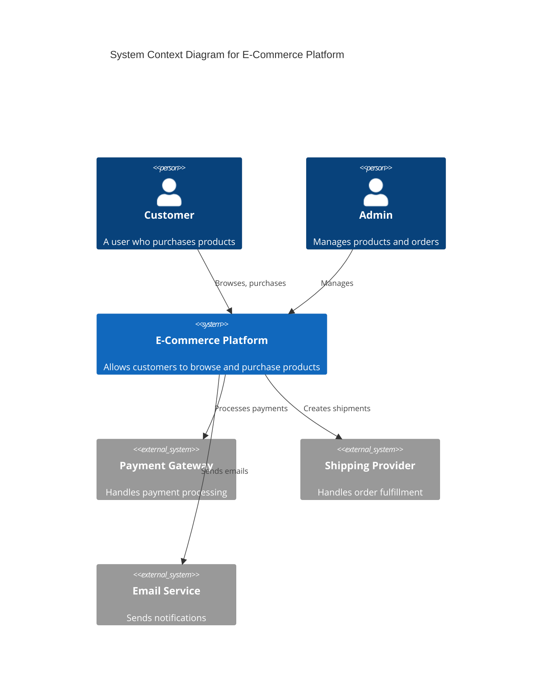

#### Container Diagram (Level 2)

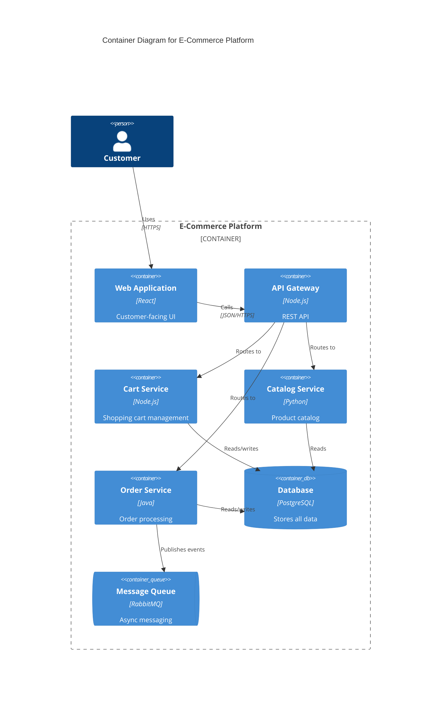

#### Component Diagram (Level 3)

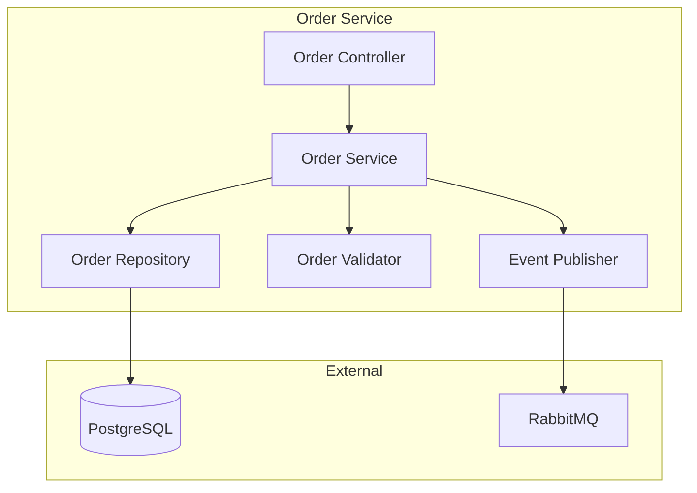

### Sequence Diagrams

#### Basic Request Flow

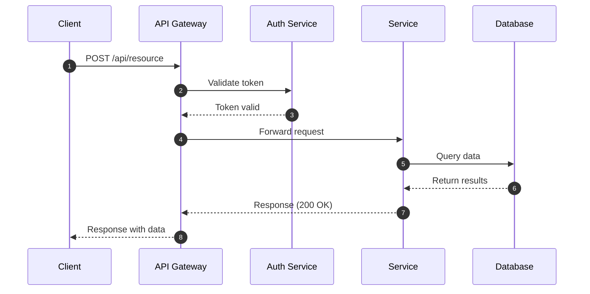

#### Error Handling Flow

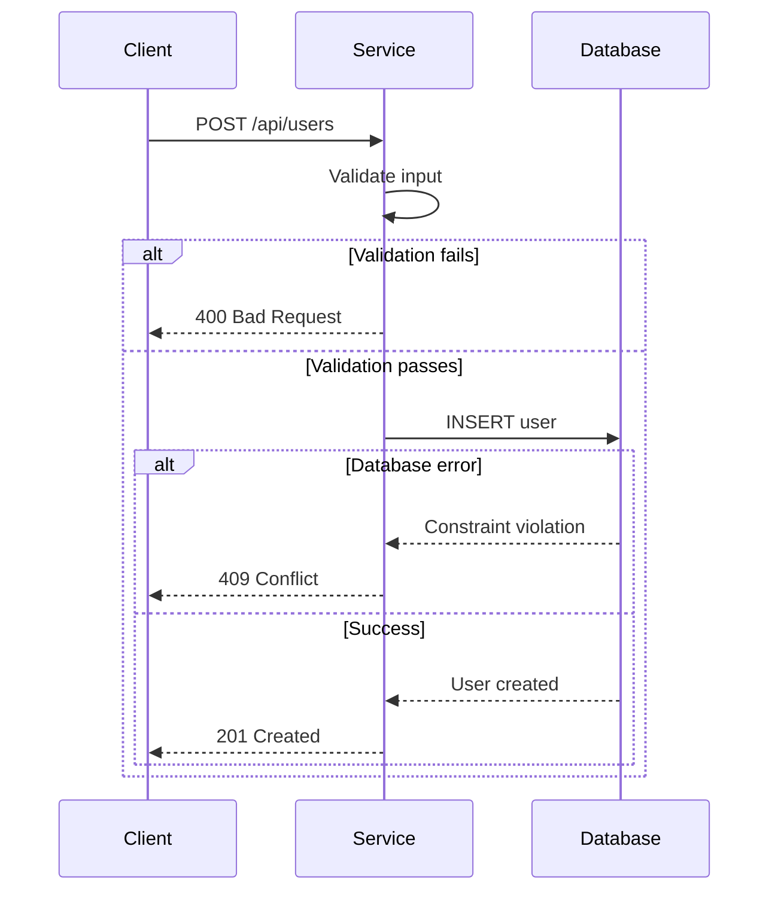

#### Async Processing

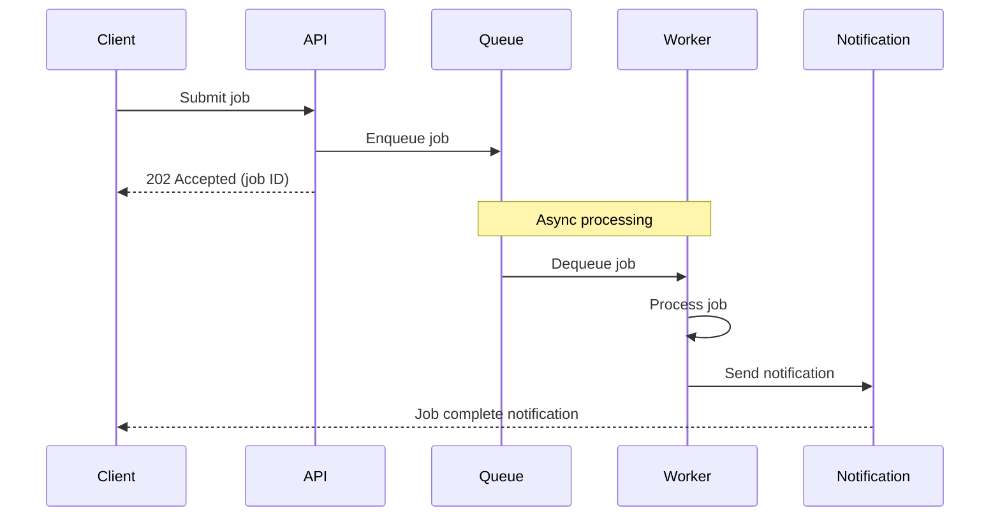

### Entity-Relationship Diagrams

#### Basic ERD

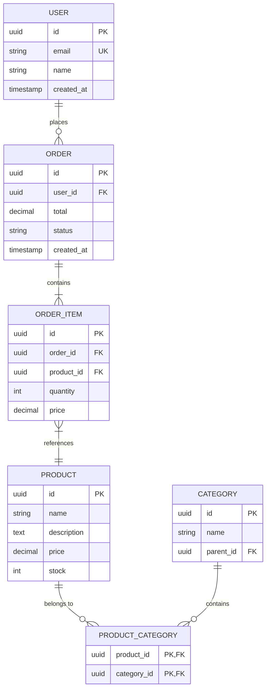

#### ERD with Relationships Explained

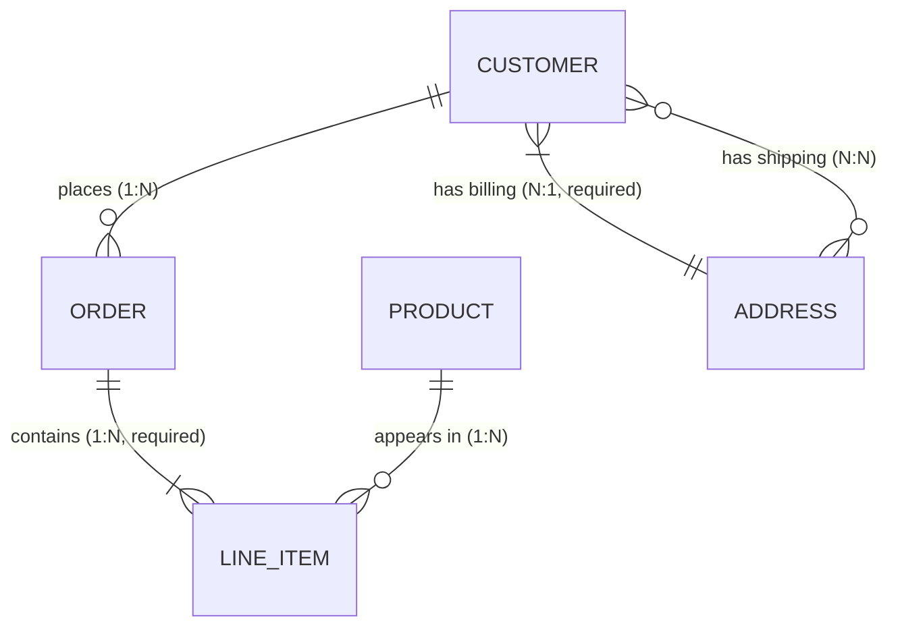

Relationship notation:

- `||` exactly one
- `o|` zero or one
- `}|` one or more
- `}o` zero or more

### Flowcharts

#### Decision Logic

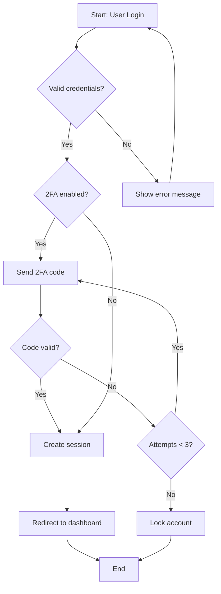

#### Process Flow

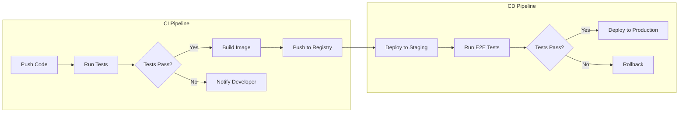

### State Diagrams

#### Order State Machine

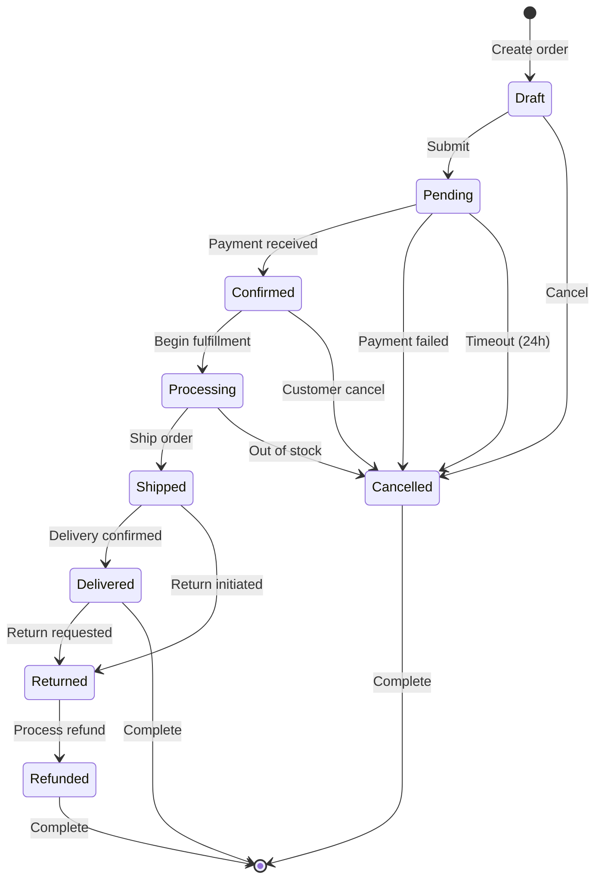

#### Connection State Machine

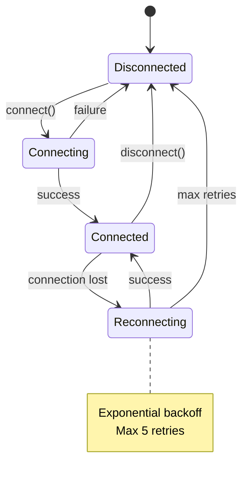

### Class Diagrams

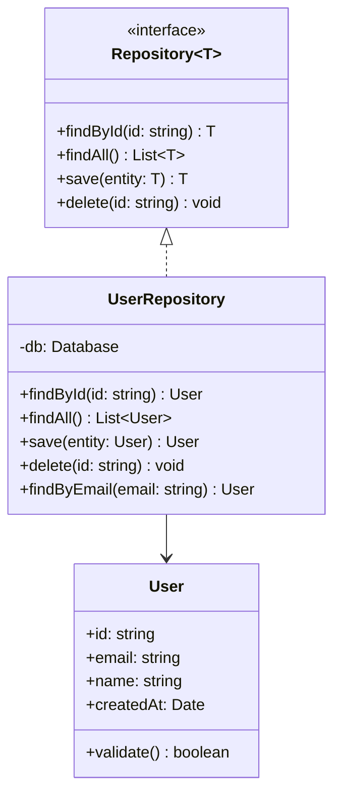
