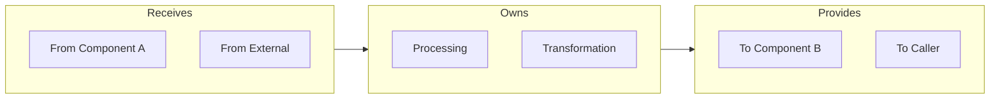
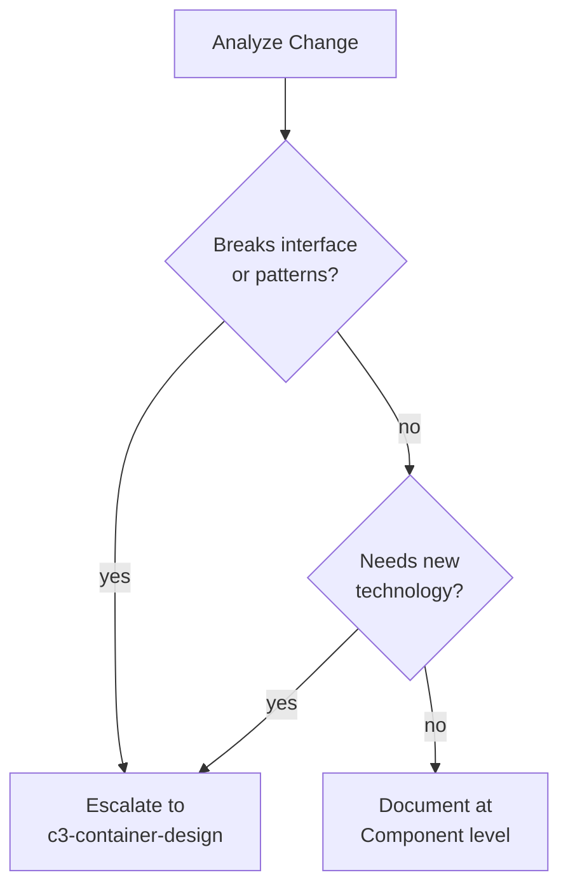

# C3 Component Level Exploration

## ⛔ CRITICAL GATE: Load Parent Container + Context First

> **STOP** - Before ANY component-level work, execute:
> ```bash
> # Load grandparent Context
> cat .c3/README.md 2>/dev/null || echo "NO_CONTEXT"
> 
> # Load parent Container (REQUIRED - components inherit from here)
> cat .c3/c3-{N}-*/README.md 2>/dev/null || echo "NO_CONTAINER"
> 
> # Check if component is listed in Container
> grep "c3-{N}{NN}" .c3/c3-{N}-*/README.md 2>/dev/null || echo "COMPONENT_NOT_IN_CONTAINER"
> 
> # Load existing component doc (if exists)
> cat .c3/c3-{N}-*/c3-{N}{NN}-*.md 2>/dev/null || echo "NO_COMPONENT_DOC"
> ```

**Based on output:**
- If "NO_CONTAINER" → **STOP.** Container must exist first. Escalate to c3-container-design.
- If "COMPONENT_NOT_IN_CONTAINER" → **STOP.** Add component to Container first.
- If component doc exists → Read it completely before proposing changes

**⚠️ DO NOT read ADRs** unless user specifically asks:
- Component work focuses on HOW, not historical WHY
- ADRs add unnecessary context → hallucination risk
- Only read: Context, parent Container, sibling Components (if dependencies)

**Why this gate exists:** Components INHERIT from Container (and transitively from Context). A component cannot exist without being listed in its parent Container.

**Self-check before proceeding:**
- [ ] I executed the commands above
- [ ] I read parent Container doc
- [ ] This component IS listed in Container's component inventory
- [ ] I know what contract/responsibility this component has (from Container)
- [ ] I read existing component doc (if exists)

---

## Overview

Component is the **leaf layer** - it inherits all constraints from above and implements actual behavior.

**Position:** LEAF (c3-{N}{NN}) | Parent: Container (c3-{N}) | Grandparent: Context (c3-0)

**📁 File Location:** Component is `.c3/c3-{N}-{slug}/c3-{N}{NN}-{slug}.md` - INSIDE the container folder.

**Announce:** "I'm using the c3-component-design skill to explore Component-level impact."

---

## The Principle

> **Upper layer defines WHAT. Lower layer implements HOW.**

At Component level:
- Container defines WHAT I am (my existence, my responsibility)
- I define HOW I implement that responsibility
- Code implements my documentation (in the codebase, not in C3)
- I do NOT invent my responsibility - that's Container's job

**Integrity rules:**
- I must be listed in Container before I can exist
- My "Contract" section must reference what Container says about me
- If Container doesn't mention me, I don't exist as a C3 document

---

## Include/Exclude

| Include (Component Level) | Exclude (Push Up) |
|---------------------------|-------------------|
| Interface (IN → OUT) | WHAT component does (Container) |
| Internal organization | Component relationships (Container) |
| Conventions & rules | WHY patterns chosen (Container/ADR) |
| Edge cases & errors | Code snippets |
| | File paths |

**Litmus test:** "Is this about HOW this component implements its contract?"

---

## Diagram-First Principle

**Components are documented visually.** The diagram tells the story, text supports it.

Every component explains:
- **Its boundary** - what it's responsible for (and what it's not)
- **Hand-off points** - where information exchanges happen with other components
- **Internal processing** - what happens inside (self-contained)

### Interface Diagram (Required)

Shows the boundary and hand-offs:



### Additional Diagrams (Where Applicable)

Use multiple diagrams when needed - just enough to explain:

| Diagram Type | Use When |
|--------------|----------|
| **Sequence** | Hand-off between multiple components matters |
| **State** | Component has lifecycle/state transitions |
| **Organization** | Internal structure is complex (layers, subsystems) |

**Foundation vs Business components:**
- **Foundation** (e.g., Hono): Shows the transition point - where framework ends and business begins. What it provides TO business components.
- **Business** (e.g., User Handler): Shows the flow - receives from foundation, processes, hands off results.

---

## ⛔ NO CODE ENFORCEMENT (MANDATORY)

**Component docs describe HOW things work, NOT the actual implementation.**

### What Counts as Code (PROHIBITED)

| Prohibited | Example | Write Instead |
|------------|---------|---------------|
| Implementation code | `function handle() {...}` | Flow diagram |
| Type definitions | `interface User {...}` | Table: Field \| Type \| Purpose |
| Config snippets | `{ "port": 3000 }` | Table of settings |
| SQL/queries | `SELECT * FROM...` | Access pattern description |
| JSON/YAML schemas | `{ "eventId": "uuid" }` | Table with dot notation |
| Example payloads | Request/response JSON | Table: Field \| Type \| Example |

### Why Mermaid is Allowed but JSON is Not

- **Mermaid** = visual flow/state diagrams (architectural)
- **JSON/YAML** = data structure syntax (implementation)
- **Rule:** If it could be parsed by JSON/YAML parser → use table instead

---

## Exploration Process

### Phase 1: Verify Integrity

From loaded Container, extract:
- Component's responsibility (from Container's component table)
- Related components (siblings)
- Technology constraints
- Pattern constraints

**If component not in Container:** STOP. Escalate to c3-container-design.

### Phase 2: Analyze Change Impact

| Check | If Yes |
|-------|--------|
| Breaks interface/patterns? | Escalate to c3-container-design |
| Needs new tech? | Escalate to c3-container-design |
| Affects siblings? | Coordinate (may need Container update) |
| Implementation only? | Proceed |

### Phase 3: Socratic Discovery

**By container archetype:**
- **Service:** Processing steps? Dependencies? Error paths?
- **Data:** Structure? Queries? Migrations?
- **Boundary:** External API? Mapping? Failures?
- **Platform:** Process? Triggers? Recovery?

---

## Template

See `component-template.md` for complete structure with frontmatter, diagrams, and examples.

**Required sections:**
1. Contract (from parent Container)
2. Interface (diagram showing boundary - REQUIRED)
3. Hand-offs table
4. Conventions table
5. Edge Cases & Errors table

**Optional sections (include based on component nature):**
- Additional diagrams (Sequence, State, Organization)
- Configuration, Dependencies, Invariants, Performance

**Keep it lean:** Simple component = 5 sections. Complex framework = multiple diagrams + optional sections.

---

## ⛔ Enforcement Harnesses

### Harness 1: No Code

**Rule:** No code blocks except Mermaid diagrams.

```bash
# Check for non-mermaid code blocks
grep -E '```[a-z]+' .c3/c3-{N}-*/c3-{N}{NN}-*.md | grep -v mermaid
# Should return nothing
```

🚩 **Red Flags:**
- `function`, `class`, `interface`, `type` keywords
- `import`, `require`, `export` statements
- File extensions like `.ts`, `.js`, `.py`
- JSON/YAML blocks (even for "schemas")
- "Example payload" in code blocks

### Harness 2: Diagram-First

**Rule:** Interface diagram (IN → Processing → OUT) is REQUIRED.

**Required sections:**
1. Frontmatter (id, c3-version, title, type, parent, summary)
2. Contract (from parent Container)
3. Interface (Mermaid diagram REQUIRED - boundary and hand-offs)
4. Hand-offs (table - what exchanges with whom)
5. Conventions (table of rules)
6. Edge Cases & Errors (table)

**Optional sections (include based on component nature):**
- Additional diagrams (Sequence, State, Organization) - where needed
- Configuration - significant config surface
- Dependencies - external dependencies matter
- Invariants - key guarantees to verify
- Performance - throughput/latency matters

🚩 **Red Flags:**
- Missing Interface diagram
- No IN/OUT structure in diagram
- Text-heavy without diagrams
- Code blocks present

---

## Verification Checklist

Before claiming completion, execute:

```bash
# Verify component doc exists in correct location
ls .c3/c3-{N}-*/c3-{N}{NN}-*.md

# Verify frontmatter
grep -E "^id:|^type:|^parent:" .c3/c3-{N}-*/c3-{N}{NN}-*.md

# Verify Interface diagram exists with IN/OUT structure
grep -c '```mermaid' .c3/c3-{N}-*/c3-{N}{NN}-*.md  # Should be >= 1
grep -E "subgraph.*(IN|OUT)" .c3/c3-{N}-*/c3-{N}{NN}-*.md  # Should find IN/OUT

# Verify NO non-mermaid code blocks
non_mermaid=$(grep -E '```[a-z]+' .c3/c3-{N}-*/c3-{N}{NN}-*.md | grep -v mermaid | wc -l)
echo "Non-mermaid code blocks: $non_mermaid (should be 0)"
```

- [ ] Critical gate executed (Container + Context loaded)
- [ ] Component IS listed in parent Container's inventory
- [ ] "Contract" section references Container's description
- [ ] **Interface diagram present** (boundary and hand-offs)
- [ ] **Hand-offs table present** (what exchanges with whom)
- [ ] **Conventions table present** (rules for consistency)
- [ ] Edge Cases & Errors table present
- [ ] **NO code blocks** (except Mermaid)
- [ ] **Additional diagrams justified** - only if Sequence/State/Organization needed
- [ ] **Optional sections justified** - only included if relevant to this component

---

## 📚 Reading Chain Output

**At the end of component work, output a reading chain for related docs.**

Format:
```
## 📚 To Go Deeper

This component (c3-NNN) is part of:

**Ancestors (understand constraints):**
└─ c3-0 (Context) → c3-N (Container) → c3-NNN (this)

**Sibling components (if dependencies):**
├─ c3-NMM - [why this sibling matters]
└─ c3-NKK - [dependency relationship]

**Parent container (for context):**
└─ c3-N-{slug} - [what contract this component fulfills]

*Reading chain generated from component's dependencies and parent.*
```

**Rules:**
- List siblings only if this component depends on or affects them
- Always include parent Container for contract reference
- Include Context only if cross-cutting concerns are relevant
- Never include ADRs unless user asked

---

## When NOT to Use

**Escalate to c3-container-design if:**
- Change affects component relationships (not just one component's internals)
- New technology/pattern needed
- Component not yet listed in parent Container

**Escalate to c3-context-design if:**
- Cross-cutting concern (affects multiple containers)
- New protocol or boundary needed

**Wrong layer symptoms:**
- Describing WHAT component does → Container's job
- Documenting WHY component exists → Container's job
- Including cross-container flows → Context's job

---

## Change Impact Decision



---

## Common Rationalizations

| Excuse | Reality |
|--------|---------|
| "JSON is clearer than a table" | JSON is code. Use table with Field \| Type \| Example columns. |
| "Just one example payload won't hurt" | Examples become implementation. Describe structure, don't show syntax. |
| "Code is easier to understand" | Code is implementation. Component doc describes patterns, not implements. |
| "Type definitions help readers" | Types are code. Use tables with Field, Type, Purpose columns. |
| "I'll use a simple config snippet" | Config syntax is code. Table: Setting \| Default \| Purpose. |
| "Mermaid is code too" | Mermaid is architectural diagram (allowed). JSON/YAML is data structure (prohibited). |
| "Interface diagram not needed for simple component" | REQUIRED. Even simple components have IN → OUT boundary. |

---

## Common Mistakes

| Mistake | Fix |
|---------|-----|
| **Including code blocks** | Use tables. Field \| Type \| Purpose for structures. |
| **Skipping Interface diagram** | REQUIRED. Shows IN → Processing → OUT boundary. |
| **Not checking Container first** | Component must be listed in parent Container inventory. |
| **Text-heavy docs** | Lead with diagrams. Text supports visuals, not vice versa. |
| **Missing Hand-offs table** | REQUIRED. Shows what exchanges with whom. |
| **Describing WHAT not HOW** | WHAT is Container's job. Component explains HOW. |

---

## Related

- `references/core-principle.md` - The C3 principle
- `defaults.md` - Component layer rules
- `references/container-archetypes.md` - How archetype shapes component docs
- `references/diagram-patterns.md` - Diagram guidance
