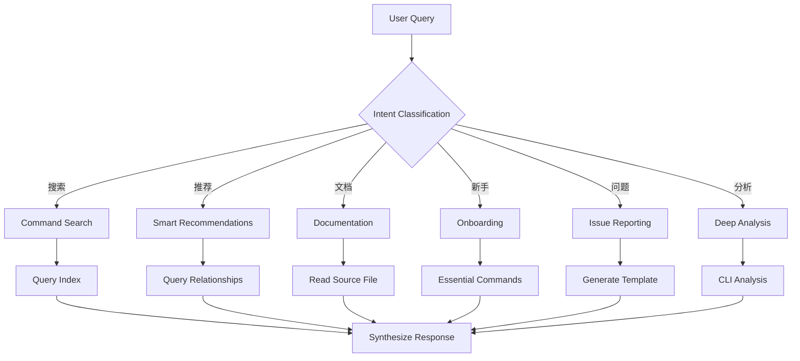

# CCW-Help Skill

CCW 命令帮助系统，提供命令搜索、推荐、文档查看和问题报告功能。

## Trigger Conditions

- 关键词: "CCW-help", "CCW-issue", "ccw-help", "ccw-issue", "帮助", "命令", "怎么用"
- 场景: 用户询问命令用法、搜索命令、请求下一步建议、报告问题

## Execution Flow



## Operation Modes

### Mode 1: Command Search 🔍

**Triggers**: "搜索命令", "find command", "planning 相关", "search"

**Process**:
1. Query `index/all-commands.json` or `index/by-category.json`
2. Filter and rank results based on user context
3. Present top 3-5 relevant commands with usage hints

### Mode 2: Smart Recommendations 🤖

**Triggers**: "下一步", "what's next", "after /workflow:plan", "推荐"

**Process**:
1. Query `index/command-relationships.json`
2. Evaluate context and prioritize recommendations
3. Explain WHY each recommendation fits

### Mode 3: Full Documentation 📖

**Triggers**: "参数说明", "怎么用", "how to use", "详情"

**Process**:
1. Locate command in index
2. Read source file via `source` path (e.g., `commands/workflow/lite-plan.md`)
3. Extract relevant sections and provide context-specific examples

### Mode 4: Beginner Onboarding 🎓

**Triggers**: "新手", "getting started", "如何开始", "常用命令"

**Process**:
1. Query `index/essential-commands.json`
2. Assess project stage (从0到1 vs 功能新增)
3. Guide appropriate workflow entry point

### Mode 5: Issue Reporting 📝

**Triggers**: "CCW-issue", "报告 bug", "功能建议", "问题咨询"

**Process**:
1. Use AskUserQuestion to gather context
2. Generate structured issue template
3. Provide actionable next steps

### Mode 6: Deep Analysis 🔬

**Triggers**: "详细说明", "命令原理", "agent 如何工作", "实现细节"

**Process**:
1. Read source documentation directly
2. For complex queries, use CLI for multi-file analysis:
   ```bash
   ccw cli -p "PURPOSE: Analyze command documentation..." --tool gemini --mode analysis --cd ~/.claude
   ```

## Index Files

CCW-Help 使用 JSON 索引实现快速查询（无 reference 文件夹，直接引用源文件）：

| 文件 | 内容 | 用途 |
|------|------|------|
| `index/all-commands.json` | 完整命令目录 | 关键词搜索 |
| `index/all-agents.json` | 完整 Agent 目录 | Agent 查询 |
| `index/by-category.json` | 按类别分组 | 分类浏览 |
| `index/by-use-case.json` | 按场景分组 | 场景推荐 |
| `index/essential-commands.json` | 核心命令 | 新手引导 |
| `index/command-relationships.json` | 命令关系 | 下一步推荐 |

### Source Path Format

索引中的 `source` 字段是从 `index/` 目录的相对路径（先向上再定位）：

```json
{
  "name": "workflow:lite-plan",
  "source": "../../../commands/workflow/lite-plan.md"
}
```

路径结构: `index/` → `ccw-help/` → `skills/` → `.claude/` → `commands/...`

## Configuration

| 参数 | 默认值 | 说明 |
|------|--------|------|
| max_results | 5 | 搜索返回最大结果数 |
| show_source | true | 是否显示源文件路径 |

## CLI Integration

| 场景 | CLI Hint | 用途 |
|------|----------|------|
| 复杂查询 | `gemini --mode analysis` | 多文件分析对比 |
| 文档生成 | - | 直接读取源文件 |

## Slash Commands

```bash
/ccw-help                    # 通用帮助入口
/ccw-help search <keyword>   # 搜索命令
/ccw-help next <command>     # 获取下一步建议
/ccw-issue                   # 问题报告
```

## Maintenance

### 更新索引

```bash
cd D:/Claude_dms3/.claude/skills/ccw-help
python scripts/analyze_commands.py
```

脚本功能：
1. 扫描 `commands/` 和 `agents/` 目录
2. 提取 YAML frontmatter 元数据
3. 生成相对路径引用（无 reference 复制）
4. 重建所有索引文件

## System Statistics

- **Commands**: 78
- **Agents**: 14
- **Categories**: 5 (workflow, cli, memory, task, general)
- **Essential**: 14 核心命令

## Core Principle

**⚠️ 智能整合，非模板复制**

- ✅ 理解用户具体情况
- ✅ 整合多个来源信息
- ✅ 定制示例和说明
- ✅ 提供渐进式深度
- ❌ 原样复制文档
- ❌ 返回未处理的 JSON
