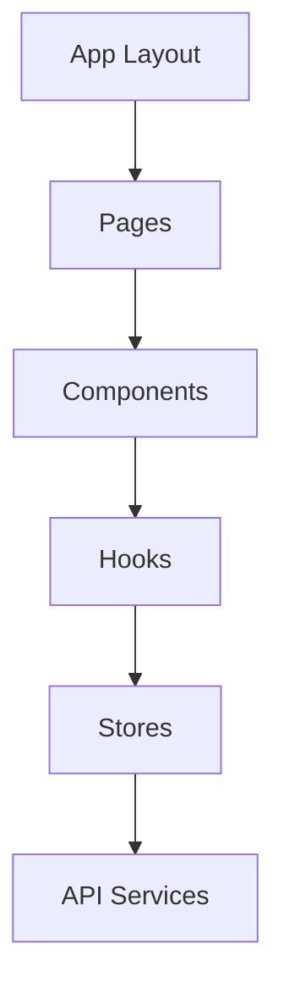

# 🧠 Codebase Understanding Skill

---
name: codebase-understanding
description: Deeply understand entire codebases including file relationships, architecture patterns, and data flows
---

## 🎯 Purpose

เข้าใจ codebase ทั้งหมดอย่างลึกซึ้ง รู้ความสัมพันธ์ระหว่างไฟล์, architecture patterns, และ data flows เพื่อให้แก้ไขได้ตรงจุด

## 📋 When to Use

- เริ่มทำงานกับ project ใหม่
- ต้องการแก้ไขที่กระทบหลายไฟล์
- Debug ปัญหาที่ซับซ้อน
- Refactor code ขนาดใหญ่
- ทำความเข้าใจ legacy code

## 🔧 Analysis Dimensions

### 1. File Structure Analysis
```
📁 Project Root
├── 📁 src/
│   ├── 📁 components/  ← UI components (React/Vue)
│   ├── 📁 pages/       ← Page components / routes
│   ├── 📁 hooks/       ← Custom hooks
│   ├── 📁 services/    ← API calls
│   ├── 📁 stores/      ← State management
│   ├── 📁 utils/       ← Helper functions
│   └── 📁 types/       ← TypeScript types
├── 📁 public/          ← Static assets
├── 📁 tests/           ← Test files
└── 📄 config files     ← package.json, tsconfig, etc.
```

### 2. Dependency Graph
```
Component A
    │
    ├──imports──► Hook B
    │               │
    │               └──uses──► Store C
    │                            │
    └──imports──► Util D         │
                    │            │
                    └──uses──────┘
```

### 3. Data Flow Analysis
```
User Action
    │
    ▼
Component (Event Handler)
    │
    ▼
Store Action (State Update)
    │
    ▼
API Service (Fetch Data)
    │
    ▼
Component Re-render (Display Data)
```

## 📝 Understanding Process

```
1. SCAN Project Structure
   - Read package.json (dependencies, scripts)
   - Identify framework (React, Vue, Next.js)
   - Map folder structure

2. IDENTIFY Key Files
   - Entry points (main.tsx, App.tsx)
   - Config files (tsconfig, vite.config)
   - Route definitions

3. TRACE Dependencies
   - Import relationships
   - Component hierarchy
   - State management flow

4. UNDERSTAND Patterns
   - Architecture patterns used
   - Coding conventions
   - State management approach

5. MAP Data Flows
   - User interactions → Events
   - Events → State changes
   - State → API calls → Renders
```

## 🔍 Key Questions to Answer

| Question | How to Find |
|----------|-------------|
| What framework? | package.json dependencies |
| How is routing done? | App.tsx, pages folder |
| Where is state? | stores/, context/, hooks/ |
| How are API calls made? | services/, api/ folders |
| What's the component tree? | Trace from App.tsx |
| Where are types? | types/, *.d.ts files |

## 📊 Analysis Output Template

```markdown
## 🧠 Codebase Analysis: {project-name}

### Tech Stack
- **Framework**: Next.js 14 (App Router)
- **Language**: TypeScript
- **Styling**: Tailwind CSS
- **State**: Zustand
- **API**: REST with React Query

### Architecture
- **Pattern**: Feature-based structure
- **Components**: Atomic design (atoms, molecules, organisms)
- **State Flow**: Unidirectional (Zustand stores)

### Key Files
| Purpose | File |
|---------|------|
| Entry | `app/layout.tsx` |
| Routing | `app/*/page.tsx` |
| Main Store | `stores/appStore.ts` |
| API Client | `lib/api.ts` |

### Dependency Map


### Notable Patterns
- Uses custom hooks for data fetching
- Implements optimistic updates
- Server components for static content

### Potential Issues
- Some circular dependencies in utils
- Large component files (>300 lines)
```

## 🎯 Framework-Specific Patterns

### React/Next.js
```
- Components: src/components/
- Pages: app/ or pages/
- Hooks: src/hooks/
- State: Zustand, Redux, Context
```

### Vue/Nuxt
```
- Components: src/components/
- Pages: pages/
- Composables: composables/
- State: Pinia
```

### Express/Node
```
- Routes: routes/
- Controllers: controllers/
- Models: models/
- Middleware: middleware/
```

## ✅ Understanding Checklist

- [ ] Framework and key dependencies identified
- [ ] File structure understood
- [ ] Entry points located
- [ ] State management approach known
- [ ] API patterns understood
- [ ] Component relationships mapped
- [ ] Coding conventions noted

## 🔗 Related Skills

- `code-search` - Find specific code patterns
- `code-explanation` - Explain complex code
- `refactoring` - Improve codebase structure
