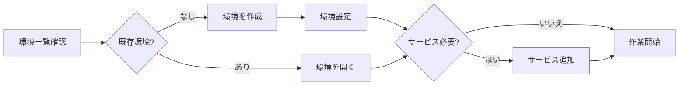

# container-use 環境構築ガイド

container-useを使用したクローズドな開発・テスト環境の構築手順です。

## 概要

container-useは、Dockerコンテナ内で開発・テストを行うためのツール群です。

**メリット**:
- ローカル環境を汚さない
- 再現可能な環境
- DB等のサービスを安全にテスト
- チーム間で同一環境を共有
- **複数Issueの並行作業が可能**（環境分離）

## ⚠️ 必須ルール

> **実装作業は原則としてcontainer-use環境で行うこと。ホスト環境での直接実装は禁止。**

例外については [implement-issues.md](../../command/implement-issues.md) の「プラットフォーム固有コード」セクションを参照。

## 🔀 並行作業ガイドライン

### なぜcontainer-use環境が必須か

複数のIssueを同時に処理する場合、ホスト環境では以下の問題が発生します：

| 問題 | 影響 |
|------|------|
| ブランチ切り替え | 未コミット変更の退避が必要 |
| 依存関係の競合 | lockファイルの変更がぶつかる |
| ビルドキャッシュ | 異なるブランチの成果物が混在 |
| 作業状態の保持 | 中断時に状態を失う |

### container-use環境による解決

```
┌─────────────────────────────────────────────────────┐
│ ホスト環境 (読み取り専用)                              │
│  - gh issue/pr 操作のみ許可                          │
│  - ファイル編集禁止                                   │
└─────────────────────────────────────────────────────┘
         │                    │
         ▼                    ▼
┌─────────────────┐  ┌─────────────────┐
│ 環境A (Issue#42)│  │ 環境B (Issue#43)│
│ env_id: abc-123 │  │ env_id: def-456 │
│                 │  │                 │
│ ブランチ:        │  │ ブランチ:        │
│ feature/42-auth │  │ feature/43-pay  │
│                 │  │                 │
│ 状態: active    │  │ 状態: active    │
└─────────────────┘  └─────────────────┘
         │                    │
         ▼                    ▼
    独立した作業           独立した作業
    （競合なし）           （競合なし）
```

### 並行作業のベストプラクティス

| ルール | 説明 |
|--------|------|
| **1 Issue = 1 環境** | 必ずIssueごとに環境を作成 |
| **環境IDを記録** | GitHub Issue のメタデータで追跡 |
| **作業再開時は既存環境を使用** | 毎回新規作成しない |
| **PRマージ後に環境削除** | リソース節約 |

## 🍎 プラットフォーム固有コードの制約

container-use環境はLinuxコンテナのため、macOS/Windows固有APIはコンテナ内でビルド/テスト不可です。

> **詳細**: [プラットフォーム例外ポリシー](../../instructions/platform-exception.md) を参照

---

## 基本フロー



## ツール一覧

| ツール | 用途 |
|--------|------|
| `container-use_environment_list` | 既存環境の一覧取得 |
| `container-use_environment_create` | 新規環境の作成 |
| `container-use_environment_open` | 既存環境を開く |
| `container-use_environment_config` | 環境設定 (base image, setup commands) |
| `container-use_environment_add_service` | サービス追加 (DB, Redis等) |
| `container-use_environment_run_cmd` | コマンド実行 |
| `container-use_environment_file_read` | ファイル読み取り |
| `container-use_environment_file_write` | ファイル書き込み |
| `container-use_environment_file_edit` | ファイル編集 |
| `container-use_environment_file_list` | ディレクトリ一覧 |
| `container-use_environment_checkpoint` | 環境のスナップショット保存 |

## 環境構築手順

### Step 1: 既存環境の確認

```python
container-use_environment_list(
    environment_source="/path/to/repo",
    explanation="Check existing environments for this project"
)
```

### Step 2: 環境の作成または再利用

#### 新規作成の場合

```python
result = container-use_environment_create(
    environment_source="/path/to/repo",
    title="Issue #123 - User Authentication Feature",
    explanation="Create dev environment for auth feature"
)
env_id = result.environment_id
```

#### 既存環境を開く場合

```python
container-use_environment_open(
    environment_source="/path/to/repo",
    environment_id="existing-env-id",
    explanation="Reopen existing environment"
)
```

### Step 3: 環境設定

プロジェクトの技術スタックに応じて設定:

```python
container-use_environment_config(
    environment_source="/path/to/repo",
    environment_id=env_id,
    config={
        "base_image": "node:20-slim",
        "setup_commands": [
            "npm ci",
            "npm run build"
        ],
        "envs": [
            "NODE_ENV=test",
            "LOG_LEVEL=debug"
        ]
    },
    explanation="Configure Node.js environment with dependencies"
)
```

### Step 4: サービス追加 (必要に応じて)

> **詳細な設定例**: {{skill:tech-stack-configs}} を参照

| サービス | image | ポート |
|---------|-------|--------|
| PostgreSQL | `postgres:15-alpine` | 5432 |
| MySQL | `mysql:8` | 3306 |
| Redis | `redis:7-alpine` | 6379 |

```python
container-use_environment_add_service(
    environment_source="/path/to/repo",
    environment_id=env_id,
    name="postgres",  # サービス名 = ホスト名
    image="postgres:15-alpine",
    envs=["POSTGRES_USER=app", "POSTGRES_PASSWORD=password", "POSTGRES_DB=testdb"],
    ports=[5432],
    explanation="Add PostgreSQL for database tests"
)
```

## コマンド実行

### 基本コマンド

```python
container-use_environment_run_cmd(
    environment_source="/path/to/repo",
    environment_id=env_id,
    command="npm test",
    explanation="Run test suite"
)
```

### バックグラウンド実行 (サーバー起動等)

```python
container-use_environment_run_cmd(
    environment_source="/path/to/repo",
    environment_id=env_id,
    command="npm run dev",
    background=True,
    ports=[3000],
    explanation="Start dev server in background"
)
```

### シェル指定

```python
container-use_environment_run_cmd(
    environment_source="/path/to/repo",
    environment_id=env_id,
    command="source .env && npm test",
    shell="bash",
    explanation="Run with bash to source env file"
)
```

## ファイル操作

### ファイル読み取り

```python
container-use_environment_file_read(
    environment_source="/path/to/repo",
    environment_id=env_id,
    target_file="src/index.ts",
    should_read_entire_file=True,
    explanation="Read source file"
)
```

### ファイル書き込み

```python
container-use_environment_file_write(
    environment_source="/path/to/repo",
    environment_id=env_id,
    target_file="src/feature.ts",
    contents="export const feature = () => { ... }",
    explanation="Write new feature file"
)
```

### ファイル編集

```python
container-use_environment_file_edit(
    environment_source="/path/to/repo",
    environment_id=env_id,
    target_file="src/index.ts",
    search_text="old code",
    replace_text="new code",
    explanation="Update import statement"
)
```

## 技術スタック別設定例

> **詳細**: {{skill:tech-stack-configs}} を参照

| 技術スタック | base_image | 主な設定 |
|-------------|-----------|---------|
| Node.js/TypeScript | `node:20-slim` | `npm ci`, Playwright対応 |
| Python/FastAPI | `python:3.11-slim` | `pip install -r requirements.txt` |
| Go | `golang:1.21-alpine` | `go mod download`, migrate対応 |
| Rust | `rust:1.85-slim` | `cargo fetch`, `cargo build` |

## DBマイグレーションのテスト

> **詳細**: {{skill:tech-stack-configs}} を参照

| ORM/ツール | マイグレーション | ロールバック |
|-----------|----------------|-------------|
| Flyway | `flyway migrate` | `flyway undo` |
| Prisma | `npx prisma migrate deploy` | `npx prisma migrate reset` |
| Alembic | `alembic upgrade head` | `alembic downgrade -1` |

## トラブルシューティング

### Docker障害時のフォールバック

**Diagnosis Commands:**

```bash
docker system df     # Check disk usage
df -h                # Check available disk space
docker info          # Check daemon status
```

**Decision Tree:**

| Condition | Action |
|-----------|--------|
| Disk space < 10GB | `docker system prune -af` and retry |
| Docker daemon not running | Start Docker Desktop, wait 30s, retry |
| After prune still failing | **User escalation required** |

**User Escalation (MANDATORY):**

When container-use cannot function:

1. **Report the failure clearly**:
   ```
   ⚠️ Container-use is unavailable due to: [specific error]
   
   Attempted recovery:
   - [action 1]: [result]
   - [action 2]: [result]
   ```

2. **Present options**:
   ```
   Options:
   A) Wait for Docker recovery (manual intervention needed)
   B) Proceed with direct host operations (breaks isolation)
   C) Abort and resume later
   
   Which would you prefer?
   ```

3. **If user chooses direct host operations**:
   - Commit message: `[non-containerized]`
   - Add warning comment to changed files
   - Create follow-up issue to verify in container

**CRITICAL**: Never silently fall back. Always get explicit user approval.

> **セッション復旧の詳細手順**: [container-useエージェントルール](../../instructions/container-use.md) を参照

### サービスに接続できない

1. サービス名をホスト名として使用 (例: `postgres`, `redis`)
2. ポートが正しいか確認
3. サービスの起動を待つ（{{skill:tech-stack-configs}} の「サービス起動待機」参照）

### 依存関係のインストールに失敗

1. base imageを確認
2. setup_commandsの順序を確認
3. 必要なシステムパッケージを追加（{{skill:tech-stack-configs}} の「ネイティブモジュール対応」参照）

### 環境が重い

1. slimイメージを使用
2. 不要なdevDependenciesを除外
3. マルチステージビルドを検討

## ベストプラクティス

1. **環境の再利用**: 同じIssueの作業には同じ環境を使う
2. **サービス名の統一**: `postgres`, `redis`, `mysql` など分かりやすい名前を使う
3. **環境変数の活用**: 接続情報は環境変数で管理
4. **チェックポイント**: 安定した状態でスナップショットを保存
5. **クリーンアップ**: 不要になった環境は削除

## 環境ID管理 (GitHub Issue)

PRレビュー後の修正作業で環境を再利用するため、環境IDをGitHub Issueで追跡します。

> **詳細**: [GitHub Issue状態管理](../github-issue-state-management/SKILL.md) を参照

### 状態追跡

| ラベル | 説明 |
|--------|------|
| `env:active` | 作業中 |
| `env:blocked` | 人間の介入が必要 |
| `env:pr-created` | PR作成済み |
| `env:merged` | マージ完了 |

**メリット**: container-use/worktree/ホスト環境のどこからでも `gh` CLI でアクセス可能。
