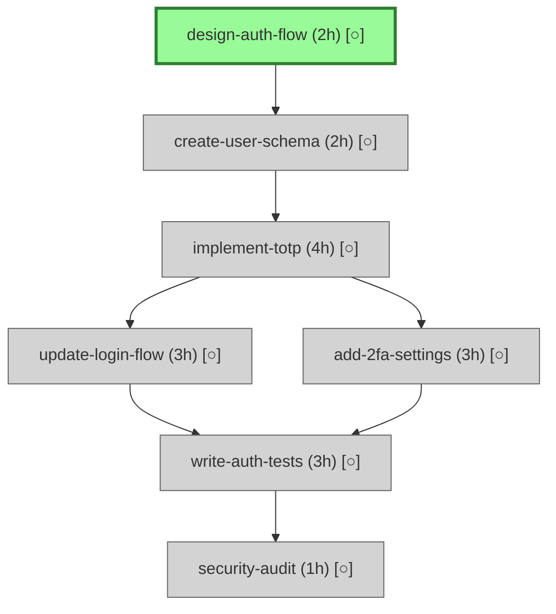

# Speculate - Task Graph Planning

Transform complex software goals into executable task graphs with atomic decomposition, dependency tracking, and visual Mermaid diagrams.

## Shell Tooling

**IMPORTANT**: Use ONLY fast, efficient shell commands for codebase exploration:

**Find FILES**: `fd` (NOT find)
- `fd "*.tsx" src/` - Find files by pattern
- `fd -e ts -e tsx` - By extension
- `fd Component` - By name part

**Find TEXT**: `rg` (NOT grep)
- `rg "pattern" src/` - Search in files
- `rg -l "pattern"` - List matching files only
- `rg -c "pattern"` - Count matches per file
- `rg --type rust "impl"` - Search by language type

**Find CODE**: `ast-grep`
- `ast-grep --pattern 'function $NAME() { $$$ }'` - Match code structure

**Process JSON**: `jq`
- `jq '.dependencies' package.json` - Extract fields
- `jq 'keys' file.json` - List keys
- `jq -r '.scripts | keys[]' package.json` - Array values

**Process YAML/TOML**: `yq`
- `yq '.scripts' file.yaml` - Parse YAML
- `yq -p toml '.dependencies' Cargo.toml` - Parse TOML

**Count/Stats**:
- `wc -l file.txt` - Count lines
- `tokei` - Code statistics by language
- `cloc .` - Lines of code breakdown

**Directory tree**: `tree`
- `tree -L 2 -d` - Show directory structure (2 levels)
- `tree -I 'node_modules|dist'` - Exclude patterns

**Git**: For repo information
- `git log --oneline -10` - Recent commits
- `git ls-files` - Tracked files
- `git diff --name-only` - Changed files

**Use speculate commands** for all task graph operations (add, update, delete, start, complete, available, after, show, validate).

## When to Activate

Activate when user:
- Requests planning or task breakdown ("how do I build X?", "help me plan")
- Mentions complex features (authentication, payments, integrations, refactoring)
- Asks about task dependencies or work ordering ("what should I do first?")
- Seems unclear about implementation steps
- Says: "break this down", "what tasks are needed"

**Don't activate for:**
- Simple one-step tasks ("fix typo", "update config")
- User explicitly says "just do it" without planning
- Debugging or investigating existing code
- Tasks clearly <1 hour of work

## Core Workflow

### 1. Detect Complexity and Gather Context

**Simple (< 1 hour)**: Skip graph, execute directly

**Medium (2-8 hours, 3-5 tasks)**: Brief plan, quick approval, proceed

**Complex (> 8 hours, 6+ tasks)**: Ask clarifying questions before generating graph

**Questions to ask for complex work:**
- Technology choices (JWT vs sessions, Stripe vs PayPal)
- Scope boundaries (MVP vs full-featured)
- Breaking changes (affects migration strategy)
- Existing code to leverage or replace

**Explore codebase first:**
- `rg "authentication|auth"` - Search for related code
- `fd "auth"` - Find related files
- `jq '.dependencies' package.json` - Check dependencies

Understanding existing code informs task breakdown (extend vs build from scratch).

### 2. Generate Task Graph

Break down the goal into atomic tasks following these principles:

**Atomic Task Rules:**
- **1-4 hours each**: Single focused session
- **Verb-first naming**: `design-api-schema`, `implement-login`, `test-webhooks`
- **Kebab-case**: Lowercase with hyphens, max 4 words
- **Single action**: No "and" in task names
- **Clear done state**: Unambiguous acceptance criteria

**Task Relationship Types:**
- `blocks`: Hard dependency (A must complete before B starts)
- `relates_to`: Thematic connection (no dependency, can parallelize)
- `part_of`: Grouping (A is part of epic B)

Create tasks using speculate commands:

```
speculate add '{
  "tasks": [
    {
      "id": "design-auth-flow",
      "description": "Design authentication flow and data models",
      "estimate_hours": 2,
      "acceptance_criteria": [
        "Flow diagram created",
        "Data models defined",
        "Edge cases documented"
      ]
    },
    {
      "id": "implement-login",
      "description": "Implement login endpoint with JWT",
      "estimate_hours": 3,
      "acceptance_criteria": [
        "POST /login endpoint functional",
        "JWT tokens generated",
        "Password validation working"
      ]
    }
  ],
  "relationships": [
    {"from": "design-auth-flow", "to": "implement-login", "type": "blocks"}
  ]
}'
```

**Naming Examples:**
- ✓ `design-api-schema`, `implement-crud`, `test-webhooks`
- ✗ `Design-API-Schema` (uppercase), `design api schema` (spaces)
- ✗ `implement-and-test-api` (has "and" - split into two tasks)

See `references/patterns.md` for detailed decomposition patterns.

### 3. Present Graph to User

Show comprehensive plan with:

1. **Goal statement**
2. **All tasks** with estimates and acceptance criteria
3. **Dependencies** (what blocks what)
4. **Ready tasks** (can start immediately)
5. **Total estimate**

Use visual Mermaid diagram:

```bash
speculate available
```

Outputs color-coded diagram:
- **Green**: Ready tasks (no blockers)
- **Gray**: Blocked tasks (waiting on dependencies)
- **Blue**: In-progress tasks
- **Light green**: Completed tasks

Example presentation:

````
Goal: Add two-factor authentication

Task Graph (7 tasks, ~18 hours):



**Ready to start:**
- design-auth-flow (2h) - Unblocks everything

**Parallel opportunities:**
- After implement-totp completes: update-login-flow and add-2fa-settings can run in parallel

Ready to begin?
````

### 4. Guide Execution

**Starting work:**

Mark task as in-progress and mirror to TodoWrite:

```bash
speculate start design-auth-flow
```

Add to TodoWrite for active tracking:
```
- Design auth flow and data models
```

**During work:**

Reference acceptance criteria from graph. Guide implementation to meet each criterion.

**Completing work:**

Mark task complete:

```bash
speculate complete design-auth-flow
```

Show impact with after query:

```bash
speculate after design-auth-flow
```

Displays Mermaid diagram highlighting:
- Tasks that became unblocked (bright green)
- Downstream tasks still blocked (beige)

Celebrate progress and suggest next:
```
✓ design-auth-flow complete!

This unblocked:
  - create-user-schema (2h)

Suggested next: create-user-schema
Start now?
```

**Tracking progress:**

Show current state:
```bash
speculate show design-auth-flow
```

View all pending tasks:
```bash
speculate available
```

### 5. Handle Changes

When scope changes, update the graph:

**Adding tasks:**
```bash
speculate add '{
  "tasks": [{"id": "add-backup-codes", "estimate_hours": 2}],
  "relationships": [
    {"from": "implement-totp", "to": "add-backup-codes", "type": "blocks"}
  ]
}'
```

**Updating tasks:**
```bash
speculate update '{
  "tasks": [{"id": "implement-totp", "estimate_hours": 5}]
}'
```

**Removing tasks:**
```bash
speculate delete '{
  "tasks": ["add-backup-codes"]
}'
```

Inform user of changes and new total estimate.

## Command Reference

**Write Commands** (modify graph, auto-save):

```bash
# Add tasks and relationships
speculate add '<json>'

# Update task properties
speculate update '<json>'

# Delete tasks and relationships
speculate delete '<json>'

# Quick status changes
speculate start <task-id>
speculate complete <task-id>

# Validate graph health
speculate validate
```

**Query Commands** (read-only):

```bash
# Show pending tasks (Mermaid diagram)
speculate available

# Show downstream impact (Mermaid diagram)
speculate after <task-id>

# Show task details (text)
speculate show <task-id>
```

See `references/protocol.md` for complete JSON schemas and examples.

## Common Decomposition Patterns

**Feature Addition** (Authentication, Payments):
- Design → Data models → Core implementation → UI → Integration → Testing → Security

**Refactoring**:
- Audit/analyze → Design approach → Extract/restructure → Update tests → Cleanup

**API Development**:
- Requirements → Data models → Endpoints (parallel) → Middleware → Docs → Tests

**Integration** (3rd party services):
- Research → Setup/config → Core integration → Error handling → Testing

**Performance Optimization**:
- Profile/measure → Optimize (parallel opportunities) → Verify improvements

See `references/patterns.md` for detailed examples with JSON.

## Estimation Guidelines

**1 hour**: Small, well-defined
- Add simple function
- Write specific test suite
- Update configuration
- Fix known bug

**2 hours**: Typical implementation
- Implement feature with tests
- Refactor module
- Design schema/API
- Research approach

**3-4 hours**: Complex but bounded
- Multi-step feature
- External integration
- Significant refactoring
- Comprehensive testing

**> 4 hours**: Too large, decompose further
- Split into design + implementation
- Separate by layers (frontend/backend)
- Break into sub-features

## Validation

Validate graph health before execution:

```bash
speculate validate
```

Checks for:
- **Cycles**: Circular dependencies (A blocks B blocks A)
- **Orphans**: Tasks with no relationships (may be intentional)
- **Invalid naming**: Tasks violating kebab-case or 4-word rules
- **Broken relationships**: Edges referencing non-existent tasks

Fix issues before proceeding.

## Integration with TodoWrite

Mirror active task to TodoWrite for visibility:

**When starting:**
```bash
speculate start implement-login
```

Then add to todos:
```
TodoWrite: Implement login endpoint with JWT
```

**When completing:**
```bash
speculate complete implement-login
```

Mark todo complete. This provides dual tracking: speculate for overall plan, TodoWrite for active work.

## Progressive Refinement

Start with high-level breakdown, refine as understanding grows:

**Initial:**
```json
{"tasks": [{"id": "add-authentication", "estimate_hours": 16}]}
```

**After investigation:**
```json
{"tasks": [
  {"id": "design-auth-flow", "estimate_hours": 2},
  {"id": "implement-jwt", "estimate_hours": 4},
  {"id": "add-login-ui", "estimate_hours": 3},
  {"id": "write-auth-tests", "estimate_hours": 3}
]}
```

Delete rough task, add refined tasks. Graph evolves with understanding.

## What This Skill Provides

1. **Structured planning** before implementation (reduces rework)
2. **Visual clarity** via Mermaid diagrams (see relationships instantly)
3. **Dependency tracking** (know what blocks what)
4. **Atomic decomposition** (1-4 hour chunks, clear done states)
5. **Progress visibility** (know what's done, what's next)
6. **Impact analysis** (see what unblocks when tasks complete)

## Responsibilities

**Activate skill when:** User needs planning for complex multi-step work

**Ask questions for:** Complex features with multiple valid approaches

**Generate graph with:** Atomic tasks, clear dependencies, realistic estimates

**Present clearly:** Mermaid diagram + ready tasks + total estimate

**Guide execution:** Mark start/complete, suggest next, celebrate progress

**Adapt to changes:** Update graph when scope shifts

---

Remember: Plan the work, work the plan. Atomic tasks with clear dependencies create executable roadmaps.
