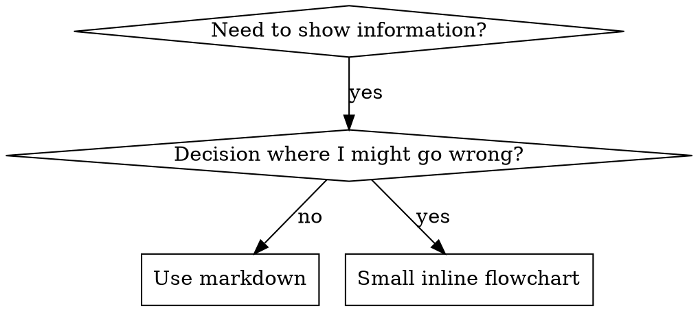

<!-- TOKEN BUDGET: 500 lines / ~1500 tokens -->

# Writing Skills

## Overview

**Writing skills IS Test-Driven Development applied to process documentation.**

**Personal skills live in agent-specific directories (`~/.claude/skills` for Claude Code, `~/.codex/skills` for Codex)**

You write test cases (pressure scenarios with subagents), watch them fail (baseline behavior), write the skill (documentation), watch tests pass (agents comply), and refactor (close loopholes).

**Core principle:** If you didn't watch an agent fail without the skill, you don't know if the skill teaches the right thing.

**REQUIRED BACKGROUND:** You MUST understand shipyard:shipyard-tdd before using this skill. That skill defines the fundamental RED-GREEN-REFACTOR cycle. This skill adapts TDD to documentation.

**Official guidance:** For Anthropic's official skill authoring best practices, see anthropic-best-practices.md. This document provides additional patterns and guidelines that complement the TDD-focused approach in this skill.

## What is a Skill?

A **skill** is a reference guide for proven techniques, patterns, or tools. Skills help future Claude instances find and apply effective approaches.

**Skills are:** Reusable techniques, patterns, tools, reference guides

**Skills are NOT:** Narratives about how you solved a problem once

## TDD Mapping for Skills

| TDD Concept | Skill Creation |
|-------------|----------------|
| **Test case** | Pressure scenario with subagent |
| **Production code** | Skill document (SKILL.md) |
| **Test fails (RED)** | Agent violates rule without skill (baseline) |
| **Test passes (GREEN)** | Agent complies with skill present |
| **Refactor** | Close loopholes while maintaining compliance |
| **Write test first** | Run baseline scenario BEFORE writing skill |
| **Watch it fail** | Document exact rationalizations agent uses |
| **Minimal code** | Write skill addressing those specific violations |
| **Watch it pass** | Verify agent now complies |
| **Refactor cycle** | Find new rationalizations → plug → re-verify |

The entire skill creation process follows RED-GREEN-REFACTOR.

## When to Create a Skill

**Create when:**
- Technique wasn't intuitively obvious to you
- You'd reference this again across projects
- Pattern applies broadly (not project-specific)
- Others would benefit

**Don't create for:**
- One-off solutions
- Standard practices well-documented elsewhere
- Project-specific conventions (put in CLAUDE.md)
- Mechanical constraints (if it's enforceable with regex/validation, automate it—save documentation for judgment calls)

## Skill Types

### Technique
Concrete method with steps to follow (condition-based-waiting, root-cause-tracing)

### Pattern
Way of thinking about problems (flatten-with-flags, test-invariants)

### Reference
API docs, syntax guides, tool documentation (office docs)

## Directory Structure


```
skills/
  skill-name/
    SKILL.md              # Main reference (required)
    supporting-file.*     # Only if needed
```

**Flat namespace** - all skills in one searchable namespace

**Separate files for:**
1. **Heavy reference** (100+ lines) - API docs, comprehensive syntax
2. **Reusable tools** - Scripts, utilities, templates

**Keep inline:**
- Principles and concepts
- Code patterns (< 50 lines)
- Everything else

## SKILL.md Structure

**Frontmatter (YAML):**
- Only two fields supported: `name` and `description`
- Max 1024 characters total
- `name`: Use letters, numbers, and hyphens only (no parentheses, special chars)
- `description`: Third-person, describes ONLY when to use (NOT what it does)
  - Start with "Use when..." to focus on triggering conditions
  - Include specific symptoms, situations, and contexts
  - **NEVER summarize the skill's process or workflow** (see CSO section for why)
  - Keep under 500 characters if possible

```markdown
---
name: Skill-Name-With-Hyphens
description: Use when [specific triggering conditions and symptoms]
---

# Skill Name

## Overview
What is this? Core principle in 1-2 sentences.

## When to Use
[Small inline flowchart IF decision non-obvious]

Bullet list with SYMPTOMS and use cases
When NOT to use

## Core Pattern (for techniques/patterns)
Before/after code comparison

## Quick Reference
Table or bullets for scanning common operations

## Implementation
Inline code for simple patterns
Link to file for heavy reference or reusable tools

## Common Mistakes
What goes wrong + fixes

## Real-World Impact (optional)
Concrete results
```


## Claude Search Optimization (CSO)

**Critical for discovery:** Future Claude needs to FIND your skill

### 1. Rich Description Field

**Purpose:** Claude reads description to decide which skills to load for a given task. Make it answer: "Should I read this skill right now?"

**Format:** Start with "Use when..." to focus on triggering conditions

**CRITICAL: Description = When to Use, NOT What the Skill Does**

The description should ONLY describe triggering conditions. Do NOT summarize the skill's process or workflow in the description.

**Why this matters:** Testing revealed that when a description summarizes the skill's workflow, Claude may follow the description instead of reading the full skill content. A description saying "code review between tasks" caused Claude to do ONE review, even though the skill's flowchart clearly showed TWO reviews (spec compliance then code quality).

When the description was changed to just "Use when executing implementation plans with independent tasks" (no workflow summary), Claude correctly read the flowchart and followed the two-stage review process.

**The trap:** Descriptions that summarize workflow create a shortcut Claude will take. The skill body becomes documentation Claude skips.

```yaml
# BAD: Summarizes workflow - Claude follows description instead of reading skill
description: Use when executing plans - dispatches subagent per task with code review between tasks

# GOOD: Just triggering conditions, no workflow summary
description: Use when executing implementation plans with independent tasks in the current session
```

See EXAMPLES.md for additional good/bad description patterns.

**Content:**
- Use concrete triggers, symptoms, situations -- describe the *problem* not language-specific symptoms
- Technology-agnostic unless the skill itself is technology-specific
- Third person (injected into system prompt)
- **NEVER summarize the skill's process or workflow**

### 2. Keyword Coverage

Use words Claude would search for:
- Error messages: "Hook timed out", "ENOTEMPTY", "race condition"
- Symptoms: "flaky", "hanging", "zombie", "pollution"
- Synonyms: "timeout/hang/freeze", "cleanup/teardown/afterEach"
- Tools: Actual commands, library names, file types

### 3. Descriptive Naming

**Use active voice, verb-first:**
- `creating-skills` not `skill-creation`
- `condition-based-waiting` not `async-test-helpers`

### 4. Token Efficiency (Critical)

**Targets:** getting-started <150 words, frequently-loaded <200 words, others <500 words.

**Key techniques:** Move details to `--help`, use cross-references instead of repeating content, compress examples to minimal form, eliminate redundancy. See EXAMPLES.md for detailed token efficiency patterns.

**Naming:** Use active verb-first names (`condition-based-waiting` not `async-test-helpers`). Gerunds work well for processes (`creating-skills`, `testing-skills`).

### 5. Cross-Referencing Other Skills

**When writing documentation that references other skills:**

Use skill name only, with explicit requirement markers:
- Good: `**REQUIRED SUB-SKILL:** Use shipyard:shipyard-tdd`
- Good: `**REQUIRED BACKGROUND:** You MUST understand shipyard:shipyard-debugging`
- Bad: `See skills/testing/test-driven-development` (unclear if required)
- Bad: `@skills/testing/test-driven-development/SKILL.md` (force-loads, burns context)

**Why no @ links:** `@` syntax force-loads files immediately, consuming 200k+ context before you need them.

## Flowchart Usage



**Use flowcharts ONLY for:**
- Non-obvious decision points
- Process loops where you might stop too early
- "When to use A vs B" decisions

**Never use flowcharts for:**
- Reference material → Tables, lists
- Code examples → Markdown blocks
- Linear instructions → Numbered lists
- Labels without semantic meaning (step1, helper2)

See @graphviz-conventions.dot for graphviz style rules.

## Code Examples

**One excellent example beats many mediocre ones**

Choose most relevant language:
- Testing techniques → TypeScript/JavaScript
- System debugging → Shell/Python
- Data processing → Python

**Good example:**
- Complete and runnable
- Well-commented explaining WHY
- From real scenario
- Shows pattern clearly
- Ready to adapt (not generic template)

**Don't:**
- Implement in 5+ languages
- Create fill-in-the-blank templates
- Write contrived examples

You're good at porting - one great example is enough.

## File Organization

### Self-Contained Skill
```
defense-in-depth/
  SKILL.md    # Everything inline
```
When: All content fits, no heavy reference needed

### Skill with Reusable Tool
```
condition-based-waiting/
  SKILL.md    # Overview + patterns
  example.ts  # Working helpers to adapt
```
When: Tool is reusable code, not just narrative

### Skill with Heavy Reference
```
pptx/
  SKILL.md       # Overview + workflows
  pptxgenjs.md   # 600 lines API reference
  ooxml.md       # 500 lines XML structure
  scripts/       # Executable tools
```
When: Reference material too large for inline

## The Iron Law (Same as TDD)

```
NO SKILL WITHOUT A FAILING TEST FIRST
```

This applies to NEW skills AND EDITS to existing skills.

Write skill before testing? Delete it. Start over.
Edit skill without testing? Same violation.

**No exceptions:**
- Not for "simple additions"
- Not for "just adding a section"
- Not for "documentation updates"
- Don't keep untested changes as "reference"
- Don't "adapt" while running tests
- Delete means delete

**REQUIRED BACKGROUND:** The shipyard:shipyard-tdd skill explains why this matters. Same principles apply to documentation.

## Testing All Skill Types

Different skill types need different test approaches:

### Discipline-Enforcing Skills
Test with academic questions, pressure scenarios (time + sunk cost + exhaustion combined), and rationalization tracking. **Pass:** Agent follows rule under maximum pressure.

### Technique Skills
Test with application scenarios, edge-case variations, and gap detection. **Pass:** Agent applies technique correctly to new scenarios.

### Pattern Skills
Test with recognition scenarios, application tasks, and counter-examples. **Pass:** Agent identifies when/how to apply pattern and when NOT to.

### Reference Skills
Test with retrieval tasks, application scenarios, and coverage gaps. **Pass:** Agent finds and correctly applies reference information.

## Common Rationalizations for Skipping Testing

| Excuse | Reality |
|--------|---------|
| "Skill is obviously clear" | Clear to you ≠ clear to other agents. Test it. |
| "Testing is overkill" | Untested skills have issues. Always. 15 min saves hours. |
| "Academic review is enough" | Reading ≠ using. Test application scenarios. |
| "No time to test" | Deploying untested wastes more time fixing later. |

**All of these mean: Test before deploying. No exceptions.**

## Bulletproofing Skills Against Rationalization

Discipline skills must resist rationalization. Key strategies:

1. **Close every loophole explicitly** -- don't just state the rule, forbid specific workarounds with "No exceptions" lists
2. **Address "Spirit vs Letter"** -- add early: "Violating the letter of the rules is violating the spirit of the rules"
3. **Build rationalization tables** from baseline testing -- every excuse agents make gets a counter
4. **Create red flags lists** for agent self-check (e.g., "Code before test", "This is different because...")
5. **Update CSO descriptions** with violation symptoms as triggers

See EXAMPLES.md for detailed good/bad examples of each strategy.

## RED-GREEN-REFACTOR for Skills

Follow the TDD cycle:

### RED: Write Failing Test (Baseline)

Run pressure scenario with subagent WITHOUT the skill. Document exact behavior:
- What choices did they make?
- What rationalizations did they use (verbatim)?
- Which pressures triggered violations?

This is "watch the test fail" - you must see what agents naturally do before writing the skill.

### GREEN: Write Minimal Skill

Write skill that addresses those specific rationalizations. Don't add extra content for hypothetical cases.

Run same scenarios WITH skill. Agent should now comply.

### REFACTOR: Close Loopholes

Agent found new rationalization? Add explicit counter. Re-test until bulletproof.

## Anti-Patterns

- **Narrative Example** -- session-specific stories are not reusable
- **Multi-Language Dilution** -- one excellent example beats five mediocre translations
- **Code in Flowcharts** -- can't copy-paste, hard to read (use markdown blocks)
- **Generic Labels** -- helper1/step3 have no semantic meaning; use descriptive names

See EXAMPLES.md for detailed anti-pattern examples.

## STOP: Before Moving to Next Skill

**After writing ANY skill, you MUST STOP and complete the deployment process.**

**Do NOT:**
- Create multiple skills in batch without testing each
- Move to next skill before current one is verified
- Skip testing because "batching is more efficient"

**The deployment checklist below is MANDATORY for EACH skill.**

Deploying untested skills = deploying untested code. It's a violation of quality standards.

## Skill Creation Checklist (TDD Adapted)

**Use TodoWrite to create todos for EACH item below.**

**RED:** Create pressure scenarios (3+ for discipline skills) -- run WITHOUT skill -- document baseline rationalizations

**GREEN:**
- [ ] Name: letters/numbers/hyphens only; YAML frontmatter (name + description, max 1024 chars)
- [ ] Description: "Use when..." + triggers/symptoms, third person, no workflow summary
- [ ] Keywords for search, clear overview, address baseline failures from RED
- [ ] Code inline or linked; one excellent example (not multi-language)
- [ ] Run WITH skill -- verify compliance

**REFACTOR:** Find new rationalizations -- add counters -- build rationalization table + red flags -- re-test until bulletproof

**Quality:** Flowcharts only for non-obvious decisions; quick reference table; common mistakes; no narrative; supporting files only for tools/heavy reference

**Deploy:** Commit and push; consider contributing via PR if broadly useful

## Discovery Workflow

How future Claude finds your skill:

1. **Encounters problem** ("tests are flaky")
2. **Finds SKILL** (description matches)
3. **Scans overview** (is this relevant?)
4. **Reads patterns** (quick reference table)
5. **Loads example** (only when implementing)

**Optimize for this flow** - put searchable terms early and often.

