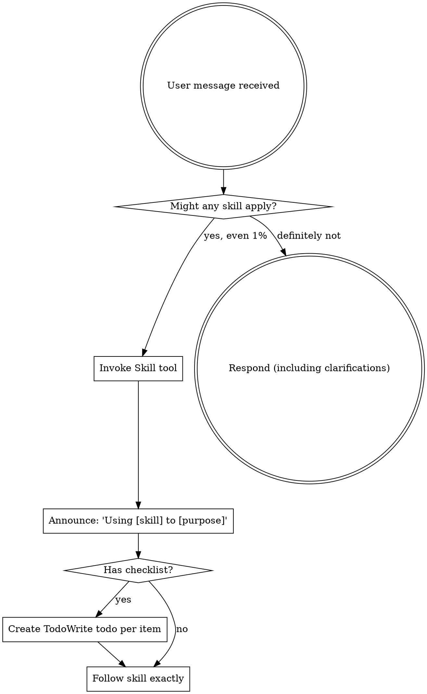

<EXTREMELY-IMPORTANT>
If you think there is even a 1% chance a skill might apply to what you are doing, you ABSOLUTELY MUST invoke the skill.

IF A SKILL APPLIES TO YOUR TASK, YOU DO NOT HAVE A CHOICE. YOU MUST USE IT.

This is not negotiable. This is not optional. You cannot rationalize your way out of this.
</EXTREMELY-IMPORTANT>

## How to Access Skills

**In Claude Code:** Use the `Skill` tool. When you invoke a skill, its content is loaded and presented to you—follow it directly. Never use the Read tool on skill files.

**In other environments:** Check your platform's documentation for how skills are loaded.

# Using Gremlins

## The Rule

**Invoke relevant or requested skills BEFORE any response or action.** Even a 1% chance a skill might apply means that you should invoke the skill to check. If an invoked skill turns out to be wrong for the situation, you don't need to use it.



## Available Gremlins

| Skill | When to Use |
|-------|-------------|
| `gremlins:brainstorming` | New features, designs, exploring ideas |
| `gremlins:writing-plans` | Creating implementation plans from specs |
| `gremlins:executing-plans` | Working through an implementation plan |
| `gremlins:plan-complete` | Moving a finished plan to complete/ |
| `gremlins:plan-archive` | Archiving abandoned or obsolete plans |
| `gremlins:plan-readiness-review` | Pre-implementation plan verification |
| `gremlins:implementation-review` | Post-implementation audit before merge |
| `gremlins:reach-opportunities` | Quick wins after implementation passes |
| `gremlins:worktree-workflow` | Full development loop orchestration |
| `gremlins:systematic-debugging` | Any bug, error, or unexpected behavior |
| `gremlins:test-driven-development` | Writing new functionality |
| `gremlins:verification-before-completion` | Before claiming work is done |
| `gremlins:requesting-code-review` | Before creating PRs |
| `gremlins:receiving-code-review` | After getting review feedback |
| `gremlins:using-git-worktrees` | Isolating feature work |
| `gremlins:subagent-driven-development` | Executing plans with subagents |
| `gremlins:dispatching-parallel-agents` | Independent parallel tasks |
| `gremlins:finishing-a-development-branch` | Completing branch work (PR/merge) |
| `gremlins:writing-skills` | Creating new skills |

## Red Flags

These thoughts mean STOP—you're rationalizing:

| Thought | Reality |
|---------|---------|
| "This is just a simple question" | Questions are tasks. Check for skills. |
| "I need more context first" | Skill check comes BEFORE clarifying questions. |
| "Let me explore the codebase first" | Skills tell you HOW to explore. Check first. |
| "I can check git/files quickly" | Files lack conversation context. Check for skills. |
| "Let me gather information first" | Skills tell you HOW to gather information. |
| "This doesn't need a formal skill" | If a skill exists, use it. |
| "I remember this skill" | Skills evolve. Read current version. |
| "This doesn't count as a task" | Action = task. Check for skills. |
| "The skill is overkill" | Simple things become complex. Use it. |
| "I'll just do this one thing first" | Check BEFORE doing anything. |
| "This feels productive" | Undisciplined action wastes time. Skills prevent this. |
| "I know what that means" | Knowing the concept ≠ using the skill. Invoke it. |

## Skill Priority

When multiple skills could apply, use this order:

1. **Process skills first** (brainstorming, debugging) - these determine HOW to approach the task
2. **Implementation skills second** - these guide execution

"Let's build X" → brainstorming first, then implementation skills.
"Fix this bug" → debugging first, then domain-specific skills.

## Skill Types

**Rigid** (TDD, debugging): Follow exactly. Don't adapt away discipline.

**Flexible** (patterns): Adapt principles to context.

The skill itself tells you which.

## Plan Structure

Gremlins uses a folder-based plan structure:

```
plans/
├── active/           # Work in progress
│   └── {plan-name}/
│       ├── design/         # Problem analysis, approach, decisions
│       └── implementation/ # Step-by-step execution plans
├── complete/         # Finished work
└── archive/          # Abandoned or obsolete plans
```

Use `gremlins:plan-complete` and `gremlins:plan-archive` to manage lifecycle.

## User Instructions

Instructions say WHAT, not HOW. "Add X" or "Fix Y" doesn't mean skip workflows.
