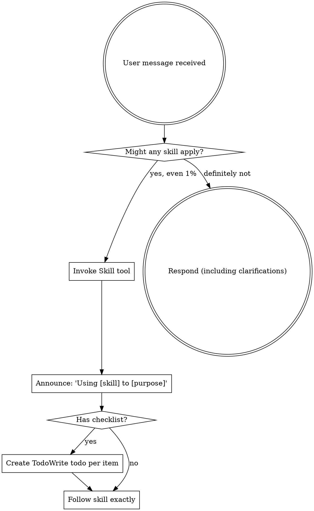

<!-- TOKEN BUDGET: 210 lines / ~630 tokens -->

# Using Shipyard

<EXTREMELY-IMPORTANT>
If you think there is even a 1% chance a skill might apply to what you are doing, you ABSOLUTELY MUST invoke the skill.

IF A SKILL APPLIES TO YOUR TASK, YOU DO NOT HAVE A CHOICE. YOU MUST USE IT.

This is not negotiable. This is not optional. You cannot rationalize your way out of this.
</EXTREMELY-IMPORTANT>

## How to Access Skills

**In Claude Code:** Use the `Skill` tool. When you invoke a skill, its content is loaded and presented to you—follow it directly. Never use the Read tool on skill files.

**In other environments:** Check your platform's documentation for how skills are loaded.

# Using Skills

## The Rule

**Invoke relevant or requested skills BEFORE any response or action.** Even a 1% chance a skill might apply means that you should invoke the skill to check. If an invoked skill turns out to be wrong for the situation, you don't need to use it.

## Available Skills

Shipyard provides these 14 skills:

| Skill | Purpose |
|-------|---------|
| `shipyard:using-shipyard` | How to find and use skills (this skill) |
| `shipyard:shipyard-tdd` | TDD discipline for all implementation |
| `shipyard:shipyard-debugging` | Root cause investigation before fixes |
| `shipyard:shipyard-verification` | Evidence before completion claims |
| `shipyard:shipyard-brainstorming` | Requirements gathering and design exploration |
| `shipyard:security-audit` | OWASP, secrets, dependencies, IaC security |
| `shipyard:code-simplification` | Duplication, dead code, AI bloat detection |
| `shipyard:infrastructure-validation` | Terraform, Ansible, Docker validation workflows |
| `shipyard:parallel-dispatch` | Concurrent agent dispatch for independent tasks |
| `shipyard:shipyard-writing-plans` | Creating structured implementation plans |
| `shipyard:shipyard-executing-plans` | Executing plans with builder/reviewer agents |
| `shipyard:git-workflow` | Branch creation, commits, worktrees, and completion |
| `shipyard:documentation` | After implementation, before shipping, when docs are incomplete |
| `shipyard:shipyard-writing-skills` | Creating and testing new skills |

## Shipyard Commands

Shipyard also provides these commands:

| Command | Purpose |
|---------|---------|
| `/shipyard:init` | Initialize a project - gather requirements via brainstorming |
| `/shipyard:plan` | Create a structured implementation plan |
| `/shipyard:build` | Execute a plan with builder and reviewer agents |
| `/shipyard:status` | Check progress on current plan execution |
| `/shipyard:resume` | Resume an interrupted build |
| `/shipyard:quick` | Quick single-task execution without full planning |
| `/shipyard:ship` | Finalize work - merge, PR, or preserve |
| `/shipyard:issues` | View and manage deferred issues across sessions |
| `/shipyard:rollback` | Revert to a previous checkpoint |
| `/shipyard:recover` | Diagnose and recover from interrupted state |
| `/shipyard:worktree` | Manage git worktrees for isolated feature development |

## Skill Activation Triggers

These triggers are **deterministic**. When a trigger condition matches, you MUST invoke the corresponding skill. Do not use judgment — if the trigger fires, invoke.

### File Pattern Triggers
| Pattern | Skill |
|---------|-------|
| `*.tf`, `*.tfvars`, `terraform*` | `shipyard:infrastructure-validation` |
| `Dockerfile`, `docker-compose.yml`, `*.dockerfile` | `shipyard:infrastructure-validation` |
| `playbook*.yml`, `roles/`, `inventory/`, `ansible*` | `shipyard:infrastructure-validation` |
| `*.test.*`, `*.spec.*`, `__tests__/`, `*_test.go` | `shipyard:shipyard-tdd` |

### Task Marker Triggers
| Marker | Skill |
|--------|-------|
| `tdd="true"` in plan task | `shipyard:shipyard-tdd` |
| Plan file loaded for execution | `shipyard:shipyard-executing-plans` |
| Design discussion, feature exploration | `shipyard:shipyard-brainstorming` |
| Creating an implementation plan | `shipyard:shipyard-writing-plans` |

### State Condition Triggers
| Condition | Skill |
|-----------|-------|
| About to claim "done", "complete", "fixed" | `shipyard:shipyard-verification` |
| About to commit, create PR, or merge | `shipyard:shipyard-verification` |
| Bug, error, test failure, unexpected behavior | `shipyard:shipyard-debugging` |
| 2+ independent tasks with no shared state | `shipyard:parallel-dispatch` |
| Creating or editing a skill file | `shipyard:shipyard-writing-skills` |
| Branch management, delivery, worktrees | `shipyard:git-workflow` |
| Starting feature work on a new phase | `shipyard:git-workflow` |

### Content Pattern Triggers
| Pattern in output or conversation | Skill |
|----------------------------------|-------|
| Error, exception, traceback, failure | `shipyard:shipyard-debugging` |
| Security, vulnerability, CVE, OWASP | `shipyard:security-audit` |
| Duplicate, complex, bloat, refactor | `shipyard:code-simplification` |
| Document, README, API docs, changelog | `shipyard:documentation` |

### Trigger Evaluation Protocol

Before EVERY response, evaluate triggers in this order:
1. **File patterns** — check files being discussed, modified, or created
2. **Task markers** — check any loaded plans or task definitions
3. **State conditions** — check current workflow state and intent
4. **Content patterns** — check recent output and user messages

If ANY trigger matches → invoke the skill BEFORE responding. Multiple triggers can fire simultaneously — invoke all matching skills.

## Red Flags

These thoughts mean STOP—you're rationalizing:

| Thought | Reality |
|---------|---------|
| "This is just a simple question" | Questions are tasks. Check for skills. |
| "I need more context first" | Skill check comes BEFORE clarifying questions. |
| "Let me explore the codebase first" | Skills tell you HOW to explore. Check first. |
| "I can check git/files quickly" | Files lack conversation context. Check for skills. |
| "Let me gather information first" | Skills tell you HOW to gather information. |
| "This doesn't need a formal skill" | If a skill exists, use it. |
| "I remember this skill" | Skills evolve. Read current version. |
| "This doesn't count as a task" | Action = task. Check for skills. |
| "The skill is overkill" | Simple things become complex. Use it. |
| "I'll just do this one thing first" | Check BEFORE doing anything. |
| "This feels productive" | Undisciplined action wastes time. Skills prevent this. |
| "I know what that means" | Knowing the concept ≠ using the skill. Invoke it. |

## Skill Priority

When multiple skills could apply, use this order:

1. **Process skills first** (brainstorming, debugging) - these determine HOW to approach the task
2. **Implementation skills second** (executing-plans, parallel-dispatch) - these guide execution

"Let's build X" → brainstorming first, then implementation skills.
"Fix this bug" → debugging first, then domain-specific skills.

## Skill Types

**Rigid** (TDD, debugging): Follow exactly. Don't adapt away discipline.

**Flexible** (patterns): Adapt principles to context.

The skill itself tells you which.

## User Instructions

Instructions say WHAT, not HOW. "Add X" or "Fix Y" doesn't mean skip workflows.
